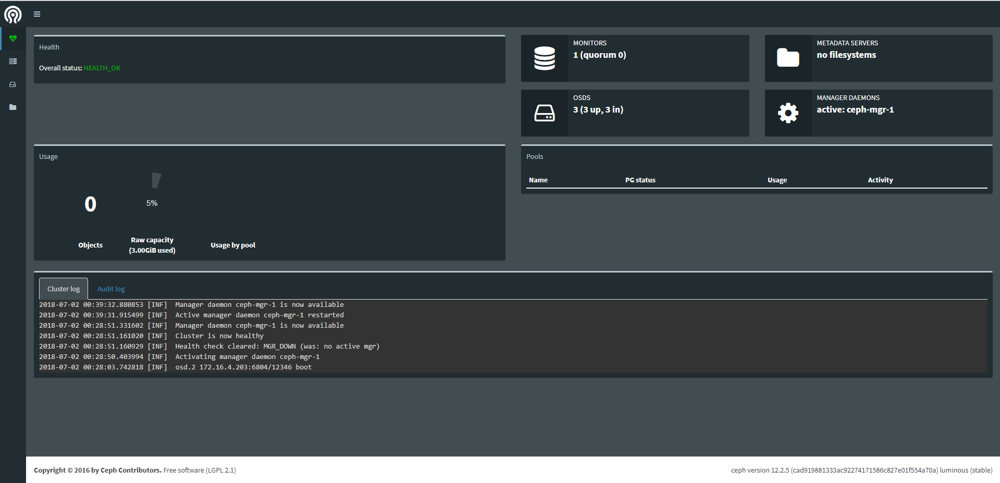

# Cài đặt Ceph All in one Luminous - CentOS 7
---
## Chuẩn bị

### Về tài nguyên
__Yêu cầu sử dụng 1 node, chạy CentOS 7 64bit__
```
CPU         2 core
RAM         4 GB

Disk        sba: os
            sbd,sdc,sde: 3 disk osd

Network     ens33: 1 replicate data (192.168.2.100)
            ens34: 1 access ceph (10.0.3.100)
```

### Cấu hình card mạng
```
# Ceph admin
echo "Setup IP ens33"
nmcli c modify ens33 ipv4.addresses 192.168.2.100/24
nmcli c modify ens33 ipv4.gateway 192.168.2.2
nmcli c modify ens33 ipv4.dns 8.8.8.8
nmcli c modify ens33 ipv4.method manual
nmcli con mod ens33 connection.autoconnect yes

echo "Setup IP ens34"
nmcli c modify ens34 ipv4.addresses 10.0.3.100/24
nmcli c modify ens34 ipv4.method manual
nmcli con mod ens34 connection.autoconnect yes

systemctl stop firewalld
systemctl disable firewalld

yum install update -y
yum install python-setuptools -y
```

## Cài đặt
### Phần 1 - Cấu hình chuẩn bị trên node
> Sử dụng quyền `root`
#### Bước 1: Tạo Ceph User
Tạo Ceph user 'cephuser' trên node.
```
useradd -d /home/cephuser -m cephuser
passwd cephuser
```
Lưu ý:
- User này sẽ được sử dụng bởi `ceph-deploy`. Tức, `ceph-deploy` sẽ sử dụng user này để triển khai các cấu hình của Ceph
- Nếu bỏ qua user này `ceph-deploy` sẽ vẫn chạy, nó sẽ tự động sử dụng biến user môi trường.

Cấp quyền root cho user vừa tạo
```
echo "cephuser ALL = (root) NOPASSWD:ALL" | sudo tee /etc/sudoers.d/cephuser
chmod 0440 /etc/sudoers.d/cephuser
sed -i s'/Defaults requiretty/#Defaults requiretty'/g /etc/sudoers
```
#### Bước 2: Cấu hình NTP
Sử dụng NTP đồng bộ thời gian trên tất cả các Node.
> Ở đây sử dụng NTP pool US.

```
yum install -y ntp ntpdate ntp-doc
ntpdate 0.us.pool.ntp.org
hwclock --systohc
systemctl enable ntpd.service
systemctl start ntpd.service
```

#### Bước 3 (Tùy chọn): Nếu sử dụng VMware, cần sử dụng công cụ hỗ trợ
```
yum install -y open-vm-tools
```

#### Bước 4: Hủy bỏ SELinux
```
sed -i 's/SELINUX=enforcing/SELINUX=disabled/g' /etc/selinux/config
```

#### Bước 5: Cấu hình Host File
```
echo '
192.168.2.100 cephaio' >> /etc/hosts
```
> Ping thử tới host, kiếm tra Network

#### Bước 6: Khởi động lại node
```
reboot
```

### Phần 2: Cấu hình SSH Server
> Truy cập cephaio với quyền `root`

#### Bước 1: Tạo ssh-key
```
echo -e "\n" | ssh-keygen -t rsa -N ""
```

#### Bước 2: Cấu hình ssh file
```
echo '
Host cephaio
        Hostname cephaio
        User cephuser' > ~/.ssh/config
```
Thay đổi quyền trên file
```
chmod 644 ~/.ssh/config
```

Thiết lập keypair
```
ssh-keyscan cephaio >> ~/.ssh/known_hosts
ssh-copy-id cephaio
```

> Yều cầu nhập password lần đầu tiền truy cập

### Phần 3: Thiết lập Ceph Cluster
> Sử dụng quyền `root`

#### Bước 1: Cấu hình Ceph repo
```
echo '
[Ceph]
name=Ceph packages for $basearch
baseurl=http://download.ceph.com/rpm-luminous/el7/$basearch
enabled=1
gpgcheck=1
type=rpm-md
gpgkey=https://download.ceph.com/keys/release.asc
priority=1

[Ceph-noarch]
name=Ceph noarch packages
baseurl=http://download.ceph.com/rpm-luminous/el7/noarch
enabled=1
gpgcheck=1
type=rpm-md
gpgkey=https://download.ceph.com/keys/release.asc
priority=1

[ceph-source]
name=Ceph source packages
baseurl=http://download.ceph.com/rpm-luminous/el7/SRPMS
enabled=1
gpgcheck=1
type=rpm-md
gpgkey=https://download.ceph.com/keys/release.asc
priority=1' > /etc/yum.repos.d/ceph.repo

yum update -y 
```

#### Bước 2: Cài đặt ceph-deploy
```
yum install ceph-deploy -y
yum update ceph-deploy -y 
```

#### Bước 3: Tạo mới Ceph Cluster
Tạo cluster directory
```
mkdir cluster
cd cluster/
```

Tạo mới cấu hình ceph, thiết lập node mon
```
ceph-deploy new cephaio
```

Cấu hình ceph.conf
```
echo "public network = 192.168.2.0/24" >> ~/cluster/ceph.conf
echo "cluster network = 10.0.3.0/24" >> ~/cluster/ceph.conf
```

#### Bước 4: Cài đặt Ceph
```
ceph-deploy install --release luminous cephaio
```

Khởi tạo tiến trình mon
```
ceph-deploy mon create-initial
```

#### Bước 5: Thiết lập OSD
> Khởi tạo tiến trình OSD

Liệt kê OSD
```
ceph-deploy disk list cephaio
```

Xóa partition tables trên tất cả node với zap option
```
ceph-deploy disk zap cephaio /dev/sdb
ceph-deploy disk zap cephaio /dev/sdc
ceph-deploy disk zap cephaio /dev/sdd
```

Tạo mới OSD
```
ceph-deploy osd create cephaio --data /dev/sdb
ceph-deploy osd create cephaio --data /dev/sdc
ceph-deploy osd create cephaio --data /dev/sdd
```

Kiểm tra tại OSD node
```
[root@cephaio cluster]# lsblk
NAME                                                                                                  MAJ:MIN RM  SIZE RO TYPE MOUNTPOINT
fd0                                                                                                     2:0    1    4K  0 disk 
sda                                                                                                     8:0    0   50G  0 disk 
├─sda1                                                                                                  8:1    0  500M  0 part /boot
└─sda2                                                                                                  8:2    0 49.5G  0 part 
  ├─centos-root                                                                                       253:0    0 45.6G  0 lvm  /
  └─centos-swap                                                                                       253:1    0  3.9G  0 lvm  [SWAP]
sdb                                                                                                     8:16   0   20G  0 disk 
└─ceph--0589e5fc--c1e8--4b7c--b373--eee113f49a4e-osd--block--530493fe--a8d3--4f92--bd20--1a0723e913ab 253:2    0   20G  0 lvm  
sdc                                                                                                     8:32   0   20G  0 disk 
└─ceph--2444521c--2a9c--4bb6--90e8--f124428859b3-osd--block--2c088db4--5529--43b9--928c--b19c810cac15 253:3    0   20G  0 lvm  
sdd                                                                                                     8:48   0   20G  0 disk 
└─ceph--586dc0b9--fe6f--46ab--93bb--18293b57b2a3-osd--block--f8f227f0--f488--41f9--837e--bd6c562d65af 253:4    0   20G  0 lvm  
sr0                                                                                                    11:0    1  636M  0 rom  

```

Khởi tạo quyền admin ceph cho node `cephaio` (Để node có quyền quản trị Ceph)
```
ceph-deploy admin cephaio
```

Thiết lập quyền truy cập file
```
sudo chmod 644 /etc/ceph/ceph.client.admin.keyring
```

Khởi tạo tiến trình ceph mgr (Không khởi tạo có thể gây lỗi ceph)
```
ceph-deploy mgr create cephaio:ceph-mgr-1
```

### Phần 4: Kiểm tra trạng thái Ceph
#### Kiểm tra cluster health
```
[root@cephaio cluster]# sudo ceph health
HEALTH_OK
```

#### Kiểm tra cluster status
```
[root@cephaio cluster]# sudo ceph -s
  cluster:
    id:     a0a1f71e-3acd-4035-904d-be26171e1e96
    health: HEALTH_OK
 
  services:
    mon: 1 daemons, quorum cephaio
    mgr: ceph-mgr-1(active)
    osd: 3 osds: 3 up, 3 in
 
  data:
    pools:   0 pools, 0 pgs
    objects: 0 objects, 0 bytes
    usage:   3077 MB used, 58350 MB / 61428 MB avail
    pgs:     

```

### Phần 5: Chỉnh sửa Crush map
> Truy cập với quyền `root`
Lưu ý:
- Khi cài đặt Ceph All In One, cần phải bổ sung cấu hình sau để lab các tính năng khác

Truy cập Cluster config, lấy crush map hiện tại
```
cd cluster/
ceph osd getcrushmap -o map.bin
crushtool -d map.bin -o map.txt
```

Chỉnh sửa crush map
```
sed -i 's/step chooseleaf firstn 0 type host/step chooseleaf firstn 0 type osd/g' ~/cluster/map.txt
```

```
crushtool -c map.txt -o map-new.bin
ceph osd setcrushmap -i map-new.bin
```

### Phần 6: Khởi tạo Ceph Dashboard
> Sử dụng cho mục đính giám sát Ceph
#### Liệt kê các module hiện có
```
[root@cephaio cluster]# ceph mgr dump
{
    "epoch": 29,
    "active_gid": 4118,
    "active_name": "ceph-mgr-1",
    "active_addr": "192.168.2.100:6806/12549",
    "available": true,
    "standbys": [],
    "modules": [
        "balancer",
        "restful",
        "status"
    ],
    "available_modules": [
        "balancer",
        "dashboard", # Enable dashboard
        "influx",
        "localpool",
        "prometheus",
        "restful",
        "selftest",
        "status",
        "zabbix"
    ],
    "services": {}
}
```
#### Kích hoạt module dashboard
```
ceph mgr module enable dashboard
```
#### Kiểm tra lại
```
[root@cephaio cluster]# ceph mgr dump
{
    "epoch": 33,
    "active_gid": 4123,
    "active_name": "ceph-mgr-1",
    "active_addr": "192.168.2.100:6806/12549",
    "available": true,
    "standbys": [],
    "modules": [
        "balancer",
        "dashboard",
        "restful",
        "status"
    ],
    "available_modules": [
        "balancer",
        "dashboard",
        "influx",
        "localpool",
        "prometheus",
        "restful",
        "selftest",
        "status",
        "zabbix"
    ],
    "services": {
        "dashboard": "http://cephaio:7000/"
    }
}
```

#### Truy cập giao diện
```
http://<ip>:7000/
```


