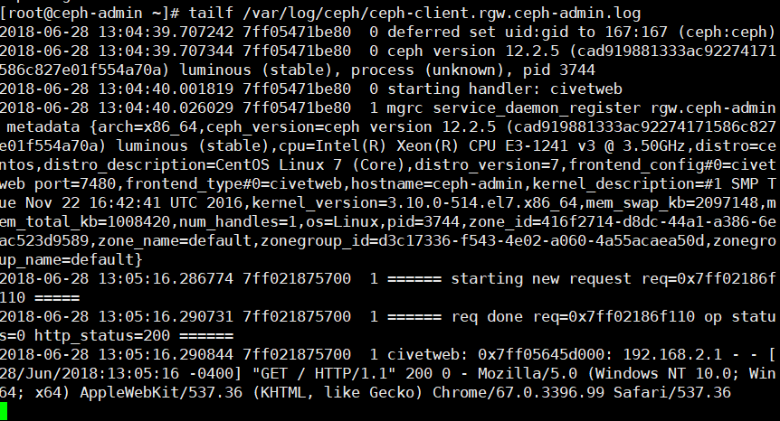
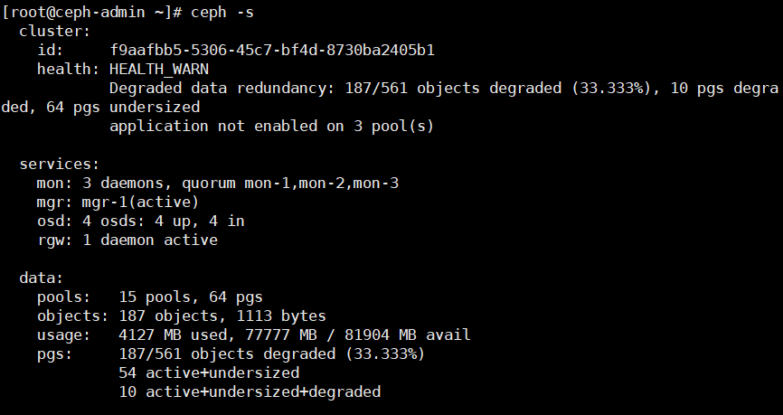
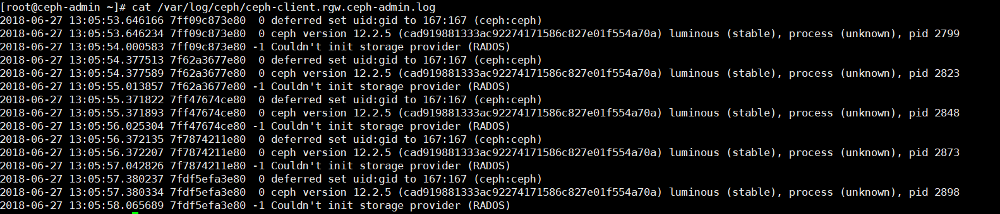
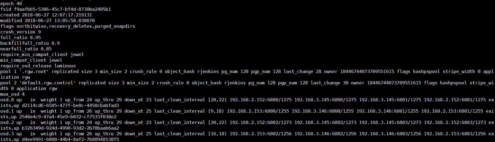
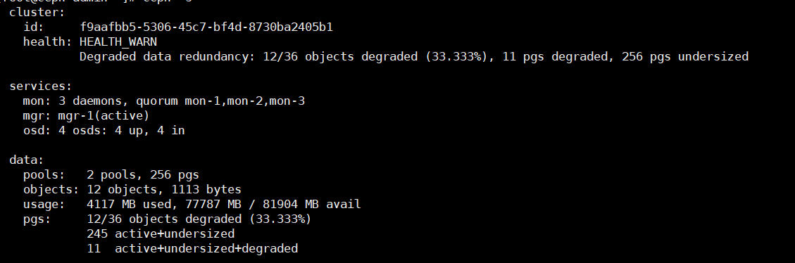

# Cài đặt Ceph manual thủ công
---
## Tổng quan 
Tổng quan về RGW

## Cài đặt


### Bước 1: Truy cập node rgw
```
ssh root@<rgw-node>
```

### Bước 2: Cài đặt ceph-radosgw
```
yum install ceph-radosgw
```

### Bước 3: Tạo các pool mặc định trước
> Truy cập https://ceph.com/pgcalc/ để tính toán pool cũng như tạo script
```
ceph osd pool create .rgw.root 4
ceph osd pool set .rgw.root size 3
while [ $(ceph -s | grep creating -c) -gt 0 ]; do echo -n .;sleep 1; done

ceph osd pool create default.rgw.control 4
ceph osd pool set default.rgw.control size 3
while [ $(ceph -s | grep creating -c) -gt 0 ]; do echo -n .;sleep 1; done

ceph osd pool create default.rgw.data.root 4
ceph osd pool set default.rgw.data.root size 3
while [ $(ceph -s | grep creating -c) -gt 0 ]; do echo -n .;sleep 1; done

ceph osd pool create default.rgw.gc 4
ceph osd pool set default.rgw.gc size 3
while [ $(ceph -s | grep creating -c) -gt 0 ]; do echo -n .;sleep 1; done

ceph osd pool create default.rgw.log 4
ceph osd pool set default.rgw.log size 3
while [ $(ceph -s | grep creating -c) -gt 0 ]; do echo -n .;sleep 1; done

ceph osd pool create default.rgw.intent-log 4
ceph osd pool set default.rgw.intent-log size 3
while [ $(ceph -s | grep creating -c) -gt 0 ]; do echo -n .;sleep 1; done

ceph osd pool create default.rgw.meta 4
ceph osd pool set default.rgw.meta size 3
while [ $(ceph -s | grep creating -c) -gt 0 ]; do echo -n .;sleep 1; done

ceph osd pool create default.rgw.usage 4
ceph osd pool set default.rgw.usage size 3
while [ $(ceph -s | grep creating -c) -gt 0 ]; do echo -n .;sleep 1; done

ceph osd pool create default.rgw.users.keys 4
ceph osd pool set default.rgw.users.keys size 3
while [ $(ceph -s | grep creating -c) -gt 0 ]; do echo -n .;sleep 1; done

ceph osd pool create default.rgw.users.email 4
ceph osd pool set default.rgw.users.email size 3
while [ $(ceph -s | grep creating -c) -gt 0 ]; do echo -n .;sleep 1; done

ceph osd pool create default.rgw.users.swift 4
ceph osd pool set default.rgw.users.swift size 3
while [ $(ceph -s | grep creating -c) -gt 0 ]; do echo -n .;sleep 1; done

ceph osd pool create default.rgw.users.uid 4
ceph osd pool set default.rgw.users.uid size 3
while [ $(ceph -s | grep creating -c) -gt 0 ]; do echo -n .;sleep 1; done

ceph osd pool create default.rgw.buckets.extra 4
ceph osd pool set default.rgw.buckets.extra size 3
while [ $(ceph -s | grep creating -c) -gt 0 ]; do echo -n .;sleep 1; done

ceph osd pool create default.rgw.buckets.index 4
ceph osd pool set default.rgw.buckets.index size 3
while [ $(ceph -s | grep creating -c) -gt 0 ]; do echo -n .;sleep 1; done

ceph osd pool create default.rgw.buckets.data 8
ceph osd pool set default.rgw.buckets.data size 3
while [ $(ceph -s | grep creating -c) -gt 0 ]; do echo -n .;sleep 1; done
```

### Bước 4: Đồng bộ các file cấu hình /etc/ceph/ceph.conf
```
scp /etc/ceph/ceph.conf root@<note còn lại>:/etc/ceph/
```
__Tùy chọn, đổi port mặc định Ceph-rgw__
```
vi /etc/ceph/ceph.conf
```
Nội dung
```
.....
[client.rgw.<obj_gw_hostname>]
host = <obj_gw_hostname>
rgw frontends = "civetweb port=80"
```

### Bước 5: Tạo thư mục chứa dữ liệu Ceph-rgw
```
mkdir -p /var/lib/ceph/radosgw/ceph-rgw.<Tên host name>

VD:
Dùng để lấy tên: `hostname -s`

mkdir -p /var/lib/ceph/radosgw/ceph-rgw.ceph-admin
```

### Bước 6: Cấp quyền ceph auth cho ceph rgw
```

VD:
Dùng để lấy tên: `hostname -s`

ceph auth get-or-create client.rgw.ceph-admin osd 'allow rwx' mon 'allow rw' -o /var/lib/ceph/radosgw/ceph-rgw.ceph-admin/keyring
```

### Bước 7: Tạo done file
```
touch /var/lib/ceph/radosgw/ceph-rgw.`hostname -s`/done

VD:
touch /var/lib/ceph/radosgw/ceph-rgw.ceph-admin/done
```

### Bước 8: Set lại quyền truy cập thư mục ceph
> Ceph thực thi service với quyền user `ceph`

```
chown -R ceph:ceph /var/lib/ceph/radosgw
chown -R ceph:ceph /var/log/ceph
chown -R ceph:ceph /var/run/ceph
chown -R ceph:ceph /etc/ceph
```

### Bước 9: Cấu hình firewalld
- Mở port 7480 theo mặc định
- Hoặc mở port tùy chọn

### Bước 10: Chạy dịch vụ ceph-radosgw
```
systemctl enable ceph-radosgw.target
systemctl enable ceph-radosgw@rgw.ceph-admin
systemctl start ceph-radosgw@rgw.ceph-admin
```

### Kiểm tra 
__Log dịch vu__



__Ceph static__




## Lỗi có thể gặp phải
Khi không tạo pool mặc định Ceph-rgw trước, số OSD quá ít (nhỏ hơn 5 OSD) sẽ dẫn đến trình trạng không thể chạy dịch vụ ceph. (Vấn đề PGS per OSD)

__Ảnh lỗi__



__ceph osd dump__



Chú ý trên `.rgw.root` và `default.rgw.controll`:
- Số pg_num = 128
- Số pgp_num = 128
2 tham số này quá lớn, dẫn đến không thể khởi tạo ceph rgw

__ceph status__

