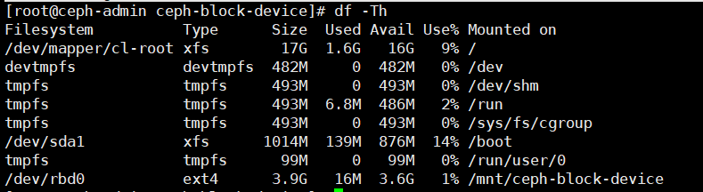

# Cài đặt Ceph RBD thủ công (manual)
---
## Tổng quan về Ceph RBD
Giới thiệu về RBD

## Cài đặt
### Bước 1: Tạo pool 'rbd' mặc định
```
ceph osd pool create {pool-name} {pg-num} [{pgp-num}] [replicated] [crush-rule-name] [expected-num-objects]

VD:
ceph osd pool create rbd 8 8
```
### Bước 2: Tạo khóa với quyền truy cập Mon, OSD cho RBD node
> Tạo user Ceph Block Device client.rbd có toàn quyền với các file trên OSD (osd 'allow rwx')

```
ceph auth get-or-create client.rbd mon 'profile rbd' osd 'profile rbd pool=<pool_name>' -o /etc/ceph/rbd.keyring

VD:
ceph auth get-or-create client.rbd mon 'allow r' osd 'allow rwx pool=rbd' -o /etc/ceph/rbd.keyring
```

### Bước 3: Tạo block device image
```
rbd create <image_name> --size <image_size> --pool <pool_name> --name client.rbd --keyring /etc/ceph/rbd.keyring

VD:
rbd create image1 --size 4096 --pool rbd --name client.rbd --keyring /etc/ceph/rbd.keyring
```


### Bước 4: Kích hoạt, tương thích Ceph RBD với CentOS
Chú ý: CentOS tương thích với block device của Ceph, để làm được điều đó cần:
- Kích hoạt module kernel
- Hủy bỏ 1 số tính năng mở rộng của Ceph RBD (Phiển bản kernel không hỗ trợ)

Kích hoạt RBD kernel module
```
sudo modprobe rbd
```

Mặc định Ceph thêm vào các tính năng:
- layering
- exclusive-lock
- object-map
- deep-flatten
- fast-diff

> Nếu sử dụng kernel RBD (krbd) client, ta sẽ không thể tích hợp được block device image vì lý do phiển bản hiện tại của CentOS (kernel version) không hỗ trợ các tính năng exclusive-lock, object-map, fast-diff, deep-flatten. Để giải quyết vấn đề ta cần tắt các tính năng này đi.

Hủy bỏ các tính năng không hỗ trợ:
```
sudo rbd feature disable image1 exclusive-lock object-map fast-diff deep-flatten
```
Hủy tính năng mặc định, tự động thêm vào của ceph về RBD node:
> Thêm vào file `/etc/ceph/ceph.conf`, sau đó đồng bộ file config

```
rbd_default_features = 1
```

### Bước 5: Map image vừa tạo tới block device pool
> Pool ở đây là `rbd`

```
rbd map <image_name> --pool <pool_name> --name client.rbd --keyring /etc/ceph/rbd.keyring

VD:
rbd map image1 --pool rbd --name client.rbd --keyring /etc/ceph/rbd.keyring
```

Hiển thị rbd map:
```
rbd showmapped

VD:
[root@ceph-admin ceph-block-device]# rbd showmapped
id pool image  snap device    
0  rbd  image1 -    /dev/rbd0
```

### Bước 6: Tạo File system trên block device
```
mkfs.ext4 -m5 /dev/rbd/<pool_name>/<image_name>

VD:
mkfs.ext4 -m5 /dev/rbd/rbd/image1
```
> Sẽ mất 1 lúc để tạo FS trên block device

### Bước 7: Mount FS vừa tạo
```
mkdir <mount_directory>
mount /dev/rbd/<pool_name>/<image_name> <mount_directory>

VD:
mkdir /mnt/ceph-block-device
mount /dev/rbd/rbd/image1 /mnt/ceph-block-device
```

Kiểm tra lại kết quả
```
df -hT
```


