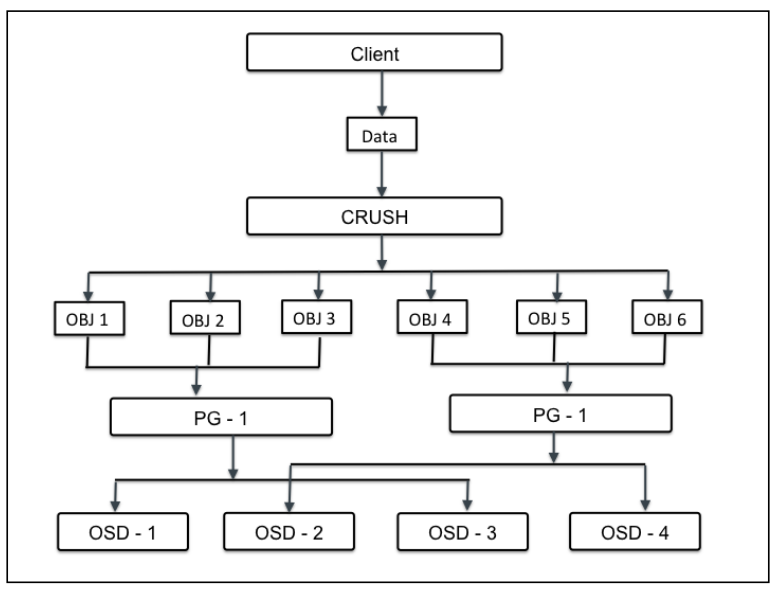

# Vị trí nhóm - Placement groups (PGs)
---
## Tổng quan
Khi Ceph cluster nhận yêu cầu từ data storage, nó sẽ chia object vào các nhóm, chúng được là placement groups (PG). CRUSH sẽ tổ chức dữ liệu thành tập các Object, dựa trên hoạt động hash và id object, mức nhân bản, các PGs (placement groups) trong hệ thông sẽ có các PGs ID tương ứng. Placement groups được coi là tập logical (logical collection) các object được nhân bản trên các OSDs, qua đó nâng cao tính bảo đảm dữ liệu tại storage system. Dựa trên mức replicate của Ceph pool, placement group sẽ được nhân bản, phân tán trên nhiều hơn 1 OSD tại Ceph cluster. Ta có thể cân nhắc placement group như logical container chứa các object. PGs (vị trí nhóm) được thiết kế đáp ứng khả năng mở rộng, hiệu suất cao trong Ceph storage system, đồng thời hỗ trợ việc quản trị Object.



Nếu không có các PGs, việc quản trị dữ liệu sẽ trở nên rất khó, cùng với đó là khả tổ chức các object đã được nhân bản (hảng triệu object) tới hàng trăm các OSD khác nhau. Qua đó, thay vì quản trị object riêng biệt, hệ thông sẽ sử dụng PGs (chứ số lượng rất nhiều object). PGs sẽ khiến ceph dễ quản trị dữ liệu và giảm bớt sự phức tạp trong khâu quản lý. Mỗi PG sẽ yêu cầu tài nguyên hệ thống nhất đinh (CPU và Memory, .. vì chúng quản lý rất nhiều object).

Số lượng PGs trong cluster cần được tính toán tỉ mỉ. Thông thường, tăng số lượng PGs trong cluster sẽ giảm bớt gánh nặng trên mỗi OSD, nhưng cần xem xét theo quy chuẩn. Khuyến nghị 50-100 PGs trên mỗi OSD. Nó tránh tiêu tốn quá nhiều tài nguyên trên mỗi OSD node, giảm gánh nặng OSD. Khi dữ liệu tăng, ta cần mở rộng cluster cùng với điều chỉnh số lượng PGs. Khi thiếtt bị mới được thêm, xóa bỏ khói cluster, các PGs sẽ vẫn tồn tại – CRUSH sẽ quản lý việc tài cấp phát PGs trên toàn cluster.

```
Giái trị PGP là tổng số PGs cho mục đích tổ chức dữ liệu, giá trị này cần bằng PGs
```

##	Tính toán số PG cần thiết - Calculating PG numbers
Xác định số PGs là bước cần thiết khi xây dựng hạ tầng Ceph storage cluster cho doanh nghiệp. PGs sẽ quyết đinh hiệu năng storge. Công thức tính tổng placement group cho Ceph cluster:
```
Total PGs = (Total_number_of_OSD * 100) / max_replication_count

Kết quả có thể làm tròn gần nhất theo 2 ^ đơn vị.
```

VD:
```
VD: 10 OSD Cluster bao gồm 10 OSD, 512 PGs, 3 repica pool

CRUSH sẽ phân tích mỗi PGs 3 OSD
Sau khi phân chia xong, mỗi OSD sẽ chứa (512*3)/10 = 150 PGs => Khi 1 OSD lỗi, kịch bản sẽ khôi phục 150 PGs trên cùng 1 thời điểm => 150 PGs còn lại sẽ nằm trên 9 OSD còn lại.
VD:Cluster có 10->20 OSDs với 512 PGs, mức nhân bản 3

CRUSH gán mỗi PG 3 OSDs
Kết thúc, (512*3)/20 = (150 -> 75) PGs
Mỗi 1 OSD lỗi => 19 OSD sẽ backup lại dữ liêu => OSD lỗi = 1 TB => 10 OSD giữa 100GB (đủ 1 TB OSD lỗi) => càng nhiều OSD tốc độ backup càng cao.
VD: Cluster 40 OSD, 512 PGs, 3 repical pool

Crush gán 3 OSD mỗi PG
Sau tính toán, mỗi OSD chứa (512*3)/40 = 35 - 40 PGs => 1 OSD lỗi (1TB data) => 39 OSD còn lại sẽ backup => Dung lượng Backup mỗi OSD = 1000 / 39 ~ 25 GB mỗi OSD => Quá trình backup diễn ra càng nhanh khi có nhiều OSD
VD: 200 OSD, 512 PGs, 3 repi pool

CRUSH gán mỗi PG 3 OSD
Sau tính toán, mỗi OSD chứa 7 PGs
Khi 1 OSD lỗi, 7*3 OSD sẽ diễn ra hoạt động backup => Dung lượng backup trên 21 OSD = 1000/21 ~~ 47 GB (nhanh hơn so với 10 PG)
```
Chọn lựa số PGs:
- Nhỏ hơn 5 OSD => set pg_num = 128
- 5-10 OSD => set pg_num = 512
- 10-50 OSD => set pg_num = 4096

Command tùy chỉnh:
```
ceph osd pool set {pool-name} pg_num
```

```
VD: cluster bao gồm 160 OSD, 3 repli
=> total PGs = (OSD * 100)/3 = (160*100)/3 = 5333.333 => làm tròn 8192 (2^n > 5333)
```

## Quá trình khắc phục lỗi:
1. Khi OSD lỗi, tất cả bản sao trên OSD bị mất, mức nhân bản PG từ 3-2
2. Ceph thực hiện quá trình khôi phục, PG sẽ chọn OSD mới, đưa vào PGs, thực hiện quá trình nhân bản
3. Trường hợp xấu, OSD thứ trong PGs chết (chết 2/3) trước khi OSD được đừa vào cụm => Dữ liệu nguy hiểm (chỉ còn 1 bản backup)
4. Ceph tiếp tục chọn OSD khác, đưa vào PG, bảo đảm mức nhân bản
5. Khi OSD (3/3) chết trong cùng PG trước khi quá trình backup diễn ra => dữ liệu mất vĩnh viễn
