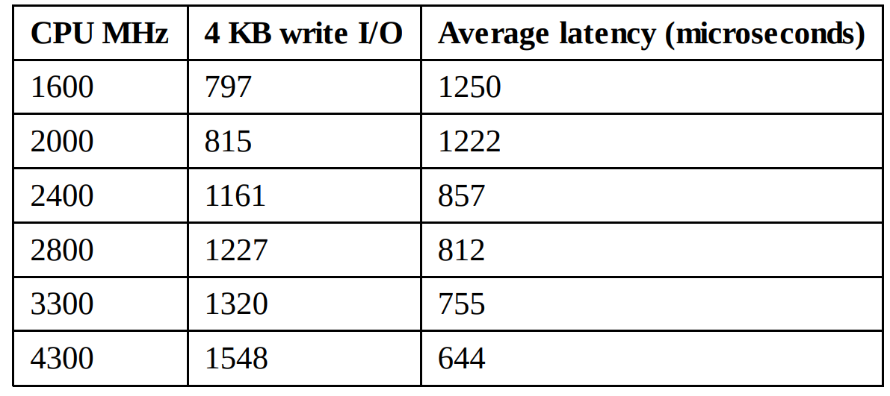
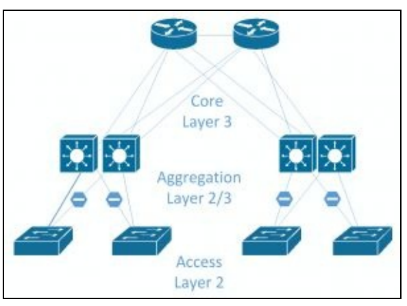
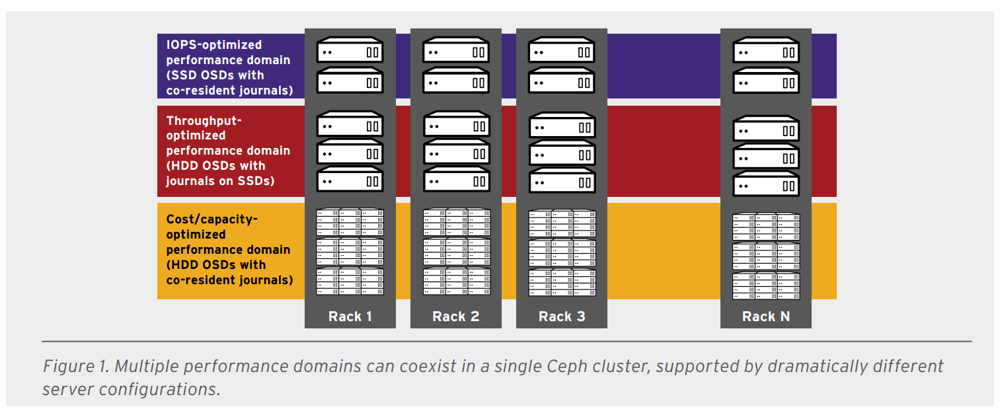
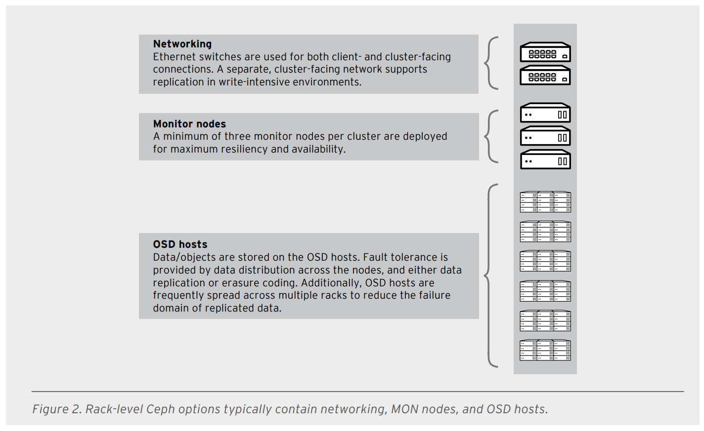

# Các yêu cầu khi xây dựng Ceph Cluster
---
## Yêu cầu hạ tầng ceph
Ceph là software-based storage system, được thiết kế chạy tương thích với các phần cứng chung. Tính năng này của Ceph khiến nó đáp ứng được các yêu cầu về chi phí, tính mở rộng, giải pháp của các nhà cung cấp. Hạ tầng phần cứng cluster cần được lựa chọn khi xây dựng storage. Phần cứng thiết kế cluster cần được cân nhắc trước khi khởi tạo project. Kế hoạch càng chi tiết sẽ giúp cho thiết kế tránh khỏi các vấn đề về nghẽn cổ chai, tính bảo đảm của cluster. Chọn phần cứng dựa trên sự đa dạng của các nhà cung cấp, túi tiền, các yếu tố phải xem xét cẩn trọng là hiệu năng, dung lượng, mức chịu lỗi, các phương pháp xử lý.
### Yêu cầu giám sát
Ceph monitor chịu trách nhiệm theo dõi sức khỏe của toàn cluster bằng cách duy trì cluster map. Ceph Mon không đòi hỏi nhiều cpu, memory, chúng yêu cầu tài nguyên thấp, trên thiết bị phần cứng cơ bản (1 core, 2 gb ram, ..). Có thể tận dụng tài nguyên server sẵn có để cài Ceph Mons(Cài lên các server đang chạy dịch vụ khác). Trong môi trường nonproduction, khi đang cân nhắc phần cứng và chi phí, tích hợp Ceph MONs trên các server chạy dịch vụ sẵn có, trên các VMs. Nếu cấu hình lưu log trên local monitor node, chắc chắn rằng ổ đĩa máy chủ đủ dụng lượng để Ceph MONs lưu log. Trên các cụm lớn, log có thể tăng lên tầm vài gb, đặc biệt với các cụm xảy ra xử cộ, đang chạy debugging level, nó có thể tăng lên vài gb trong thời gian rất ngắn. Vì vậy cần cân nhắc hạ tầng, thiết kế monitor node phù hợp.

Network cho Ceph MONs cần được cung cấp đủ hoặc thừa. NIC tổi thiểu 1 Gbs được khuyên dùng. Vì khi xuất hiện lỗi trên cluster, sẽ tạo rất nhiều Report. Đối với môi trường test, đây không phải là vấn đề đang lưu tâm nhưng đối với môi trường sản phẩm thì nó sẽ là 1 vấn đề quan trọng.

### Yêu cầu OSD
Ceph sẽ tạo OSD cho mỗi ổ đĩa vật lý bên trong cluster node. Tuy nhiên OSD hỗ trợ triển khai linh hoạt trên OSD/disk và OSD/Raid.

Ceph OSD yêu cầu:
-	CPU, memory
-	OSD journal (block device hoặc file)
-	Filesystem chạy trên (XFS, ext4, and Btrfs)
-	Tách biệt các OSD
-	Đòi hỏi đường truyền dự phòng

```
Cấu hình khuyến cáo:
CPU 1 GHz, RAM 2gb trên mỗi OSD để đáp ứng cho môi trường cluster, khả năng chịu lỗi của cluster.
```

Tiến trình khôi phục yêu cầu nhiều tài nguyên. OSD là đơn vị lưu trữ chính trong Ceph, vì vậy khi mở rộng, tăng thêm ổ đĩa cần tăng thêm cả RAM để đáp ứng yêu cầu về hiệu suất. Từ góc độ hiệu năng, cần cân nhắc tách biệt OSD journal trên OSD. Hiệu năng sẽ được cải thiện khi OSD journal thiết lập trên SSD, OSD data tạo trên HDD. SSD sử dụng như journal sẽ cải thiện hiệu năng cluster, giải quyết các công việc nặng nhanh chóng, hiệu quả. Tuy nhiên sử dụng SSD sẽ gia tăng chi phí. Vì vậy có thể thiết kế 1 SSD phục nhiều OSD Data, nhưng đổi lại, nếu SSD journal lỗi, toàn bộ dữ liệu trên các OSD sẽ bị mất, đồng thời tránh sử dụng quả tải SSD, khuyến cáo 1 SSD cho 2-4 OSD.

### Yêu cầu Network
Từ khía cạnh thiết kế hạ tầng, ceph yêu cầu ít nhất 2 mạng riêng:
- Public network (front-side data network)
- Clustered network (backside data network).

Tách biệt 2 đường truyền client data với ceph cluster traffic. Vì hầu như mọi thời điểm, Ceph cluster sẽ sử dụng cluster traffic để thực hiện quá trình nhân bản object, khôi phục dữ liệu trong trường hợp phát sinh lỗi. Nếu sử dụng chung 2 đường truyền chung có thể sẽ giảm hiệu năng cluster. Tuy nhiên, ta có thể sử dụng chung 1 đường vật lý của cả 2 mạng. Về cơ bản, khuyến cáo 1 GB cho mỗi đường nhưng để có hiệu năng tốt nhất nên sử dụng đường truyền mạng 10 GB (trong trường hợp thiết kế cluster đáp ứng yêu cầu trong tương lai, tránh tình trạng nghẽn cổ chai). Cần tính toán khoảng dư thừa cho mỗi thiết bị mạng như network controller, ports, switches, router.

Đường public network cung cấp các liên kết giữa Client với Ceph cluster. Mỗi quá hoạt động I/O giữa client và Ceph cluster sẽ tạo ra 1 kết nối. Cần chắc chắn có đủ băng thông cho các client.
Với Cluster network, các tiến trình của Ceph sẽ sử dụng đường truyền này. Tất cả các hoạt động nhân bản, khôi phục, tái cần bằng, các hoạt động này diễn ra, các tiền trình giao tiếp bên trong Ceph sẽ sử dụng đường cluster network.

Vì vậy cần dựa theo hạ tầng, đánh giá để thiết kế đường truyền phù hợp, nâng cao hiệu năng, chất lượng.

### Yêu cầu MDS

Ceph MDS yêu cầu nhiều tài nguyên. Tối thiểu CPU (>= 4 core). Ceph MDS phụ thuộc vào tùy chỉnh data caching, và để nhanh chóng đáp ứng yêu cầu chúng sẽ yêu cầu rất nhiều RAM. Số lượng Ram cao sẽ cải thiện hiệu năng CephFS, vì vậy cần đặt Ceph MDS trên máy vật lý với nhiều tài nguyên RAM, CPU (core). Yêu cầu network cho Ceph MDS tối thiểu 1 GB.

---
# Tối ưu dựa trên thành phần
## SSD
Đặc điểm quản trọng của SSD là thời gian truy vấn, tốc độ đặc ghi với độ trễ rất thấp 10 microseconds. Các khối SSD có dạng 4KB, 128KB, Sẽ yêu cầu cả khối để ghi dữ liệu.

Để đọc ghi nhanh, SSDs trang bị RAM buffer. Hoạt động đọc ghi diễn ra trên RAM, sau đó firmware sẽ tiếp tục đẩy dữ liệu xuống bộ nhớ flash, vì vậy dữ liệu sẽ mất kể cả khi đã ghi xong (mất điện đột ngột). => Trong ssd có bộ chứa năng lượng dự trự, giữ đủ lâu để ghi dữ liệu xuông bộ nhớ flash.

Các loại SSD:

### Cho khách hàng bình thường:
- Giá thành rẻ, nâng cấp hiệu năng lên đáng kể, cung cấp khả năng lưu trữ vừa phải, giá thành hợp lý.
- Không hỗ trợ thành phần năng lượng dữ trữ, bảo vệ dữ liệu khi mất điện
- Hiệu suất kém khi thực hiện ghi đồng bộ, bảo đảm tính toàn vẹn dữ liệu kém
- Khả năng ghi lâu dài kém, nhưng đủ để thực hiện hoạt động đọc ghi cơ bản, nhu cầu thường ngày.

### Cho khách hàng cao cấp:
- Có hiệu năng tốt hơn, khả năng ghi lâu dài hơn tuy nhiên vẫn chưa thê so sáng với SSD mức doanh nghiệp
#### Lý do tại sao không nên sử dụng khi xây dựng Ceph:
- Thiếu bộ lưu trữ năng lượng dự trữ, không bảo đảm tính toàn vẹn dữ liệu
- Firmware không được thử nghiệm nhiều như SSD doanh nghiệp, có khả năng xảy ra lỗi cao
- Độ bền thấp, khả năng xảy ra lỗi sau 1 thời gian sử dụng
- Dựa trên khả năng xảy ra lỗi, các lợi thế về giá ko còn

Việc sử dụng SSD của người dùng cơ bản sẽ ảnh hưởng tới hiệu suất của Ceph, làm tăng nguy cơ xảy ra lỗi

### SSD dành cho doanh nghiệp
Điểm khác biệt lớn nhất giữa SSD cơ bản và SSD doanh nghiệp là SSD doanh nghiệp là khả năng bảo đảm dữ liệu.

VD: Khi xảy ra vẫn đề, OS có thể chắc chắn rằng dữ liệu đã ghi trên SSD không bị ảnh hưởng. Trên các SSD sẽ có bộ lưu trữ năng lượng dự phòng, khi mất điện bảo đảm dữ liệu sẽ được hoàn tất chuyển từ RAM sang bộ nhớ flash.

SSD doanh nghiệp sẽ có nhiều sự lựa chọn khác nhau dựa trên giá thành dựa trên sự bảo đảm dữ liệu, thời gian đọc ghi an toàn, ..

### Enterprise – read intensive (Khả năng đọc)
Thuật ngữ này khá chuyên sâu, và mang tính chất maketing. Cơ bản nó là các yếu tố đánh giá độ bền đọc ghi SSD, bảo đảm khả năng đáp ứng, giá thành trên mỗi GB. Các SSD thường bảo đảm độ bền trong 0.3 - 1 trong vòng 5 năm đầu với hoạt động đọc ghi mỗi ngày (drive writes per day - DWPD)

VD: Ghi 400gb vào ổ 400gb SSD mỗi ngày sẽ có độ bảo đảm lớn nhất là 5 năm. Gấp đôi, 800gb thì độ bền sẽ là 2.5 năm.

Khi sử dụng trên Ceph, với khối lượng đọc ghi, các dải SSD thưởng không đủ bền để đáp ứng khối lượng công việc.

### Enterprise – Các loại thường sử dụng
Các SSD sử dụng cơ bản phải đáp ứng đc chu kỳ 3 - 5 DWPD, đáp ứng cân bằng giữa giá và thời gian ghi. Để sử dụng Ceph, lựa chọn SSD dựa trên số OSD, và tính toán độ lớn công việc trên cụm.

### Enterprise – write intensive (Khả năng ghi)
Các loại SSD cung cấp khả năng ghi chuyên dụng là loại có giá thành cao nhất, cung cấp sự bảo đảm 10 DWPD trong thời gian bảo đảm nhà cung cấp. Nên sử dụng chúng là thành phân journal cho các ổ hdd trong Ceph cluster, hoặc cho các OSD có hoạt động đọc ghi nặng.

Hiện nay, Ceph sử dụng 2 phương thức tổ chức object trên disk FileStore và BlueStore. Hiện tại, xuất phát từ các giới hạn đọc ghi dựa trên cấu trúc PostFix FileSystem, Ceph yêu cầu jounal cho hoạt động đọc ghi. Nếu không có SSD chuyên dụng sử dụng cho jounal, Ceph sẽ sử dụng 1 phần ổ để thực hiện công việc journal. Tất cả ghi liệu ban đầu sẽ được ghi xuống journal sau đó mới được đẩy xuống storage lưu trữ. Đây là lý do tại sao khuyên sử dụng SSD cho mục đích journal. Bên cạnh đó các SSD OSD cung yêu cầu journal, qua đó cung cấp hiệu năng tốt hơn cho khách hàng.

## Memory
Yêu cầu cơ bẩn 1 GB ~ 1 TB storage, nó đủ để bạn không phải lo lắng OSD trong cụm đang gặp vấn đề về RAM và cần bổ sung thêm RAM để cải thiện hiệu năng.

Bên cạnh thông số cơ bản để tính toán lượng RAM sử dụng cho OSD, số lượng PGs cũng ảnh hưởng tới số lượng RAM sử dụng. Về cơ bản, các cluster nặng với 200 PGs trên mỗi OSD sẽ yêu cầu tối thiểu 2GB RAM trên mỗi OSD, và nếu số PGs/OSD càng cao thì càng đòi hòi nhiều RAM hơn.

Tại thời điểm loại bỏ các OSD ra khỏi cụm, số lượng PGs trên OSD sẽ được tính toán lại, đồng thời diễn ra quá trình phục hồi, lương RAM sử dụng sẽ tăng lên đột biến, nếu không đủ bộ nhớ sẽ gây ra tính trạng lỗi không đủ ram cấp phát.

> A large swap partition on SSD should always be provisioned to reduce the risk of the Linux out-of-memory (OOM) killer randomly killing
OSD processes in the event of a low memory situation.

Yêu cầu tối thiểu:
- 2GB / OSD + OS
- Để bảo đảm hiện năng 4GB / OSD

Tùy thuộc vào khối lượng công việc, độ lớn các ổ đĩa sửa dụng cho Ceph OSD, OS đôi khi đòi hỏi 1 lượng memory nhất định thực hiện cho việc cache.

> Yêu cầu ECC memory

## CPU
Ceph khuyến kích 1 GHz CPU trên mỗi OSD. Tùy nhiên đối với thực thế, yêu cầu trên CPU phụ thuộc vào yêu cầu đọc ghi Ceph. CPU thực hiện các hoạt động, có hoạt động IO tức cần tài nguyên CPU. Từ đó càng nhiều hoạt động đọc ghi, cần càng nhiều CPU.

Tài nguyên CPU ảnh hưởng tới hiệu năng Ceph, nó sẽ gẫn đến độ trễ nhất định trong các hoạt động khôi phục, đọc ghi dữ liệu.

> Yêu cầu 1-10 MHz trên IO, tương ứng 4KB-4MB đọc ghi dữ liệu.

Việc lựa chọn CPU là 1 phần quan trọng khi tính toán xác định hiệu năng Ceph. Nó dựa trên clock speed / cores. Luồng đơn càng nhanh, độ trẽ càng thấp, tuy nhiên do kiến trúc CPU, sẽ có đánh đổi giữa số lượng core và clock speed (càng nhiều core, xung nhịp sẽ bị ảnh hưởng (thấp hơn)).

1 thử nghiệm dựa để xét sự ảnh hướng giữa xung nhịp với độ trễ ghi dữ liệu:



Độ trễ, đặc biệt độ trễ ghi là khía cạnh rất quan trọng khi thiết kế hạ tầng Ceph, nên lựa cọn CPU có xung nhịp cao (lơn hơn 3GHz để có hiệu năng tốt nhất).

Cần tính toán số core cần thiết trên 1 cụm, số SSD cần thiết.
````
Khuyên khích:
12 HDD + SSD journal = 4 core = bảo đảm hiệu năng, cung như xung nhịp cơ bản, với mức giá trung bình.
````

1 Vấn đề cần cân nhắc khi lựa chọn CPU, main là số lượng socket. Có nhiều loại main với 1,2,3,4 socket, đi cùng với số lượng memory hỗ trợ, disk controller. Kiến trúc công tác 2 cpu có thể đem lại hiệu năng tốt hơn.

## Disk
Dung lượng khả năng lưu trữ của các ổ đĩa tăng đột biến trong 20 năm vừa qua nhưng hiệu năng thì không. Đầu tiên, bỏ qua các các thông số về đọc ghi liên tiếp MBps (thông số này thường không quan trọng đối với các vấn đề doanh nghiệp). Vấn để quan trọng nhất là khả năng đọc ghi ngẫu nhiên và khối lượng IOPS
VD:
```
7.2k disks = 70-80 4k IOPS
10k disks = 120-150 4k IOPS
15k disks = nên sử dụng SSDs
```
Như 1 quy luật, nếu thiết kế 1 cụm, điều đang quan tâm là khối lượng diễn ra hoạt động đọc ghi. Thiết kế dựa trên IOPS, không phải dựa trên khả năng lưu trữ. Nếu Cluster chứa nhiều HDD với mục đích cung cấp khả năng lưu trữ thì việc lựa chọn nhiều HDD dung lượng nhỏ sẽ tốt hơn chọn ít HDD với dung lượng lớn (chứa nhiều IOPS hơn). Đặc biệt, với thời điểm hiện tại, giá thành SSD đã giảm xuống rất nhiều so với quá khứ, có thể xem xét sử dụng SSD dưới dạng cache tier hoặc 1 cụm SSD lưu trữ.

Mặc dù khi set mức replicate = 3 => Mỗi tiến trình ghi sẽ nhân bản thành 3 tại backend. Nhưng trong thực tố, tiến trình ghi xuống có thể lên đến 6 lần theo kỹ thuật của Ceph. Nếu không sử dụng SSD journal trong cluster số lần nhân bản có thể lên tới 12 lần theo kịch bản xấu nhất.

Mặc dù Ceph được biết đến với khả năng khôi phục nhanh chóng khi gặp lỗi. Tuy nhiên đối với 1 lượng dữ liệu lớn, nó vẫn là 1 thử thách.
VD: 1 cụm có 10 disk 1TB, sử dụng 50%, trong kịch bản 1 ổ lỗi, khóa trình khôi phục diễn ra với 500GB (55GB trên mỗi ổ). Với tốc độ khôi phục cở bản = 20 MBps quá trình sẽ mất 45 phút. Với 100 ổ TB, với trường hợp 1 ổ lỗi, quá trình tái tạo 500GB sẽ mất 4 phút. Trong thực tế quá trình khôi phục sẽ diễn ra lâu hơn tùy theo tùy chỉnh và kỹ thuật.

## Networking
Network là 1 thành phần quan trọng trong Ceph; Thiết kế lỗi sẽ dẫn đến rất nhiều vấn đề, ảnh hưởng trực tiếp tới hiệu năng, gây khó khăn cho hoạt động tìm lỗi.

### Yêu cầu đường truyền 10G
10GB network được khuyên nghị khi xây dựng Ceph cluster. Khi 1G có thể vẫn hoạt động nhưng độ trễ sẽ tăng lên, ảnh hưởng tới khả năng mở rộng. Đặc biệt đối với trường hợp xảy ra lỗi, 1 lượng lớn dữ liệu sẽ được chuyển, tái tạo => 1GB network không đủ cung cấp cho nhưng trường hợp này. Trong trường hợp xấu nhất có thể dẫn tới vấn đề trên các OSD vì tính kém ổn định Cluster.

Lợi ích chính 10GB network là giảm độ trễ, mặc dù Cluster ít khi đẩy traffic lên đến 10G, tuy nhiên độ trễ sẽ được cải thiện đáng nhận thấy. 4K packet đi qua 10G network mất khoảng 90 microseconds, qua 1GB network sẽ mất 1 millisecond.

Nếu node OSD có 2 nic, khuyên cáo thiết kế chung hoạt động dạng active active cho cả 2 hoạt động gửi và nhận. Sẽ lãng phí khi để 10GB ở trạng thái thụ động và giảm độ trễ

### Network design
Thiết kế network là bước quan trọng để xây dựng Ceph Cluster.

Khuyến cáo Ceph node kết nối tới 2 đường dự trữ khác nhau tại 2 switch khác nhau. Phòng trường hợp Switch lỗi, Ceph node vẫn có thể truy cập được.

Thiết kết chuẩn hóa theo hướng bắc-nam (Nouth-South), khi client ở hướng bắc, truy cập đường mạng tới server tại hướng nam. Nếu server kết nối tới switch cần giao tiếp với server khác tại switch khác, traffic cần định tuyến thông qua switch core. Server - Server traffic được đặt tên East-West traffic, trở nên thường thấy tại các data center.

Ceph sinh ra rất nhiều East-West traffic, không chỉ nội bộ cluster replicate mà còn nói đến các traffice giữa các server sử dụng Ceph. Trong môi trường lớn, số lượng traffice rất nhiều, chúng sẽ được định tuyến qua switch core vì vậy các Faster switchs cần được sử dụng, chúng sẽ có nhiều cổng hơn có thể thêm vào.

Mô hình thiết kế network Ceph:


Tham vấn thêm

## OSD node sizes
Phương pháp thiết kế node thường thấy là lựa chọn nhưng server có khả năng lưu trữ lên, nhưng bên cạnh đó, tại 1 số kịch bản, lựa chọn các node nhỏ lại thích hợp hơn. Để quyết định số lượng ổ trên mỗi node tại Ceph Cluster sẽ cần quan tâm các vấn đề bên dưới:

### Failure domains
Nếu Cluster có ít hơn 10 node, nó có thể trở thành 1 vấn đề.

With legacy scale-up storage, yêu cầu đối vấn phần cứng phải là 100%. Tất cả thành phần đồi có thành phần dự trữ. Với Ceph, lỗi các thành phần như disk, node, rack được coi là bình thường và không thể từ lỗi 1 thành phần khiến Ceph xảy ra vấn đề (downtime)

VD: Ceph Cluster có 240 ổ; So sánh 2 thiết kế:
- Cluster A chứa 20 node, mỗi node 12 disk;
- Cluster B chứa 4 node, mỗi node 60 disk.
Kịch bản 1 node xảy ra vấn đề, lỗi hoặc bảo trì. Các node đó không thể truy cập, mọi dữa liệu không khả dụ. Ceph được thiết kế để che dấu đi tình trạng hiện tại của cụm, thực hiệc các kịch bản khôi phục, trong khi dữ liệu vấn có thể truy cập bình thường.

Kịnh bản đối với Cluster, 1 node lỗi => mất 5% số disk hiện có, trong trường hợp tái khôi phục, số lượng dữ liệu là 72TB. Cluster B mất 1 node = 25% số lượng disk, số dữ liệu cần khôi phục là 360TB. Thời gian khôi phục của Cluster A sẽ nhanh hơn Cluster B (tiến trình khôi phục có thể lên đến nhiều ngày).

Qua ví dụ trên, việc thiết kế cluster với các thành phần node nhỏ sẽ khuyến khích hơn.

## Các lưu ý khi xây dựng Ceph Cluster
- Sử dụng đường truyền tối thiếu 10G
- Nghiên cứu, kiếm thẻ các thành phần phần cứng sẽ sử dụng
- Don't use the nobarrier mount option
- Không cấu hình pool size = 2 và minsize = 1
- Không sử dụng SSD thông thường
- Không sử dụng RAID controller khi không có thành phần năng lương dự trữ
- Không sử dụng các cấu hình không hiểu
- Implement some form of change management
- Thực hiện kiểm thử khi mất điện
- Có kế hoạch backup và khôi phục


---
# Yêu cầu khi tối ưu Ceph
Tối ưu dựa trên Hoạt động Ceph Cluster

## Tối ứu dựa trên IOPS
Tính chất:
- Tối ưu chí phí trên mỗi IOPS
- Có giá trị IOPS cao nhất trên mỗi GB
Sử dụng, áp dụng cho:
- Giải pháp Block storage
- 3x replication đối với ĐH và 2x replication đối với SSD
- MySQL on OpenStack cloud

## Tối ưu thông lượng
Tính chất:
- Tối ưu chí phí trên mỗi MBps
- Giá trị MBps tốt nhât trên mỗi TB
- Giá trị MBps tốt nhất trên BTU
- Giá trị MBps tốt nhất trên Watt
Sử dụng:
- Block hoặc object storage
- 3x replication
- Tối ưu cho lưu trữ video, audio, image
- Streaming media
## Tối ưu cho khả năng lưu trữ, giá thành
Tính chất
- Giá thành thấp nhất trên mỗi TB
- Giá trị BTU thấp nhất trên mỗi TB
- Giá trị Watt thấp nhất trên mỗi TB
Sử dụng:
- Object storage
- Kho lưu trữ Video, audio, image, object
- Lưu trữ object

 CRUSH map thực hiện:
 - failure domains
 - performance domains.

 Performance domains are simply a hierarchy that takes the performance profile of the underlying hardware into consideration.

CRUSH hỗ trợ nhiều phân cấp, tách biệt phần cứng có hiệu năng khác nhau:
- HDD được sử dụng cho tối ưu chi phí, các hoạt động đòi hỏi khả năng lưu trữ
- HDD kết hợp với SSD làm journal được sử dụng tối ưu hoạt động lưu trữ
- SSD được sử dụng cho công việc đồi hòi IOPS cao như MySQL, MariaDB

Các thành phần có miền hiệu suất khác nhau có thể tồn tại trong cùng 1 cụm Ceph.



## SERVER AND RACK-LEVEL CEPH SOLUTIONS
- Network switching: Redundant network switching interconnects the cluster and provides access to clients.
- Ceph MON nodes: The Ceph monitor is a datastore for the health of the entire cluster, and contains the cluster log. A minimum of three monitor nodes are strongly recommended for a cluster quorum in production
- Ceph OSD hosts: Ceph OSD hosts house the storage capacity for the cluster, with one or more OSDs running per individual storage device. OSD hosts are selected and configured differently depending on both workload optimization and the data devices installed: HDDs, SSDs, or NVMe
SSDs.
- Red Hat Ceph Storage: Many vendors provide a capacity-based subscription for Red Hat Ceph
Storage bundled with both server and rack-level solution SKUs.



## Cấu hình tối ưu cho IOPS
Để đáp ưng các hoạt động đòi hỏi IOPS, Ceph cần cung cấp hiệu năng tốt nhất cho các ứng dụng bên trên. Các hoạt động đòi hỏi: MySQL, MariaDB, PostgreSQL.
Cấu hình:
- CPU. 10 cores per NVMe SSD, assuming a 2 GHz CPU.
- RAM. 16GB baseline, plus 2GB per OSD.
- Networking. 10 Gigabit Ethernet (GbE) per 12 OSDs (each for client- and cluster-facing networks).
- OSD media. High-performance, high-endurance enterprise NVMe SSDs.
- OSDs. Four per NVMe SSD.
- Journal media. High-performance, high-endurance enterprise NVMe SSD, co-located with OSDs.
- Controller. Native PCIe bus.

## Tối ưu cho giải pháp THROUGHPUT
- CPU. 0.5 cores per HDD, assuming a 2 GHz CPU.
- RAM. 16GB baseline, plus 2GB per OSD.
- Networking. 10 GbE per 12 OSDs (each for client- and cluster-facing networks).
- OSD media. 7,200 RPM enterprise HDDs.
- OSDs. One per HDD.
- Journal media. High-endurance, high-performance enterprise serial-attached SCSI (SAS) or NVMe
SSDs.
- OSD-to-journal ratio. 4-5:1 for an SSD journal, or 12-18:1 for an NVMe journal.
- Host bus adapter (HBA). just a bunch of disks (JBOD).

## Tối ưu cho chi phí, khả năng lưu trữ
- CPU. 0.5 cores per HDD, assuming a 2 GHz CPU.
- RAM. 16GB baseline, plus 2GB per OSD.
- Networking. 10 GbE per 12 OSDs (each for client- and cluster-facing networks).
- OSD media. 7,200 RPM enterprise HDDs.
- OSDs. One per HDD.
- Journal media. Co-located on the HDD.
- HBA. JBOD
