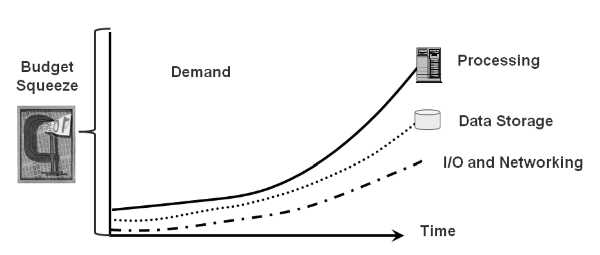
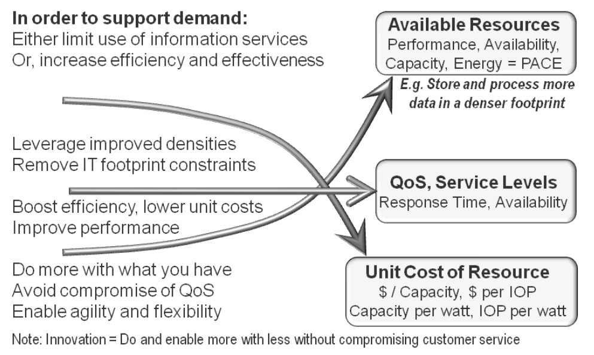
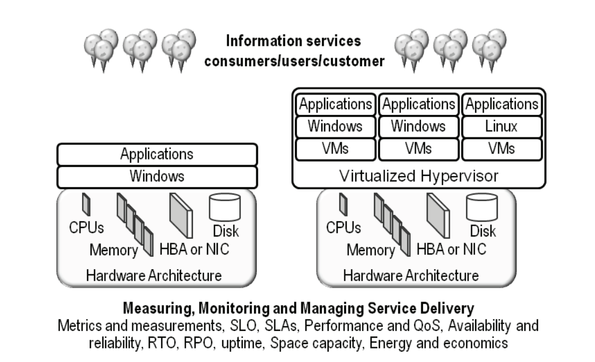
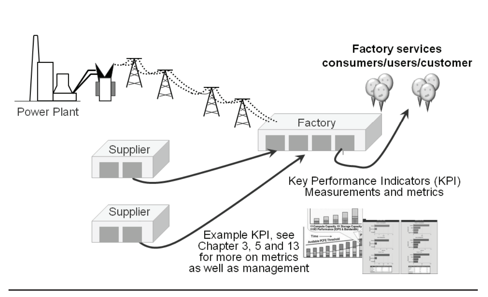
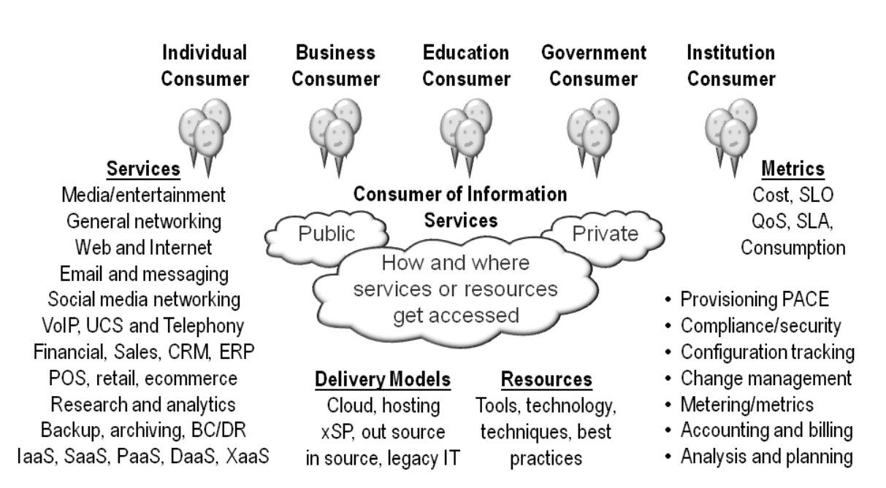
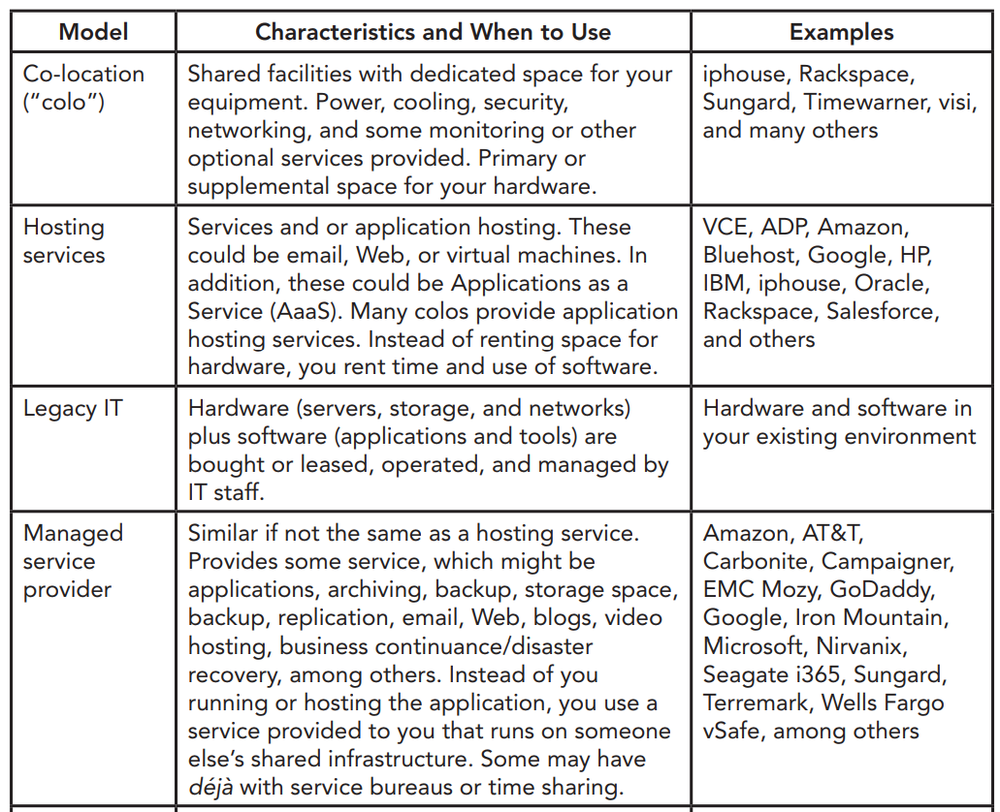
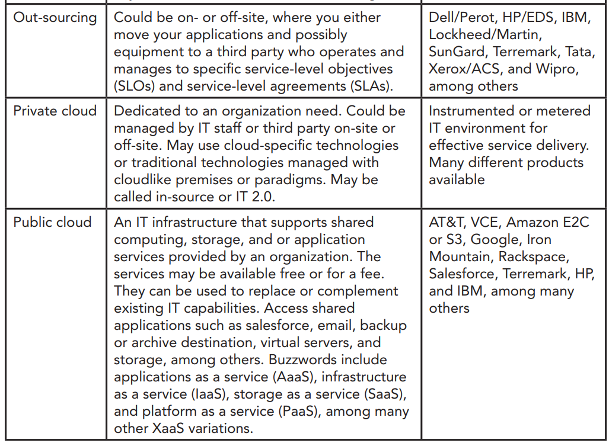
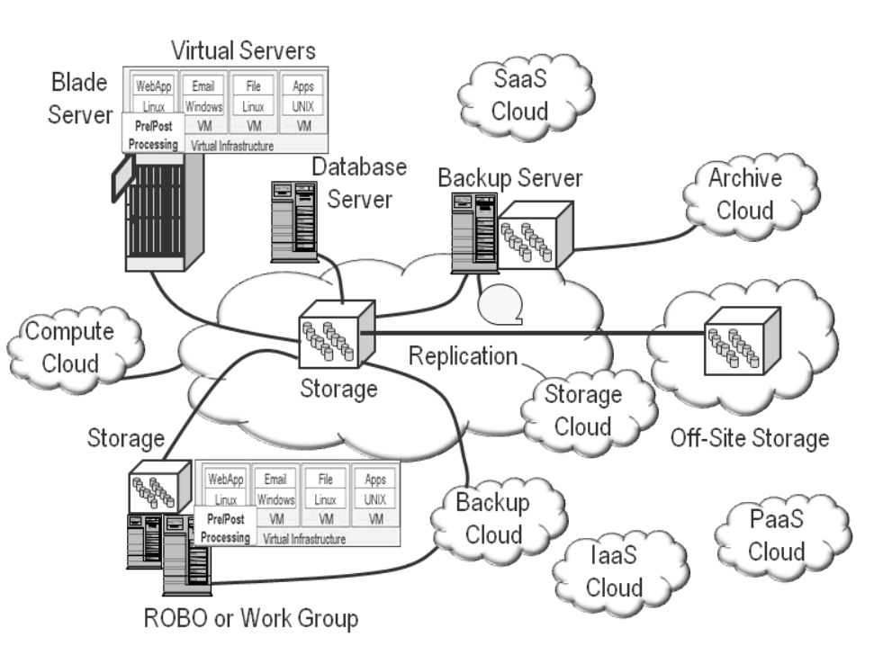

# Cloud và Virtual Data Storage Networking - Xu hướng và các khía cạnh (Industry Trends and Perspectives)
---
## Tổng quan
Thách thức lớn nhất của các tổ chức, doanh nghiệp hiện tại là sự bùng nổ dữ liệu, các công việc quản lý, tính ràng buộc, giá thành, thời gian, cơ sở vật chất, không gian, làm mát, năng lượng, khả năng khác thách, cùng với rất nhiều vấn đề kéo theo.

## Tầm quan trọng của Data và Storage
Chúng ta đang sống trong kỷ nguyên dữ liệu, vì thế yêu cầu về khả năng lưu dữ liệu rất cần thiết và trở lên cấp bách khi dữ liệu ngày càng lớn, không gian lưu trữ ngày càng càng giảm và các giải pháp truyển thống dần trở nên không đáp ứng được.

Data và các thông tin liên quan (metadata) được lưu trữ trên các hệ thống (storage system). Storage system là sự kết hợp các thành phần (applications, facilities, networks, servers, storage hardware, and software resources)

Tại thời điểm hiện tại, số lượng data đã lưu trữ đã cao hơn rất nhiều so với quá khứ, kéo theo các nhu cầu về năng lượng, cơ chế chi phí làm mát hơn trên mỗi GB, TB, PB, EB.

Vấn đề hiện tại phải đối mặt của các doanh nghiệp là mật độ lưu trữ dữ liệu ảnh hướng tới khả năng xử lý dữ liệu của doanh nghiệp, càng nhiều dữ liệu => càng thêm nhiều vấn đề phải xử lý, cần thêm nhiều hơn khả năng IO, khả năng lưu trữ, nhiều dữ liệu phải xử lý, di chuyển, sắp xếp, tổ chức, backup, lưu giữa trong thời gian dài.

> Tổng kết, việc bùng nổ dữ liệu khiến các tổ chức sẽ phải đối mặt với nhiều vấn đề hơn (Năng lượng tiêu thụ, nơi đặt, không gian, server, storage, tài nghiên mạng, quản lý, túi tiền, nhân viên)



## The Business End of IT Data Storage Impact
Sự mở rộng các đối tượng cần lưu trữ, từ small office/home office (SOHO) tới remote office/branch office (ROBO), small/medium-size business (SMB), small/medium enterprise (SME), tới ultra-large organizations or enterprises, economics.

Đi cùng với sự tăng trưởng dữ liệu là sự tin cậy, sự ràng buộc đối, tính toàn vẹn đối với dữ liệu, ... Khi có thêm thông tin => cần phải chi trả thêm cho công tác quản lý, lưu trữ. Khi dữ liệu có thể ảnh hưởng trực tiếp hoặc gián tiếp tới lợi nhuận, => việc cân bằng trở nên quan trọng. Vì vậy để hỗ trợ cho sự phát triển kinh tế, việc hỗ trợ, giám sát dữ liệu rất quản trọng. Công việc này sẽ kéo theo các chi phí về (phần cứng, phần mềm, nhân lực, cơ sở vật chất, năng lượng)

`Sự mới mẻ cần nhiều hơn những gì đã có`: yêu cầu về  chất lượng dịch vụ, không ảnh hưởng tới service-level objectives (SLOs), bao gồm chất lượng dịch vụ, trong khi đó có thể giảm giá thành vận hành. Để làm được đòi hỏi sự cân bằng tài chính.

Cân bằng tài chính bao gồm các vấn đề: Nhân lực, các quy trình, thời gian, túi tiền, cơ sở vật chất, năng lượng, làm mát, không gian, server, storage, phần cứng mạng, đi cùng với phần mềm, dịch vụ. Đảm bảo giảm giá thành, tăng chất lượng, đảm bảo các yêu tố SLO.

Giải pháp cho vấn đề: Chuyển dịch, chuyển đổi dần sang sử dụng các giải pháp dựa trên Cloud service.

```
service-level objectives (SLOs) là chất lượng dịch vụ thỏa thuận giữa nhà cung cấp là khách hàng, thỏa thuận rõ ràng giữa 2 bên

```
> Tìm hiểu thêm docs

Việc sử dụng cloud service sẽ giảm giá thành, tận dụng tối đa chi phí, QoS và SLOs. Đồng nhất hóa các thành phần, vướt qua các trở ngại, rào cản đang mắc phải, tối ưu chi phí duy trì, cải thiện trải nhiệm dịch vụ, bao gồm QoS và SLOs. Cho phép mở rông, hỗ trợ các giải pháp mới, cải thiện hệ thống hiệu quả.



> Tổng kết: Clouds, virtualization, và storage networks có thể là các tool, kỹ thuật, giải pháp hỗ trợ, đảm bảo sự tăng trưởng cùng với giảm giá thành, loại bỏ sự phức tạp, tăng sự linh hoạt, cải thiện trải nhiệm người dùng. hơn nữa, các công cụ, phương tiên, kỹ thuật hỗ trợ việc kinh hiệu quả hơn. Cho phép áp dụng giải pháp mới, tận dụng những gì đã có, bắt kịp sự phát triển.

## Sự tăng trường dữ liệu và sự phụ thuộc
Sự phổ cập hóa các thiết bị di động, thiết bị thông minh dữ trên ứng dụng web chỉnh là nguyên nhân dẫn đến sự tăng trưởng dữ liệu, yêu cầu sự mở rộng các giải pháp lưu trữ. 

Các dữ liệu không có cấu trúc như: Bảng tính, PowerPoint, slide, Pdf, word, web pages, video, audio, JPEG, MP3, MP4, photo, video, ...

VD:
- Gaming, security, and other surveillance video or security
- Unified communications including Voice-over-IP (VoIP)
- Rich media entertainment production and viewing
- Digital archive media management
- Medicine, life science, and health care
- Energy including oil and gas exploration
- Messaging and collaborations (email, IM, texting)
- Internet, Web, social media networking, video and audio
- Finances, marketing, engineering, and customer relations management (CRM)
- Regulatory and compliance requirements

Dữ liệu không cấu trúc có yều về hoạt động I/O khác nhau khi so sánh với dữ liệu có cấu trúc. 

VD: Các dữ liệu nhiều khi yêu cầu truy cập rất lớn, đôi khi rất ít truy cập. VD: Audio, video nổi bật trên các mạng xã hội, web ...

## Vấn đề Business và các thách thức công nghệ - (Business Issues and IT Challenges)
Các vần đề về kinh doanh, các thách thức, xu hướng bao gồm:
- Tăng tính đảm bảo thông tin, bảo đảm đáp ứng khi yêu cầu:
- Bảo đảm tính cạnh tranh với các sản phẩm tương tự
- Đáp ứng yêu cầu công ty
- Bảo đảm về sự phát triển tài nguyên(mức nhân viên, kỹ năng, túi tiền, tinh linh hoạt)
- Giảm giá thành trong khi không làm ảnh hưởng tới chất lượng dịch vụ (QoS, SLO)

`Data storage` ta đang và sử dụng hàng ngày nhưng ít người nhận thấy sự quan trọng của nó. Đa phân vấn đề này sẽ được coi như vấn đề của nhà cung cấp dịch vụ với các hệ thống máy chủ, network, workstation, app ... Vấn đề coi trọng đối với user cơ bản là chất lượng network.

Khi so sánh, data storage có tầm quan trọng = với network, server, phần cứng, phần mềm, ..

Các vấn đề doanh nghiệp gặp phải:
- Cần nhiều hơn không gian lưu trữ dữ liệu, xử lý, lưu trữ trong thời gian dài.
- Tăng tính bảo đảm, sẵn có, luôn sẵn sàng phục vụ.
- Giới hạn về nguồn lực, tài nguyên dẫn đến sự tắc nghẽn:
 - Đòi hỏi áp dựng công nghệ mới
 - Tài nguyên sẵn có về phần cứng, phần mềm, băng thông mạng
 - Túi tiền
 - Năng lượng, làm mát, không gian
 - Thời gian backup, bảo vệ
 - Các quy định, quy trính sẵn có
 - Các yêu cầu về hiệu năng, tính bảo đảm, không gian, năng lượng
- Bản quyền software, hardware, hỗ trợ
- Cơ sở hạ tầng cũ, tính tái sử dụng phức tạp
- Thời gian, nhân lực cần thiết cho hoạt động kinh doanh
- Tốc độ, độ chính xác của các tài nguyên cung cấp.

## Thử thách về Business và cơ hội (Business and IT Opportunities)

Khi nào thì cần xây dựng, đầu tư mở rộng cloud, virtualization, storage?
- Dựa trên yêu cầu các bài toán khác nhau. Tại 1 số trường hợp có thể tối ưu và tận dụng các thành phần đã có. Đối với trường hợp khác có thể lại thì có thể thay thế, đổi mới giải pháp. Tuy nhiên khi hạ tầng đến giới giạn, cần nâng cấp, thay đổi giải pháp cũ để loại bỏ các rào càn.

## Traditional Information Services Delivery/Model
Phương pháp truyền thống, mua hoặc thuê dịch vụ từ nhà cung cấp. Các thông tin về dịch vụ sẽ được chuyển tới người dùng. Người dùng từ đó truy cập tới app business đang chạy trên server nào đó. Phương pháp truy cập có thể thông qua network, hoặc 1 đường kết nới riêng từ Server cung cấp dịch vụ tới người dùng.

Server cung cấp dịch vụ có thể là ảo hỏa hoặc vật lý, với các yều cầu về OS, DB, công cụ hỗ trợ quản lý riêng tùy theo yêu cầu người dùng

Dịch vụ được thiết lập dạng dedicated or shared applications, chúng được gọi là (cloud and managed services). Có nhưng mô hình riêng khi cung cấp các dịch vụ khác nhau

Trong trường hợp ảo hóa và cloud, 1 số thành phần có thể là công nghệ mới hoặc được đóng gói lại từ các dịch vụ cũ, có sẵn từ trước.

> Dựa trên loại ứng dụng, có thể chuyển 1 phần sang cloud hoặc tất cả sang cao. Bên cạnh đó yêu cầu lựa chọn các nhà cung cấp dịch vụ, hosting,  



## Information Factories
Hầu hết các tổ chức IT hoặc hạ tầng sẵn có, có hỗ trợ các ứng dụng business, kèm theo các phương pháp quản lý, tổ chức thông tin. Trong 1 số trường hợp, business app cung cấp dịch vụ bởi IT bao gồm thông tin quản trị factories, accounting, marketing, and engineering, .... Tuy nhiên các thông tin cung cấp không đủ để giám sát, quản lý sâu dịch vụ.

VD: Các tổ chức có các phương pháp để ghi chép, giám sát các số liệu hệ thống, các vấn đề về hiệu năng, tính sẵn sàng, capacity, cấu hình, năng lượng, hệ sinh thái, ..

Traditional factories tận dụng các tool, kỹ thuật, metrics, tài nguyên, measurements và các kỹ thuật khác để xây dựng, cung cấp dịch vụ, truyển tải tới tầng dịch vụ (service level).

Factories có thể dạng dedicated hoặc private, có thể dạng chia sẻ tài nguyên hoặc dạng cung cấp riêng,  mô hình lai, tuy theo mục đích cung cấp, sử dụng, truyền tải. 

Các tổ chức có thể có factory riêng, hoặc có thể là hạ tầng ảo hoặc các dịch vụ cung cấp từ hạ tầng nhà cung cấp. IT service có thể được cung cấp thông qua hạ tầng các tổ chức khác dạng phần mêm thứ 3 hoặc ảo hóa



Tính chất tiêu biểu:
- Reliable, to meet demand, avoid downtime, avoid mistakes and rework
- Scalable, to meet changing workload demands
- Efficient, reduce waste, customer SLOs met in an economical manner
- Work is done quickly, yet reliably, with good quality
- Flexible capacity and ability to retool to meet changing needs
- Factories may be wholly owned, shared, or owned by a third party
- Factories consume materials and resources to create/deliver goods and services
- Those goods and services may in turn be consumed by other factories
- Factories produce product to a blueprint, template, or run book specifications

Khái niệm của Information factory bao hàm các vấn đề về cloud, virtualization, storage network, các mô hình public, private, lai.

Tiêu biểu Factory bao gồm:
- Dựa theo nhà cung cấp, hoặc các factory khác.
- Have bill of materials, metrics and measurements, costing information
- Quality assurances programs to ensure that QoS and SLOs are being met
- Focus on reducing defects and waste while boosting productivity to reduce cost
- Build templates for optimized information service delivery
- Best practices, processes, policies and procedures
- Balance of productivity, cost control, waste reduction, utilization, meeting SLOs
- Leverage new technologies that have good payback for enabling goals
- Cost-effective habitats for deploying and using technologies
- Efficiency gained with repeatable processes, and increased workload activity

Information factories có thể là:
- Private
- Public
- Hybrid

Information factories (or clouds) có thể có hoặc cho phép các tính chất:
- Multitenancy, measurability, and accountability
- For service providers, this can include chargeback
- Secure, flexible, dynamic, scalable, and resilient
- Able to relocate services as needed
- Rapid deployment and provisioning of resources
- Efficient, cost-effective resource usage that meets QoS and SLAs
- Automate and guide users or customers to best-fit services selection


## Cơ hội của Cloud, Virtualization, và Data Storage Networking
Các information factory đặt tại 1 địa điểm cố định sẽ kéo theo các tài nguyên về năng lượng, làm mát, các kỹ thuật, .... Sản phẩm IF là các information service, chúng có có thể là server, storage, network, ... 

> Các dịch vụ cung cấp đòi hỏi yêu cầu về khả năng phát hiện lỗi, tỷ lể lỗi thấp, đạt các tiêu chuẩn về QoS, hiệu năng, availability và sự cân bằng chi phí.

Với Cloud compute hoặc Storage providers, chi phí dịch vụ cung cấp của họ sẽ có giá thành rẻ hơn so với việc bạn tự xây dựng hạ tầng. Đồng thời sự đa dạng các dịch vụ được cung cấp.

Điểm mạnh của cloud cũng chính là điểm yếu của nó, khi nó tiết kiệm giá thành, tài nguyên, nó sẽ kéo theo các vấn đề về hiệu năng, availability, tính toàn vẹn dữ liệu, khả năng quản lý, và rất nhiều yếu tố khác ảnh hưởng tới chất lượng dịch vụ. 

Khi đánh giá cloud, ta không nên xem là 1 công nghệ cạnh tranh, thay thế mà ta nên coi nó là giải pháp bổ sung cho sự đa dạng các dịch vụ, tối ưu tài nguyên sẵn có, bổ sung thêm các nguồn lực cho dịch vụ.

Hiểu đơn giản cloud computing và storage đơn giản là lớp server hoặc kho dữ liệu có thêm các tính chất bảo đảm hiệu năng, tính bảo đảm, đáp ứng nhu cầu khác nhau. Mục tiêu chình của chúng là bổ sung thêm tài nguyên, nâng cao chất lượng dịch vụ, giảm giá thành, nâng cao khả năng xử lý dữ liệu, khả năng lưu trữ trong thời gian dài.

## IT Clouds and Virtualization: Not If, Rather When, Where, Why, and How
Có rất nhiều cách định nghĩa cloud. Cơ bản, cloud computing là 1 mô hình, định nghĩa vẫn đang được phát triển, có khái niệm khác nhau khi so sánh các công nghệ cloud khác nhau.

Cloud được định nghĩa khác nhau qua từng khía cạnh dựa trên quan điểm từng lĩnh vực. Góc nhìn nghiên cứu => cloud là làn sóng của tương lai. Với IT professional, chúng là giải pháp cho mọi vấn đề đang gặp phải của doanh nghiệp. Cloud còn là hình ảnh ẩn dụ cho các thành phần mạng (internet) trong nhiều thế kỷ qua.

1 thuộc tính quan trọng trong cloud là sự trừ tượng hóa các thành phần phức tạp bên dưới đồng thời cho phép cung cấp dịch vụ linh hoạt, hiệu quả hơn. Đây cũng là vấn đề gây nhầm lẫn khi nói đến cloud. Đôi khi cloud được nhầm là các công nghệ đã cũ đóng gói lại.

## What are IT clouds? Where do they fit?
Có thể bạn đã và đang sử dụng cloud, các sản phẩm dựa trên cloud, các kỹ thuật lưu trữ, hoặc 1 số sản phẩm tương tự nhưng ko nhận thấy.



Các tính năng cơ bản cloud hoặc service bao gồm:
- Remote or off-site backup, replication, vaulting, or data copy
- Remote or off-site storage on-line, near-line, or off-line
- Email and messaging services including social media networking and Web 2.0
- Archive, fixed content, and other reference or look-up data
- Website, blog, video, audio, photo, and other rich media content hosting
- Application hosting (e.g., salesforce.com, concur expense, social media)
- Virtual server or virtual machine (VM) hosting (Amazon, VCE, etc.)
- General on-line storage or application-specific storage such as Google Docs

Sự nhầm lẫn xuất hiện do có quá nhiều loại cloud, bao gồm public, private, sản phẩm, dịch vụ, 1 số có giao diện, giao thức giống nhau nhưng lại khác biệt về mặt công nghệ. Cloud có thể là 1 dịch vụ, 1 sản phẩn, 1 kiến trúc, 1 mô hình quản lý, ..

## Private Cloud: Coexistence vs. Competing with Legacy IT (Khả năng tương thích, kế thừa tài sản hiện có)




# Cloud, Virtualization, and Storage Networking: Bringing It Together (for Now)

Cách cloud, virtualization, networking technologies và các kỹ thuật khác kế hợp với nhau.



# Nguồn 
