# Cloud, Virtualization, and Data Storage Networking Fundamentals
---
## Tổng quan
Chúng ta sử dụng các dịch vụ cloud và Virtual Data Storage mỗi ngày nhưng đôi khi lại không nhận thấy hoặc không hiễu rõ về nó. 

1 số vấn đề cơ bản, khi không gian lưu trữ tới giới hạn, ta không thể tìm thêm không gian lưu trữ hoặc khi xảy ra các thảm họa (cháy, lụt, virus, hỏng hóc, ..) ta nhận ra dữ liệu chưa được backup, được bảo vệ. Chí phí cũng là 1 vấn đề phải đối mặt, khi dữ liệu tăng lên từng ngày => chi phí bỏ ra cho việc lưu trữ tăng lên. Đặc biệt, khi ta đang sống trong kỹ nguyên bùng nổ dữ liệu, việc bảo đảm dữ liệu sẽ là 1 vấn đề đáng quan tâm.

Bên cạnh đó, còn rất nhiều tài nguyên cần hỗ trợ Information services, bao gồm các app, ứng dụng quản lý. Quan trọng không kém là khả năng IO, Networking giữa server và data storage, các nhiệm vụ infrastructure resource management (IRM), các tiến trình xử lý, ...

## Server và Storage I/O Fundamentals
Server, cũng đc gọi là các computer, đóng vài trò rất quan trọng trong cloud, ảo hóa, data storage networking. Về cơ bản, server sẽ chạy các ứng dụng chuyên dụng, hỗ trợ cung cấp các Information Service. Các chương trình này chịu trách nhiệm tạo các tiến trình IO dữ liệu, các truy cập network. 1 vài trò khác của server trong cloud và virtualized data centers là lưu trữ dữ liệu, thực hiện các nhiệm vụ với mục đích lưu trữ.

Server có nhiều loại tùy theo giá, hiệu năng, tính sẵn sàng (availability), khả năng lưu trữ (capacity), năng lượng tiêu thụ (energy consumption). Sự đa dạng của chúng hướng tới giải quyết các vấn đề khác nhau trong giải pháp cloud. 1 loại khác của server là virtual server, khi chúng là các hypervisor (vd Microsoft Hyper-V, VMware vSphere, or Citrix Xen ....). Chúng được sử dụng để tạo các VM từ physical machines. Cloud-based compute hoặc server resources sẽ chia sẻ tài nguyên vật lý tới các VM.

Sự đa dạng computer hoặc server tập trung vào các đối tượng khác nhau (office, business, enterprise, ...) chúng sẽ giải quyết các vấn đề tùy theo các giải pháp.

## Danh mục các loại computer và server bao gồm (General categories of servers and computers include):
- Laptops, desktops, and workstations
- Small floor-standing towers or rack-mounted 1U and 2U servers
- Medium-sized floor-standing towers or larger rack-mounted servers
- Blade centers and blade systems
- Large-sized floor-standing servers, including mainframes
- Specialized fault-tolerant, rugged, and embedded processing or real-time servers
- Physical and virtual along with cloud-based servers

Server có nhiều tên khác nhau: email server, database server, application server, Web server, video or file server, network server, security server, backup server, or storage server, các đặt tên này dựa theo trách nhiệm của chúng. Đây cũng là vấn đề gây lẫn về server. Vì 1 server có thể hỗ trợ nhiều dịch vụ khác nhau nên khó có thể đặt tên chuyên dụng cho nó. Vì vậy ta nên cân nhắc server có dạng storage, server hoặc 1 phần của network, hoặc app platform. 

Đôi khi thuật ngữ "appliance" được sử dụng cho server (loại server riêng biệt) khi dịch vụ cung cập được kết hợp dựa trên hardware và software. Về mặt kỹ thuật đây không phải 1 loại server, 1 số nhà sản xuất sử dụng thuật ngữ "tin-wrapped" software để tránh sự nhẫm lẫn appliance, server

1 dạng phát triển của "tin-wrapped software model" là software-wrapped appliance hoặc virtual appliance. Dưới dạng các model, các nhà cung cấp sử dụng VM để host software của họ trên cùng server physical, hoặc các appliance được sử dụng cho nhưng mục đích riêng.

> VD: nhà cung cấp DB cung cấp các VM chạy sẵn sản phẩm của họ trên cùng Physical server. Giải pháp này tối ưu tài nguyên server nhưng vấn đề  sẽ xuất hiện khi các VM chạy quá mức ảnh hưởng tái các VM còn lại. Vấn đề này trở nên nghiêm trọng khi các VM đang trong giải đoạn nhạy cảm (backup, IO, ..)

> Keep in mind that cloud, virtual, and tin-wrapped servers or software still need physical compute, memory, I/O, networking, and storage resources.

## Server và kiến trúc IO - Server and I/O Architectures
Về cơ bản, các nhà cung cấp sẽ có nhưng kiến trúc khác nhau. Kiến trúc bao gồm CPU, Memory, internal busses hoặc các  communication chips, I/O port, tương tác giữa các port của kiến trúc với network, các loại storage device, ... Computer cần thực hiện hoạt động IO trên các thiết bị khác nhau, và thành phần quan trọng để thực hiện quá trình IO, networking connectivity là Peripheral Component Interconnect (PCI) standard interface.

PCI là chuẩn chipset sử dụng cho kết nối giữa CPU và Memory với các thiết bị IO, các thiết bị mở rộng. Có rất nhiều chuẩn PCI định nghĩa bởi PCI Special Interest Group (PCISIG): PCI Express (PCIe), PCIx, Fibre Channel, Fibre Channel over Ethernet (FCoE), InfiniBand Architecture (IBA), SAS, SATA, Universal Serial Bus (USB), and 1394 Firewire.

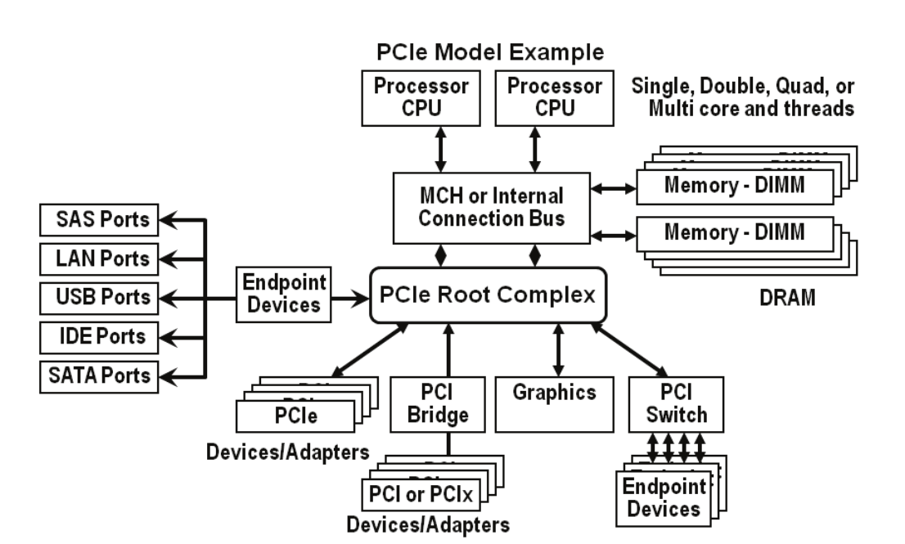

> Tham khỏa thêm docs

Các thành phần cơ bản trên server:
- Compute or CPU chips or sockets
- One or more cores per CPU socket or chips capable of single or multithreading
- Internal communication and I/O buses for connecting components
- Some main memory, commonly dynamic random access memory (DRAM)
- Optional sockets for expansion memory, extra CPUs, and I/O expansion slots
- Attachment for keyboards, video, and monitors (KVM)
- I/O connectivity for attachment of peripherals including networks and storage
- I/O networking connectivity ports and expansion slots such as PCIe
- Optional internal disk storage and expansion slots for external storage
- Power supplies and cooling fans

Dựa trên giá thành, và các giải pháp khác nhau, các computer sẽ có số lượng Core, tốc độ xử lý, RAM, khe mở rộng (PCI) khác nhau.

## Kiến trúc storage - Storage Hierarchy
Kiến trúc storage liên quan đến các vấn đề từ memory tới các thiết bị mở rộng, bao gồm tài nguyên ảo, cloud. Server cần các hoạt động IO networking để kiên kết tới server khác, truy cập theo các phương pháp khác nhau (local, remote, cloud storage resources).

Tốc độ truy cập tới các thành phần L1, L2, trên CPU sẽ có tốc độ khác nhau (từ nhanh tới chậm, đố lớn khác nhau). Nhanh nhất => đi cùng với giá thành cao, kém linh hoạt. Chậm => độ lớn nhiều, giá thành vừa phải, độ linh hoạt cao (ứng với memory ~ các thiết bị storage).
> Xem thêm docs

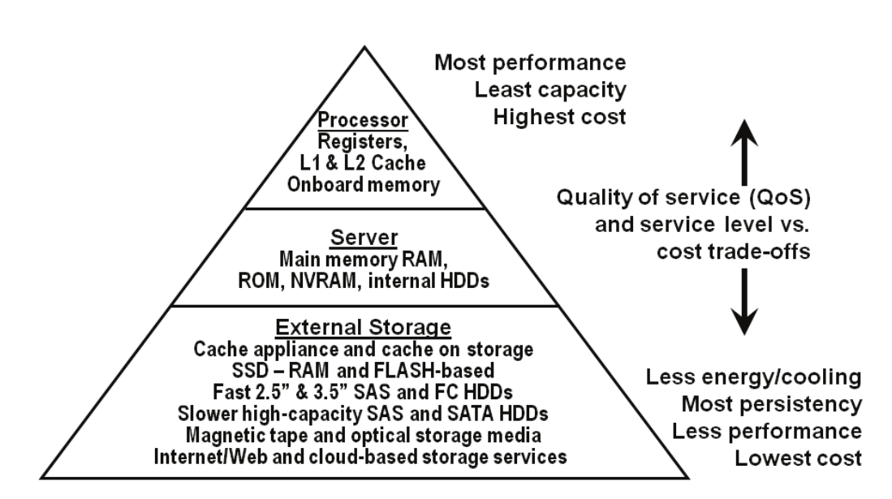

Các VM cần memory, các thiết bị ngoại vị, thiết bị mở rộng để hoạt động (tài nguyên lấy này lấy từ server vật lý ra) => VM đc coi là thành phần phần ảo, sử dụng cấu trúc dữ liệu riêng, truy cấp tài nguyên chia sẻ có sẵn từ cloud, system. Càng nhiều VMs càng đòi hỏi nhiều Memory.

Các ứng dụng sẽ đòi hỏi các tài nguyên khác nhau, VD: Các app, DB, video render, các chương trình phân tích thông số, .... sẽ có yêu cầu khác nhau.

Các loại Storage có thể phân loại (NVRAM, FLASH base) hiêu năng sẽ khác nhau => giá thành khác nhau.

(các loại hdd, ssd, rpm, raid tài liệu tìm hiểu khóa luận trước)
> Xem thêm docs

## Disk Storage Fundamentals

Storage có thẻ là dedicated internal Direct Attached Storage (DAS) hoặc external shared DAS, hoặc các công nghệ software-base, cloud-base

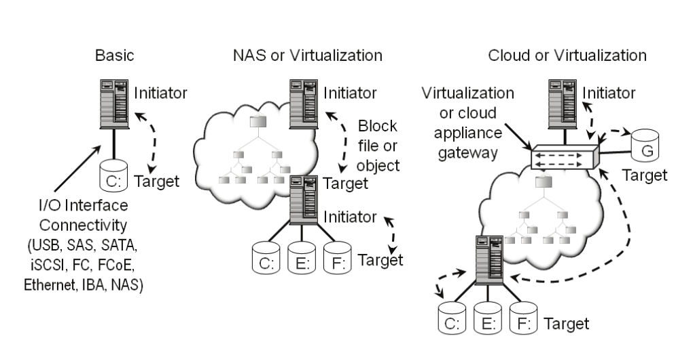

Các giải pháp yêu cầu khả năng I/O target vào các thành phần block, file, object. Các chuẩn kết nối (e.g., SAS, iSCSI, Fibre Channel, FCoE, or SRP on InfiniBand), where the target is a SCSI logical unit (LUN).

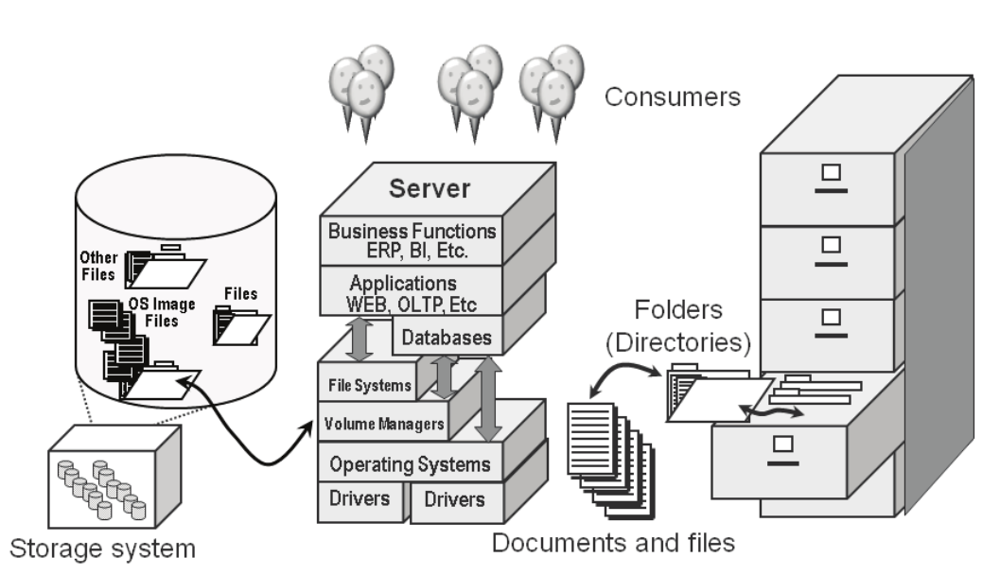

Các vấn đề về ổ đĩa, ....

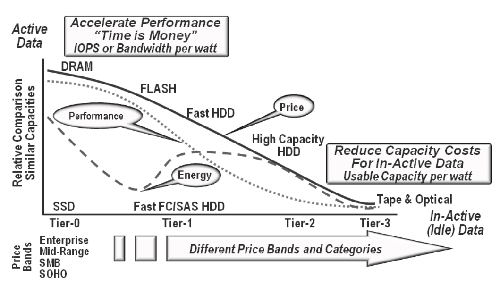

## Block Storage Access

Block-based data access là mức truy cập thấp nhất và mức cơ bản nhất khi xây dựng thành phần block cho tất cả các loại storage. Vì vậy block-based data access thích hợp cho cloud, virtualized storage cũng như storage networks. Tất cả các request tới file, object, hay file system, database, email ... cuối cùng đều sẽ bóc tách, cuối cùng xử lý tại mức thấp nhất block data, các đọc hoặc ghi sẽ diễn ra trên đó.

Các ứng dụng truy cập file system, các loại database, chương trình quản lý thư mục, .... đều đa trừ tượng lớp block-based. Mức trừ tượng có nhiêu mức, trên ổ đĩa, trên storage system, controller, RAID, hay các tầng ảo hóa của virtualized storage, trên các  device drivers, các volume manager, databases, và các application.

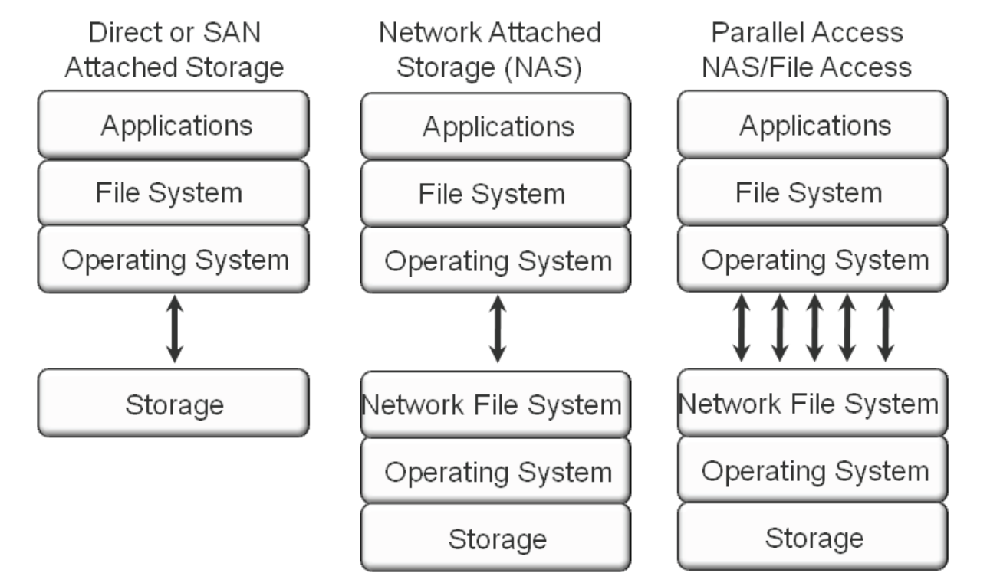

## Files Access, File Systems, and Objects

File Based data truy cập vào các dữ liệu không cấu trúc (unstructured data) đang tăng lên nhanh chóng vì đặc tính lưu trữ dữ liệu. File-based data access đơn giản là lớp bên trên, trừ tượng hóa block-based, cho phép truy cập thông tin dưới dạng File name.

File system software cung cấp trừ tượng hóa truy cập file-based trên local hoặc remote. Tổ chức dữ liệu = dạng folder or directory đễ dễ dàng quản trị.

(các hệ thống NAS, DAS, SAN ..)

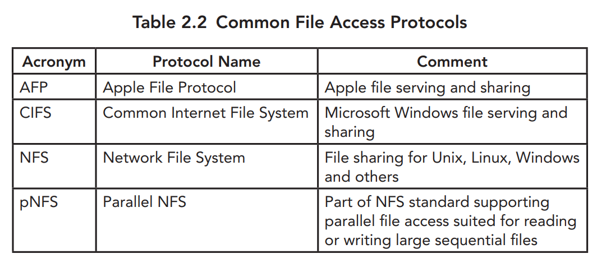

## Object and API Storage Access
Object-based storage hoặc content-addressable storage (CAS), tiếp tục kế thừa và xây dựng trên block, file storage access models. Thay vì truy cập storage system dựa trên file access, đọc ghi dữ liệu bằng các file system, object based storage làm việc với các object.

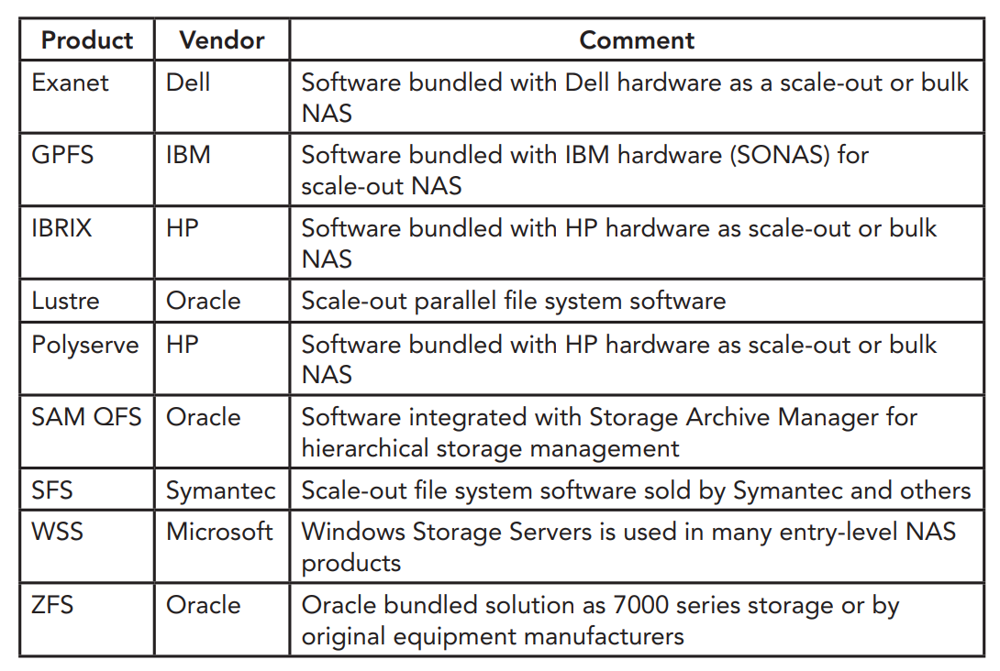

Đối với block- và file-based storage, app khi làm việc với dữ liệu, sẽ tương với các địa chỉ vật lý đi kèm các metadata. Với object storage, data sẽ lưu dưới dạng object chứa thông tin, metadata (quản lý = các metadata). Object được định nghĩa bởi app hoặc các đối tượng (trừa tượng thông tin vật lý). Các hoạt động truy vấn, đọc ghi dữ liệu dựa trên key object.

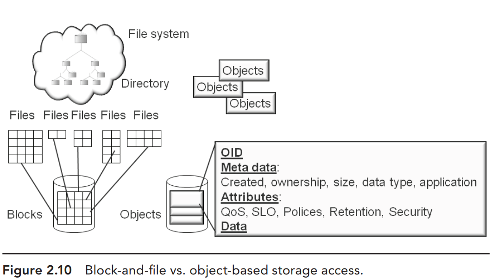

## I/O Connectivity and Networking Fundamentals

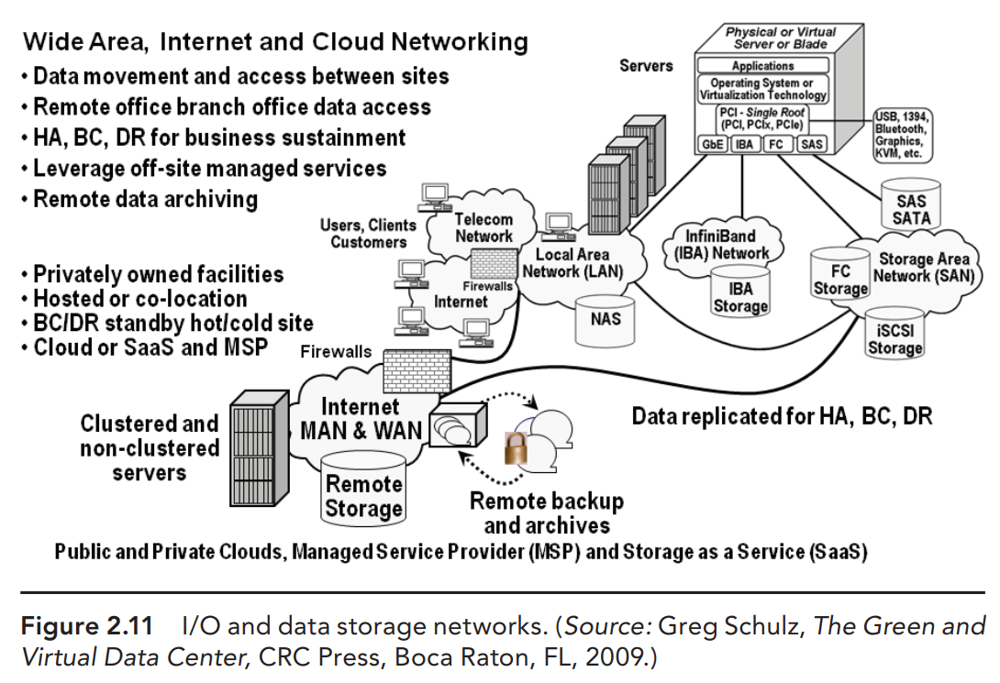

Có rất nhiều phương thức IO, các giao thức networking protocol, các chuẩn kết nối interface. Các giao thức storage IO có nhưng tiêu chuẩn riêng đễ hỗ trợ truyền data giữa các server, storage cũng như giữa các storage device.

Local area networks (LANs) và wide area networks (WANs) sử dụng cho:
- Accessing and moving data to or from public/private clouds
- Data movement, staging, sharing, and distribution
- Storage access and file or data sharing (NAS)
- High-availability clustering and workload balancing
- Backup/restore for business continuance and disaster recovery
- Web and other client access, including PDAs, terminals, etc.
- Voice and video applications including Voice-over-IP (VoIP)

Thuật ngữ networked storage thường nói về NAS và SAN. Trong bối cảnh truy cập storage thông qua IO network.

> SAN and NAS are both part of storage networking. SAN is associated with Fibre Channel block-based access and NAS with LAN NFS or CIFS (SMB) file-based access.

Các giao thức, interface chuẩn  Fibre Channel, InfiniBand, Serial Attached SCSI (SAS), and Serial ATA (SATA) as well as Ethernet-based storage.

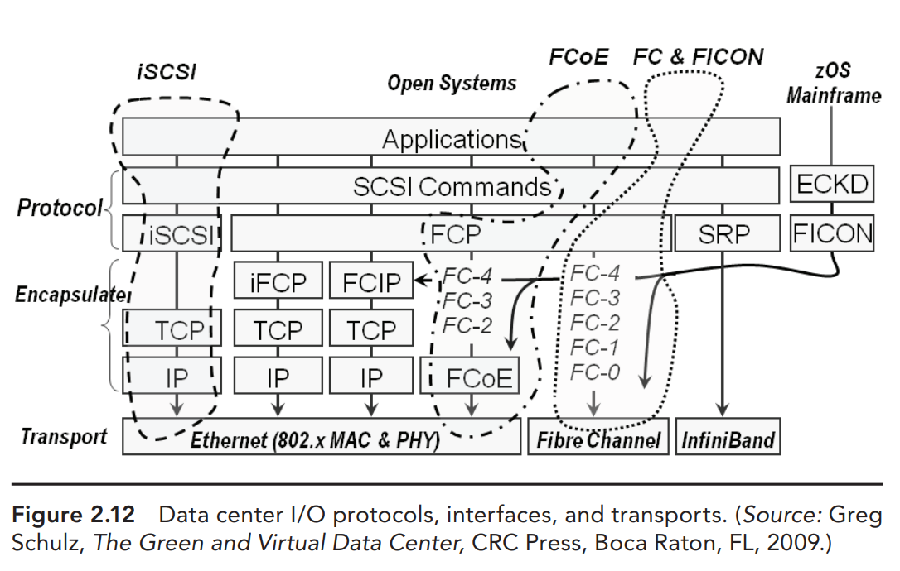

## IT Clouds
Có rất nhiều loại hình cloud (public, private, hybrid), các cloud sẽ có chức năng khác nhau khi nói đến từng mảng, từng giải pháp và tùy theo mô hình triển khai.
> 1 số public cloud cho phép truy cập thông qua API (REST, DICOM, SOAP, or others)

Tính năng sẽ được xây dựng dựa trên giá thành, SLA, loại hình dịch vụ service hoặc mục tiêu sản phẩm. 1 số service hoạt động dựa trên hạ tầng (Infrastructure), chúng có thể là dedicated hoặc isolated, hỗ trợ theo vị trí địa lý, tích hợp bảo mật, khả năng quản trị.

Cloud cũng có thể là các sản phẩm, công nghệ, cũng như mô hình quản trị. Có thể bao trùm nhiều công nghệ khác nhau (DAS, SAN, NAS, ...) server, networking protocol, các phương thức, ...

Dịch vụ cloud bao gồm các app đặc biệt, chuyên dụng - cung cấp các tính năng quản trị, backup, restore, recovery, các phần mêm phân tích số liệu, database, data warehousing, document sharing, office, các giải pháp storage, object storage, video, vm, ..

Qui chuẩn service. Các từ viết tắt: `x as a Service`, trong đó x có thể là:
- Archive as a Service (AaaS)
- Application as a Service (AaaS)
- Backup as a Service (BaaS)
- Desktop as a Service (DaaS)
- Disk as a Service (DaaS)
- Infrastructure as a Service (IaaS)
- Platform as a Service (PaaS)
- Software as a Service (SaaS)
- Storage as a Service (SaaS)
- ....

## Virtualization: Servers, Storage, and Networking
Có rất nhiều khía cạnh khi nói đến ảo hóa. Các công nghệ ảo hóa được tiếp cận, phát triển, góp phần nâng cho chất lượng dịch vụ của các nhà cung. Nâng cáo hiệu năng, tài nguyên server, storage. Giảm thiểu năng lượng, chi phí làm mát, không gian, phương pháp quản trị, tài sử dụng, tái tận dụng, tăng sự đa dạng.

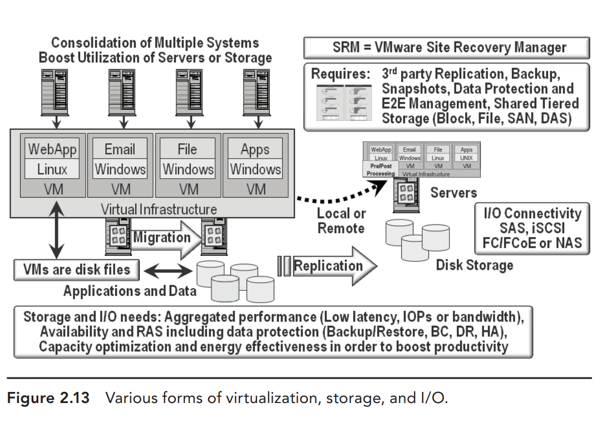

> Sơ đồ mô hình, kiếm trúc cơ bản

1 khía cạnh quan trọng của ảo hóa là khả năng tích hợp công nghệ mới vào hạ tàng, tài nguyên, môi trường sản phẩm đã có, và sự thay thế các công nghệ cũ.

Ảo hóa cũng được sử dụng để linh hoạt hóa, điều chỉnh tài nguyên, nguồn lực cho các vấn đề khác nhau theo kế hoạch, hoặc ko theo kế hoạch. Bên cạnh đó, nó cho phép bảo trì linh hoạt mà không làm ảnh hướng đến toàn hệ thống.

## Virtualization and Storage Services
Các storage virtualization service khác nhau hoạt động tại các vị trí khác nhau, hỗ trợ các thành phần khác nhau trong cloud.

1 trong nhưng khái thường nói đến storage virtualization là sự tập hợp (aggregation) và giải pháp hồ chứa (pooling solution). 2 vấn đề nhằm cung cố các thành phần LUNs, file system, .. các tính năng quản trị, khả năng lưu trữ, tính bảo vệ (investment protection), khả năng quản trị dữ liệu không đồng nhất trên các  tiers, categories, and price bands of storage from various vendors.

Hầu hết các storage virtualization solutions sử dụng khái niệm trừ tượng (abstraction). Tính trừ tượng (Abstraction) và minh bạch trong công nghệ (technology transparency) bao gồm device emulation, interoperability, coexistence, backward compatibility, transition to new technology with transparent data movement and migration, support for HA and BC/DR, data replication or mirroring (local and remote), snapshots, backup, and data archiving.

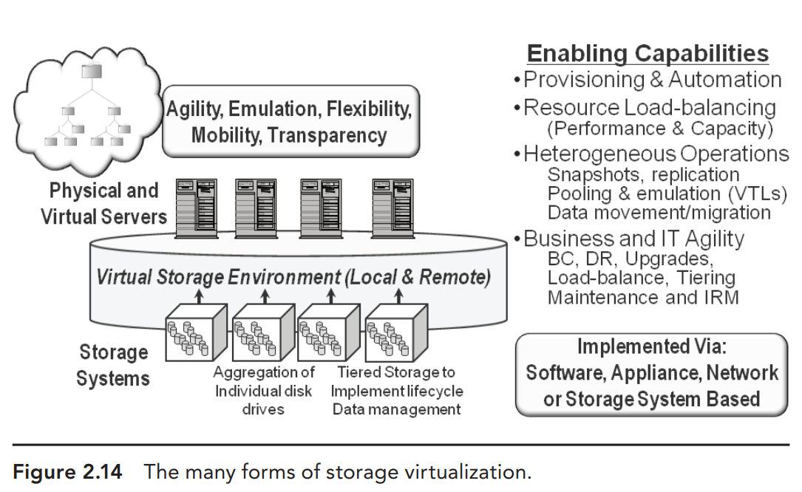

## Data and Storage Access
Quan hệ, sự phụ thuộc giữa các thành phần lưu trữ

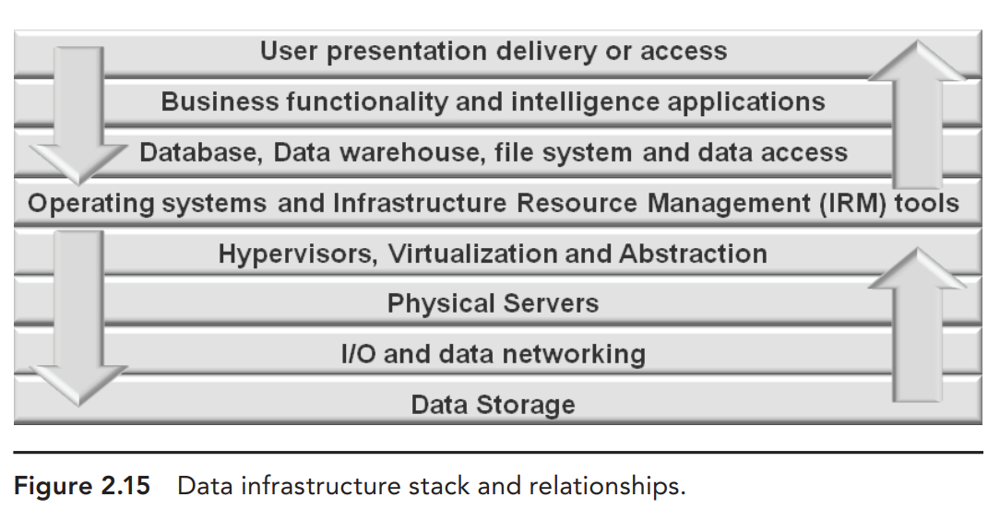

1 số mô hình, hạ tầng từ cơ bản tới phức tạp

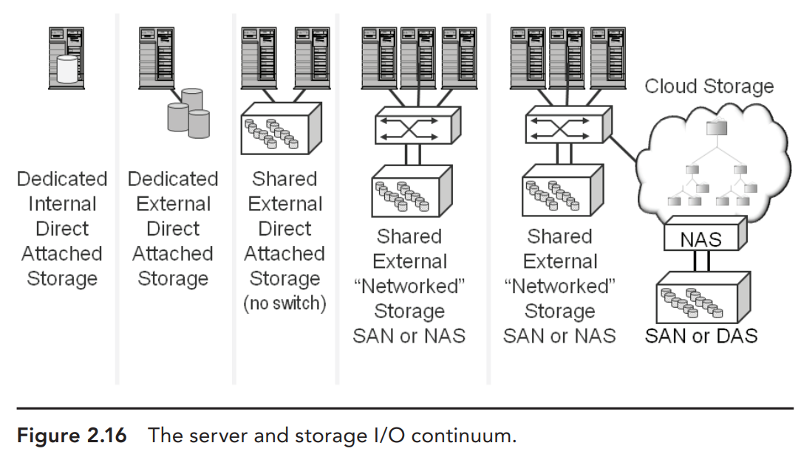

## Mô hình DAS, NAS, SAN

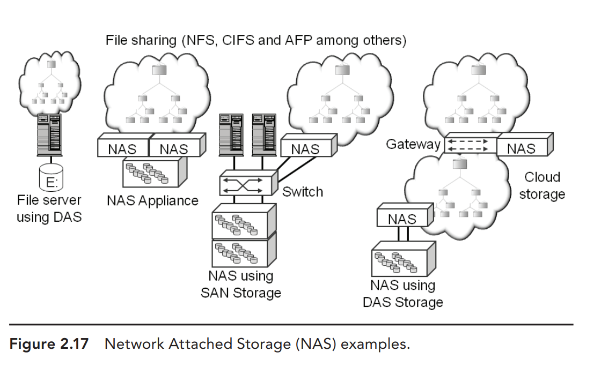

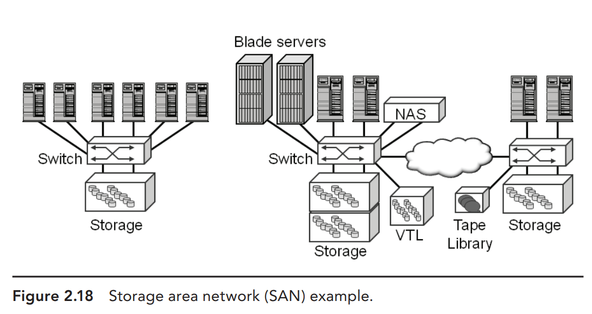

> Xem thêm docs

## Networked Storage: Public and Private Clouds

Mô hình cloud kết hợp DAS, NAS, SAN storage
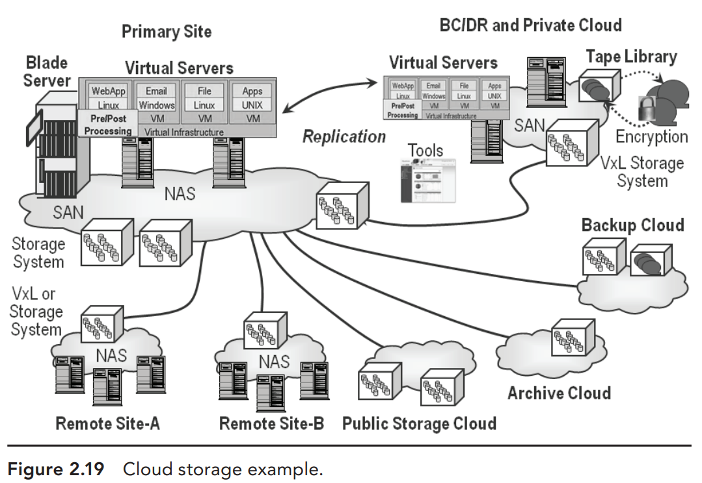

Bảng tổng hợp các thuật ngữ

