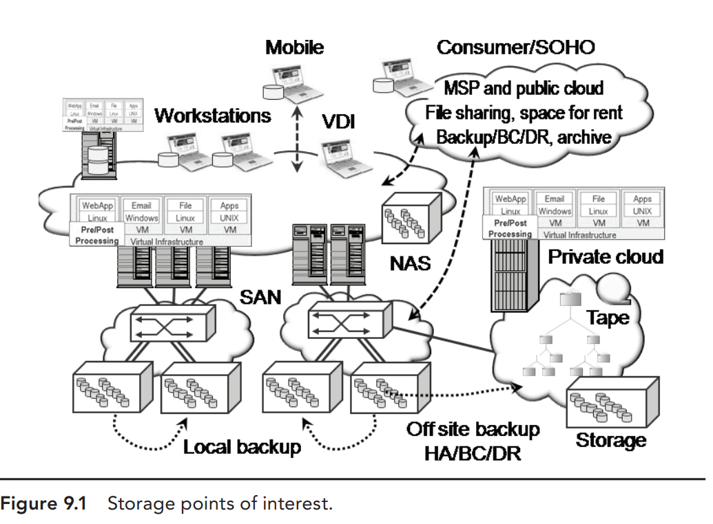
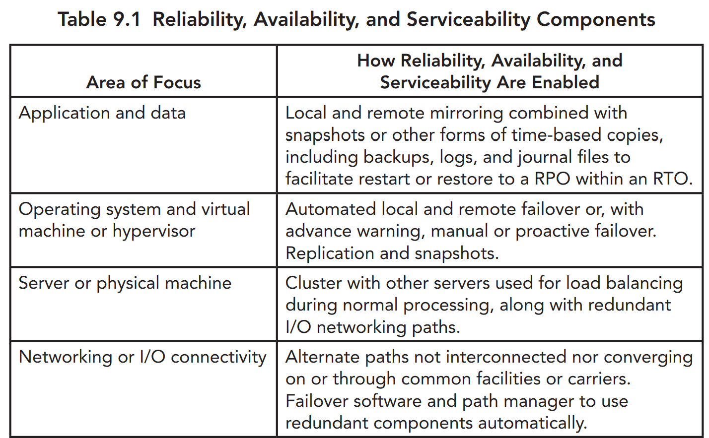
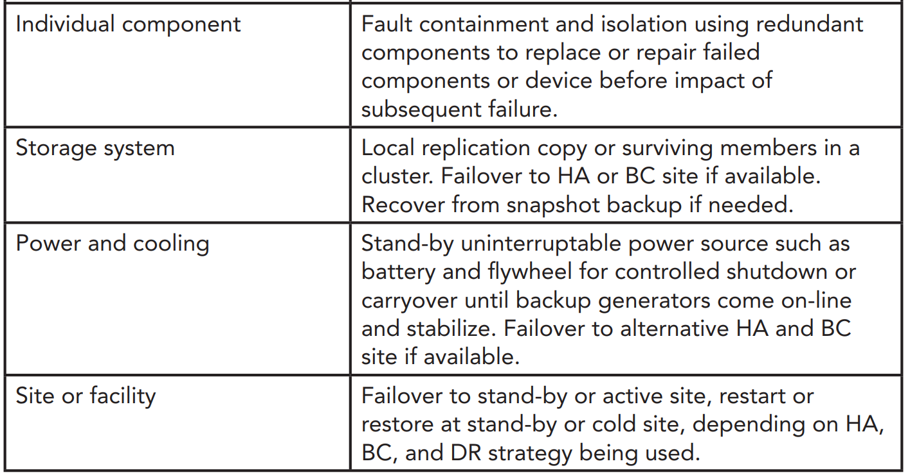
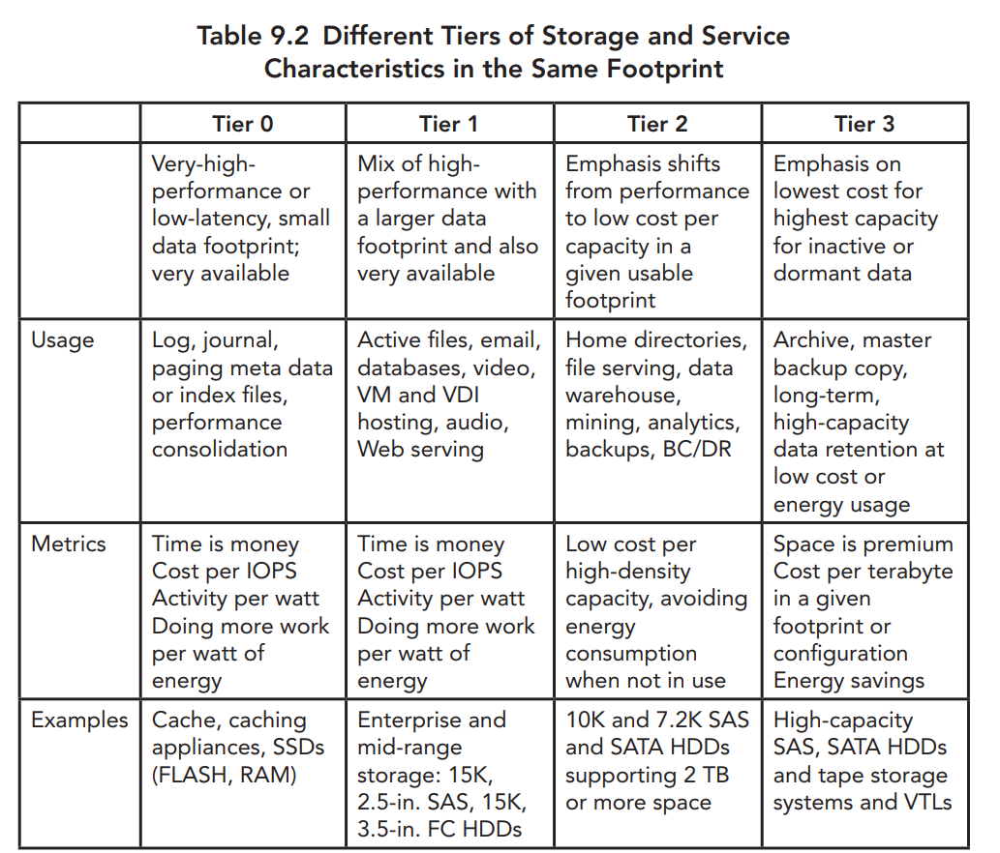
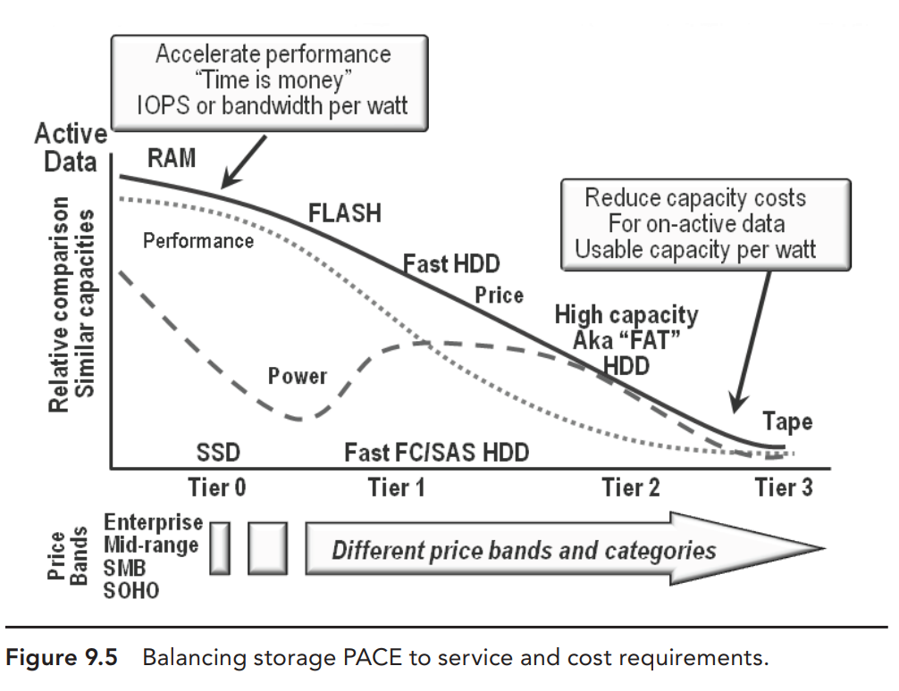
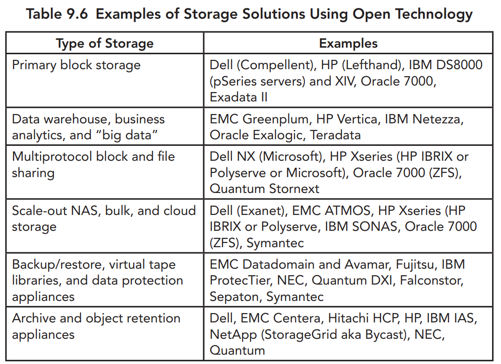
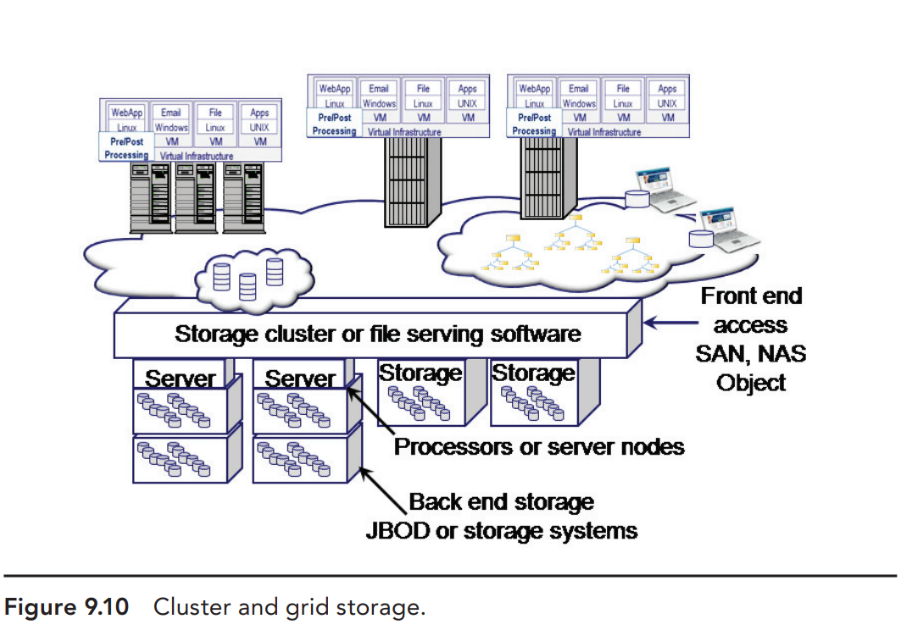
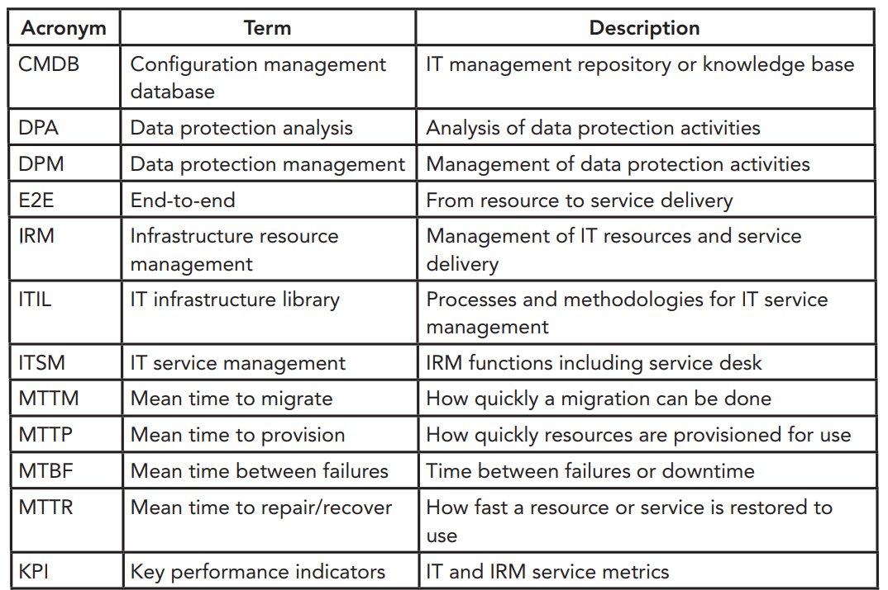
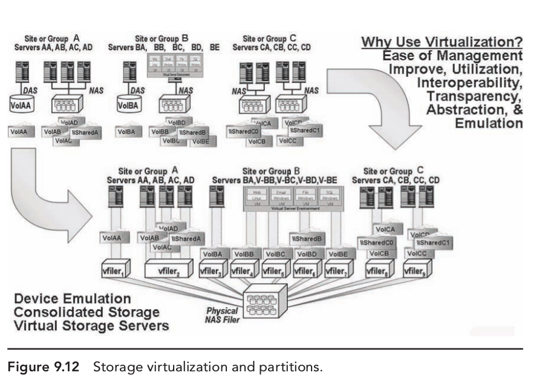
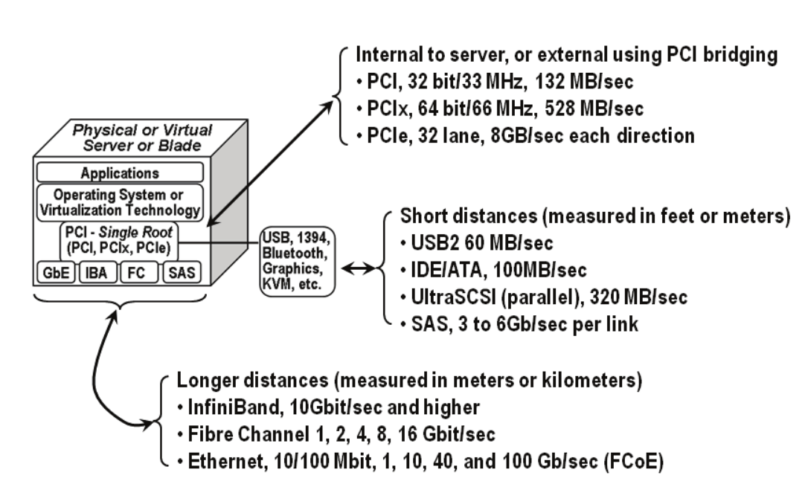

# Dịch vụ Storage và hệ thống - Storage Services and Systems
---
## Tổng quan
Công nghệ Data storage được sử dụng để lưu trữ, truy cập local or remote, chia sẻ tài nguyên sử dụng cho app, vm (trong or ngoài mạng). Có nhiều loại storage để phục vụ các yêu cầu khác nhau.

Các storage có thể được tìm thấy trong SAN, NAS, cloud system, server, workstations, laptop, ... Các loại storage khác nhau có tính năng, chức năng, mục đích, kiến trúc, giá thành, chất lượng khác nhau. 1 số giải pháp storage tập trung cho 1 mục đích nhất được, 1 số khác phục vụ cho thương mai.

> 1 số storage được xây dựng dạng opensource software

Các tính chất cơ bản storage:
- Internal or external to a server, or dedicated or shared with others
- Performance in bandwidth, activity, or IOPS and response time or latency
- Availability and reliability, including data protection and redundant components
- Capacity or space for saving data on a storage medium
- Energy and economic attributes for a given configuration
- Functionality and additional capabilities beyond read/write or storing data

> Góc nhìn cơ bản storage

## Lớp Storage - Tiered Storage
Mục đích của Tiered storage là định hình các lớp storage system, các mức hiệu suất, availability, capacity, and energy or economics (PACE) capabilities để đáp ứng các yêu cầu của ứng dụng.

Các thiết bị lưu trữ ssd, hdd được sử dụng cho đáp ứng từng tiered storage khác nhau.

Bên cạnh đó, storage tiering có định nghĩa khác nhau đối với từng khía cạnh. VD 1 số cho rằng nó mô tả khả năng lưu trữ, 1 số khác cho rằng nó mổ tả các hệ thống lưu trữ sử dụng cho hoạt động kinh doanh, ứng dụng, cung cấp các dịch vụ lưu trữ. 1 số phân loại storage tiers bằng giá và số tiền phải trả cho giải pháp. 1 số khác coi nó là size và capacity hoặc tính năng

## Storage Reliability, Availability, and Serviceability (RAS)

Mục đích cơ bản storage là đảm bảo tính toàn vẹn, tính ràng buộc dữ liệu. Tất cả các loại công nghệ, bao gồm storage đều có thể lỗi - Các vấn đề phát sinh từ phần cứng đến lỗi phần mêm. Các lỗi phát sinh ro tác động con người, do điều kiện môi trường, các vấn đề do năng lượng, làm mát, ...

Storage reliability, availability, and serviceability kết hợp:
- Redundant components: power, cooling, controllers, spare disks
- Fault containment: automatic leveraging of redundant components
- Self-healing: error correction, data integrity checks, rebuild and repair
- High availability: redundant components, replication with snapshots
- Business continuance: failover or restart at alternate site
- Disaster recovery: rebuild, restore, restart, and resume at alternative site
- Management tools: Notification, diagnostics, remediation and repair

Để bảo đảm storage reliability, availability, and serviceability, sẽ có từng các yêu cầu đặc biệt đối với từng dịch vụ:

## Aligning Storage Technology and Media to Application Needs
Do sự đa dạng các loại dữ liệu từ trực tuyến => ngoại tuyến, tính truy cập khác nhau vì vậy giải pháp lưu trữ cần tối ưu theo nhiều hướng khác nhau để đáp ứng, tối ưu hóa trên từng vấn đề.

Tiered storage bao gồm các thiết bị từ tốc độ nhanh, hiệu năng cao tới hiệu năng chậm, khả năng lưu trữ lớn.

Đối với tier 0, sử dụng SSD và cache cung cấp khả năng IOPS tốt, độ trễ thấp, đánh đổi là khả năng lưu trữ sẽ thấp và giá cả cao.

Với tier 1, không yêu cầu độ trễ thấp nhưng vấn cần hiệu năng cao, dung lượng lớn => Lựa chọn có hdd 15k RPM, nó sẽ vừa đủ đáp ứng yêu cầu về IOPS, băng thông và khả năng lưu trữ.

Với tier 2 3, sẽ sử dụng cho data có tần suất truy xuất thấp, nhưng đòi hỏi khả năng lưu trữ cao (hàng trăm tb, ...)

Các vấn đề cần cân nhắc khác là RAID, sự đánh đổi hiệu năng >< khả năng lưu trữ giữa các loại RAID

> Tìm hiểu Raid theo docs

Đánh đổi giữa chất lượng và giá thành

> Tìm hiểu các loại ổ đĩa theo docs

## Storage System Architectures

Các giải pháp Storage xây dựng dựa trên kiến trúc, tính đóng gói giải pháp trong storage system. Các giải pháp đáp ứng các hệ thống nhỏ tới các hệ thống lớn, các hệ thống doanh nghiệp chuyên dụng. Các hệ thống khác nhau sẽ sử dụng các giao thức, protocol chuẩn hóa, được định nghĩa theo quy chuẩn, tuân theo kiến trúc storage system, tính tương thích, tính cắm cao.

Ngoài việc hỗ trợ các hệ thống mở, tương thích các mainframe, Highend cache-centric storage system, các hệ thống còn hỗ trợ tới hàng nghìn hdds, bao gồm cả các SSD, SAS HDD, các chuẩn kết nối tốc độ cao.

## Servers as Storage, Storage as Servers
Khái niệm "Open storage" có nghĩa là storage cho hệ thống mở hoặc storage system sử dụng công nghệ mở. Giá trị của storage system là tận dụng tính mở của công nghệ mới, tính linh hoạt trong lựa chọn storage software stack, khả năng chạy giải pháp trên phần cứng được chọn, trái ngược với giải pháp trọn gói (tính đóng gói cao, khả năng tùy chỉnh thấp). 2 công nghệ thường thấy là ZFS hoặc Microsoft Windows Storage Server

Storage systems (Table 9.6), gateways, and appliances (thiết bị) sử dụng công nghệ mở bao gồm 1 phần mềm chuyên dụng hoặc tool quản trị storage chạy trên thiết bị mở hoặc trên phần cứng chuấn x86-based PC server. 1 số giải pháp khác cho openstorage là sử dụng các open source software chạy trên các phần cứng mở (đa dạng) thay vì các phần mềm chuyên dụng độc quyền.

> For some of the solutions, internal dedicated SAS, SATA, and/or SSD disk drives are used. Other solutions may use a mix of internal and external or all external storage, either JBOD (Just a Bunch Of Disks) enclosure shelves or complete storage systems

Như bảng trên, các storage thương sử dụng các công nghệ mở, trên các phần cứng đặc biệt, đó là các cloud gateway hoặc các thiết bị chuyên dụng. 1 số trường hợp cloud access gateways or appliances, local storage có thể bao gồm các giải pháp cache, buffer, temporary area, khả năng snapshot, backup, 1 số tính năng di chuyên data trên cloud. Rất nhiều giải pháp cloud, service hoặc các nhà cung cấp service tận dụng nhiều công nghệ khác nhau để tạo sự đa dạng service trong cloud.

## Clustered and Grid Storage
Clustered và grid storage, cơ bản là khả năng bao hàm hoặc tính mở rộng của hệ thống, các storage ở đây có thể là block, file, object based storage, bao gồm nhiều tính năng khác nhau. 

Hạ tầng các tổ chức thường rất lớn, phức tạc, đòi hỏi tính linh hoạt, bao trùm lớn => cluster storage cần có khả năng đáp ứng được các yêu cầu trên (performance, availability, capacity, and functionality). Từ góc nhìn hiệu năng, 1 số hệ thống được tối ưu cho khả năng đọc ghi random hoặc liên tiếp phục vụ hoạt động các file, web page, truy xuất metadata. 1 số hệ thống khác được tối ưu cho khả năng truy xuất liên tiếp lớn như các video, image, các dữ liệu phức tạp, khi các giải pháp được trộn lẫn. Từ đó, ta thấy được từ khái niệm cluster or grid storage solution, ta không tự suy ra được quy mô, hiệu năng, khả năng lưu trữ của storage system.

> The term cluster means different things to different people, particularly when clustered storage is combined with NAS or file-based storage

Clustered storage solutions có thể truy cập trông qua block  (iSCSI, FC, or FCoE), file (NFS, pNFS, or CIFS), object, HTTP, APIs, or proprietary approaches (1 sô pp khác).

Clustered Storage có tính chất giống với clustered servers, cung cấp khả năng mở rộng không giới hạn - đáp ứng các yêu cầu về: 
- scale for performance
- scale for availability
- scale for capacity 
- enable growth in a modular fashion—adding performance and intelligence capabilities along with capacity.

Đối với các hạ tầng nhỏ, clustered storage hỗ trở giải pháp modular, cung cấp khả năng  pay-as-you-grow, mở rộng khi cần. Đối với hạ tầng lớn, cluster storage cho phép mở rộng không giới hạn, đáp ứng các yêu cầu performance, capacity, or availability.

Các application sử dụng clustered, bulk, grid, and “big data” storage solutions bao gồm:
- Unstructured data files
- Data warehouse, data mining, business analytics
- Collaboration including email, SharePoint, and messaging systems
- Home directories and file shares
- Web-based and cloud or managed service providers
- Backup/restore and archive
- Rich media, hosting, and social networking Internet sites
- Media and entertainment creation, animation rendering and postprocessing
- Financial services and telecommunications, call detail billing
- Project-oriented development, simulation, and energy exploration
- Look-up or reference data
- Fraud detection and electronic surveillance
- Life sciences, chemical research, and computer-aided design

Clustered storage solutions cần đáp ứng các yêu cầu về tính truy cập tuần tự lớn, khả năng truy cập đồng thời (large sequential parallel or concurrent file access), hỗ trợ phương thức truy cập ngẫũ nhiên tới các file nhỏ. Scalable và flexible clustered file servers, tương tính các servers, networking, các công nghệ storage (storage technologies), cũng như đáp ứng được các công nghệ mới, yêu cầu lưu trữ dữ liệu không có cấu trúc, cloud services, and multimedia. Đồng thời đáp ứng các yêu cầu về hiệu năng (IOPS, bandwidth), độ trễ thấp, dung lượng, tính linh hoạt và chi phí thấp.

Tính mở rộng, linh hoạt trên cluster file server, các hệ thống lưu trữ (Scalable and flexible clustered file server and storage systems) cần có khả năng cải tiến, tính mới phần cứng theo từng năm, tránh sự lạc hậu hạ tầng.

Các yêu cầu cần đáp ứng grid, clustered, big data, and scale-out storage:
- Can memory, processors, and I/O devices be varied?
- Is there support for large file systems with many small or large files?
- What is the performance for small, random, concurrent IOPS?
- What is the performance for single-threaded and parallel or sequential I/O?
- How is performance enabled across the same cluster instance?
- Can a file system and file be read and written to from all nodes concurrently?
- Are I/O requests, including meta-data look-up, sent to a single node?
- How does performance scale as nodes and storage are increased?
- How disruptive is adding new or replacing existing storage?
- Is proprietary hardware needed, or can industry-standard components be used?
- What data management features, including load balancing, exist?
- What interface and protocol options are supported?

## Cloud Storage

Cloud storage (Figure 9.11) có thể dạng public, private, có kiến trúc, có thể là 1 sản phẩm, hoặc giải pháp bao gồm hardware, software, networking, services. 1 số loại cloud storage services hoặc giải pháp cloud tập trung vào các vấn đề cụ thể (file sharing, backup/restore, archiving, BC/DR, lưu trữ data dạng multimedia như photos, video, and audio.).

1 số sản phẩn cloud service tối ưu cho security, database or email and Web hosting, healthcare electronic medical records (EMR), or digital asset management (DAM), including Picture Archiving Communication Systems (PACS).

Có nhiều cách để truy cập Cloud storage, nó sẽ dựa trên loại service hoặc sản phẩm. 1 số truy cập dựa trên NAS file-based interface, hoặc truy cập qua gateway, các thiết bị, 1 số software driver module. Bên cạnh đó, cloud storage cũng cung cấp các giao thức mở rộng, cho phép truy cập qua cloud appliances or gateways. Data lưu trên cloud cung cấp, hỗ trợ tính năng như replication, snapshot, babandwidth optimization, security, metering, reporting, and other capabilities. Cloud services tận dụng nhiều giải pháp khác nhau để đa dạng giải pháp cung cấp (VD: Google)

## Storage Virtualization and Virtual Storage
Có nhiều loại storage virtualization, bao gồm các tính chất tập hợp (aggregation) hoặc hồ chứa (pooling), tính mô phỏng (emulation), hoặc trừ tượng (abstraction) trên các lớp khác nhau trong  physical storage. Bảo đảm tính rõ ràng hạ tầng vật lý (transparency of physical resources)

Storage virtualization có thể thấy tại nhiều vị trí khác nhau như trong server software, app server, các OS, trong các thiết bị, cũng như các hệ thống lưu trữ (storage systems).

### Volume Mangers and Global Name Spaces
1 dạng cơ bản của storage virtualization là volume manager, nó trừ tượng hệ thống lưu trữ vật lý (physical storage), cung cấp lớp trừ tượng cho app và file system. Bên cạnh đó, volume manager cung cấp các giải pháp trừ tượng khác nhau cho các công nghệ khác nhau. Volume manager cũng được sử dụng để hỗ trợ sự tập hợp (aggregation), tối ưu hiệu năng, infrastructure resource management (IRM) functions.

Volume manager cung cấp lớp trừ tượng, cho phép các loại physical storage khác nhau có thể thêm, loại bỏ, phục vụ cho hoạt động bảo dưỡng, nâng cấp mà không gây ảnh hưởng tới app và file system.

> Các tính năng IRM được hỗ trợ trong volume manager, bao gồm storage allocation, provisioning, data protection operations như snapshots và replication; Các phương pháp này sẽ khác nhau tùy theo nhà cung cấp.

> File systems bao gồm clustered và distributed systems, có thể được xây dựng bên trên liên kết với các volume managers để hỗ trợ việc mở rộng(scaling) bảo đảm performance, availability, and capacity.

Global name spaces cung cấp các dạng trừ tượng khác nhau để tạo các tập hợp, các lớp trừ tượng trên nhiều file system khác nhau. Global name space có thể nằm trên nhiều file system khác nhau, cung cấp giao diện truy cập, dễ dàng cho việc quản trị.

### Virtualization and Storage Services
Virtual storage và storage virtualization cho phép agility, resiliency, flexibility,
and data and resource mobility to simplify IRM. 1 số storage virtualization solutions tập trung vào sự hợp nhất và pooling. Có nghĩa là mở rộng, tập trung vào tính ảo hóa và sự hợp nhất, tập hợp các LUN, bảo đảm tính agility, flexibility, data or system movement, technology refresh, and other common time-consuming IRM tasks.

Nhiều loại storage virtualization services thực hiện trên các vị trí khác nhau đễ hỗ trợ xử lý nhiều tác vụ. Tính năng Storage virtualization bao gồm pooling, aggregation
trên cả block- và file-based storage, khả năng tương tác với tài nguyên IT hardware và software, các virtual file system, di chuyển dữ liệu trên hoạt động nâng cấp, bảo trì, hỗ trợ tính high availability (HA), business continuance(BC), và disaster recovery (DR).

Storage virtualization functionalities bao gồm:
- Pooling or aggregation of storage capacity
- Transparency or abstraction of underlying technologies
- Agility or flexibility for load balancing and storage tiering
- Automated data movement or migration for upgrades or consolidation
- Heterogeneous snapshots and replication on a local or wide area basis
- Thin and dynamic provisioning across storage tiers

Việc Aggregation và pooling các LUN, file system, volume poling, nhằm tăng cường khả năng quản trị, giát sát, bao gồm đồng nhất dữ liệu suốt các lớp khác nhau. 

Hầu hết các giải pháp storage virtualization là các công nghệ abstraction. Abstraction và công nghệ bên trong bao gồm trừ tượng thiết bị, khả năng tương tác, coexistence, tương thích ngược (back- ward compatibility), công nghệ di chuyển data, ánh xạ, hỗ trợ tính HA, BC, DR. 1 số loại ảo hóa cho phép sao chép dữ liệu không đồng nhất, ánh xạ (mirroring) (local hoặc từ xa), snapshot, backup, lưu trữ data (data archiving), application awareness

Các vấn đề cần cân nhắc trong Storage virtualization:
- What are the various application requirements and needs?
- Will it be used for consolidation or facilitating IT resource management?
- What other technologies are currently in place or planned for the future?
- What are the scaling (performance, capacity, availability) needs?
- Will the point of vendor lock-in be shifting or costs increasing?
- What are some alternative and applicable approaches?
- How will a solution scale with stability?

1 số dạng storage virtualization là các virtual storage server hoặc các storage partition cho phép hơp nhật các hệ thống lưu trữ, sau đó tách biệt các phân vùng cho các app, server dưới dạng các hệ thống lưu trữ khác nhau. Ý nghĩa của giải pháp là tính tách biệt, hợp nhất, cho phép trừ tượng các LUNs, volumes, file system. VD: storage server hợp nhất dữ liệu trên các ứng dụng đồng thời ngăn việc truy cập trái phép trên các ứng dụng, khác hàng, người dùng.

1 số giải pháp storage virtualization xây dựng dựa trên các software chạy trên thiết bị hoặc các phần cứng hệ thống cho phép mô phỏng.

### Storage Virtualization Locations
Storage virtualization nằm tại nhiều vị khí khác nhau, bao gồm các server, thiết bị network, tất cả tổng hợp thành 1 storage system. 

Việc sử dụng storage virtualization và nơi đặt sẽ tùy theo thiết kế của hệ thống. Giải pháp cloud có thể tiếp cần theo nhều hướng, có thể kết hợp nhiều giáp pháp, miễn là các giải pháp đó phù hợp với yêu cầu của bạn.

