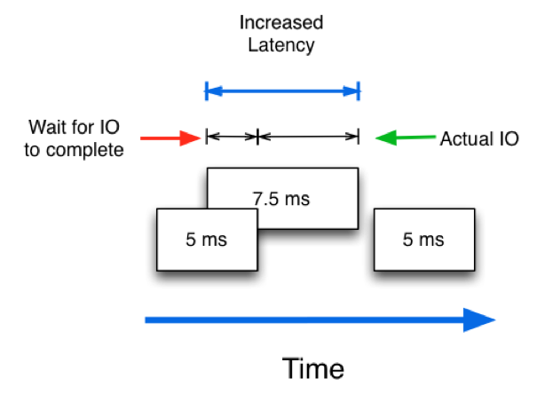
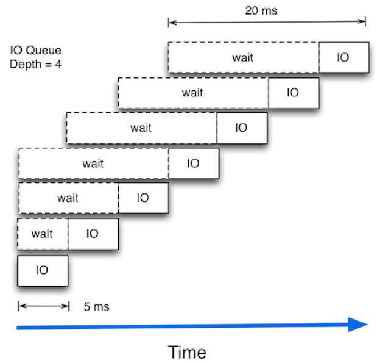

# IOPS, Latency và Throughput - Phần 2
---
## 2. Latency - Thông số quan trọng nhất trong hệ thống lưu trữ

__Latency__ là khái niệm về __tốc độ xử lý 1 request I/O của hệ thống__.

Khái niệm này rất quan trọng bởi:
- 1 hệ thống A lưu trữ có capacity `1000 IOPS` với thời gian trung bình xử lý latency `10ms`,
- 1 hệ thống B lưu trữ có capacity `5000 IOPS` với thời gian trung bình xử lý latency `50ms`.

- Hệ thống A vấn có thể tốt hơn hệ thống B

> `latency` đặc biệt quan trọng đối với các ứng dụng "nhạy cảm" với `latency`, chẳng hạn như dịch vụ `Database`.

VD:
Trong 1 siêu thị, các thu ngân (ổ cứng) phục vụ các khách hàng (I/O) với thời gian latency là 10ms.

=> Thu ngân này phục vụ 100 khách/1 giây.

Tuy nhiên, nếu có thời điểm 100 khách này tới cùng 1 lúc trong vòng 10ms thì sao? => khách hàng sẽ phải đứng đợi.

> Tuỳ từng nhu cầu khách hàng (size I/O) mà latency có thể khác nhau, `15ms` hoặc thậm chí `20ms`

__Hình minh hoạ giải thích tại sao khi ổ cứng tăng IOPS lại tốn latecy cao hơn.__

> Sự thật là hệ thống lưu trữ sẽ nhìn vào hàng đợi (queue) và ra lệnh xử lý tuần tự cho các I/O, dẫn đến nếu hàng đợi dài hơn thì latency sẽ cao hơn, tùy thuộc vào hiệu năng yêu cầu của ứng dụng mà chúng ta có thể chấp nhận chuyện này hay không.

## 3. IOPS vs Latency : Yếu tố nào quyết định hiệu năng hệ thống Storage?

Để so sánh được hiệu quả hệ thống storage, các yếu tố về môi trường platform và ứng dụng cần phải giống nhau – điều này rất khó, vì hệ thống của doanh nghiệp cần phải chạy multi-workload. Trong một vài trường hợp, việc xử lý/transfer 1 lượng lớn data (high throughput) thì được xem là tốt, nhưng khi cần xử lý số lượng lớn các I/O nhỏ thật nhanh (cần IOPS), thì chưa chắc và ngược lại. Lúc này kích cỡ I/O, độ dài của hàng đợi (queue depth) và mức độ xử lý song song… đều có ảnh hưởng đến hiệu năng.

IOPS – Có lẽ hệ thống sử dụng các ổ cứng HDD hay SSD hiện nay thì đã quá cao rồi, khi đứng riêng lẻ 1 mình, con số này trở nên vô ích. Và vô hình chung nó trở thành 1 thuật ngữ để các nhà sản xuất marketing cho thiết bị của mình, các doanh nghiệp không nên vin vào đó làm thước đo quyết định hiệu năng hệ thống Storage.

Thay vì đặt câu hỏi: “hệ thống với bao nhiêu IOPS là được?” ta nên hỏi rằng: “Thời gian xử lý ứng dụng là bao nhiêu?” Latency nên được xem là thông số hữu ích nhất, vì nó tác động trực tiếp lên hiệu năng của hệ thống, là yếu tố chính nên dựa vào tính toán ra IOPS và throughput. Nghĩa là việc giảm thiểu latency sẽ giúp cải thiện chung hiệu năng của cả hệ thống

## Nguồn
https://viettelidc.com.vn/tim-hieu-ve-cac-thong-so-iops-latency-va-throughput-phan-2.html
