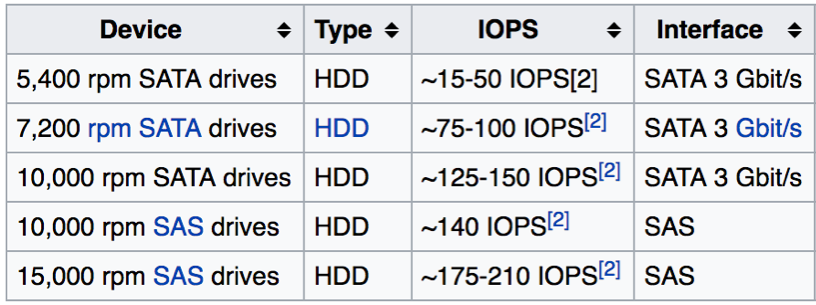
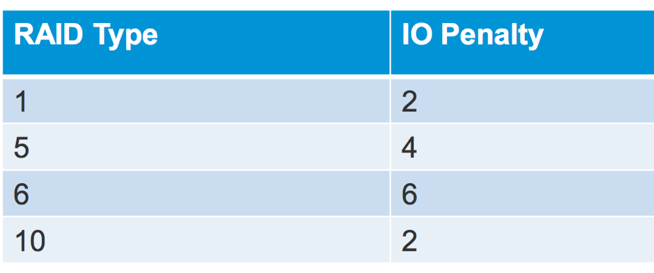

# Tìm hiểu về các thông số: IOPS, Latency và Throughput
---
## Tổng quan

`IOPS`, `Latency` và `Throughput` là ba khái niệm quan trọng khi bắt đầu xây dựng hệ thống Storage và cho những ai muốn cải thiện tốc độ Cloud Server/Private Cloud.



Mô tả sự liên quan của 3 khái niệm này trong hoạt động ship hàng từ điểm A đến B như sau:

- `IOPS`: Số lượng chuyến đi thưc hiện trong một khoảng thời gian

- `Throughput`: Số hàng chuyển được trong một khoảng thời gian

- `Latency`: Độ trễ trung bình trong tất cả các chuyến đi trong một khoảng thời gian đã thực hiện

Trong ba tham số, đặc biệt là hai tham số IOPS và latency phản ánh chất lượng phục vụ nhưng ko phải lúc nào cũng song hành với nhau kiểu một chỉ số tốt thì các chỉ số còn lại cũng tốt theo.

- Có thể một ngày có nhiều chuyến hàng nhưng có những chuyến hàng chuyển nhanh, có chuyến hàng chuyển chậm, IOPS cao nhưng latency trung bình cũng lại cao.

- Có thể một ngày có ít chuyến hàng nhưng mỗi chuyến lại chở full tải thì throughput lại cao dù IOPS thấp vì `Throughput = IOPS * IO Average size` (IO average size cao thì throughput cao).

- Có thể latency trung bình thấp nhưng số hàng chuyển cũng không vì thế mà cao được do ít đơn hàng (application ít request vào storage).


## 1. IOPS
### Định nghĩa
__IOPS - Input/Output operation per Second__ là đơn vị đo lường được sử dụng cho các thiết bị lưu trữ như HDD, SSD hoặc SAN – __cho biết số lượng tác vụ Write hoặc Read được hoàn thành trong 1 giây.__

Số IOPS được publish bởi các nhà sản xuất thiết bị, và không liên quan gì đến các ứng dụng đo lường hiệu năng cả, tuỳ theo cảm tính mà các Sys Admin có thể dùng các ứng dụng đo lường khác nhau (như IOmeter, DiskSpd..).

### Vai trò của IOPS đối với Cloud Server

Nói một cách dễ hiểu, thông số __IOPS càng cao__ thì __tốc độ xử lý càng nhanh__, số tác vụ được xử lý sẽ nhiều hơn, và tất nhiên, hiệu năng của ứng dụng trên Cloud Server sẽ cao hơn. Tuy nhiên, có trường hợp IOPS quá cao đến giới hạn vật lý sẽ gây ra tình trạng thắt cổ chai (IOPS quá cao --> Latency cao --> giảm throughput).

> Đối với IOPS, thứ quan trọng nhất cần được chú ý đến là tỉ lệ Read và Write (thông thường tỉ lệ này là 70% (read) và 30 (Write) - có thể tùy chỉnh được).

### Cách tính IOPS và số lượng ổ cứng:

VD:
- Hệ thống lưu trữ sử dụng ổ SAS 15k
- Dung lượng mỗi ổ là 900Gb.
- Tỉ lệ Read/Write tương ứng: 7:3
- Cấu hình RAID 10
- IOPS per Disk là 176

=> __Yêu cầu: IOPS > 1000__

Hệ thống lúc này cần 8 cứng là đủ, số IOPS của hệ thống lúc này là 1200.

```
RAID    Level   Capacity    IOPS
RAID    10      3,215 GB    1200
RAID    6       4,822 GB    624
RAID    5       5,626 GB    821
```

> Khi cấu hình các RAID level khác nhau, IOPS và capacity thay đổi đáng kể:
 - IOPS cao => capacity sẽ bị giảm xuống (ngược lại).
 - Lý do là vì từng __RAID level__ có sự __khác biệt về số lượng ổ cứng tối thiểu (`Raid Penalty`)__.
 - Vì thế, để setup 1 hệ thống sát với nhu cầu, Sys Admin cần phải xác định rõ ưu tiên hệ thống của mình là gì: `Ứng dụng chạy nhanh`? `Mức độ bảo mật`? `dung lượng lưu trữ`?


__Bảng yêu cầu RAID Penalty – số lượng ổ cứng tối thiểu tương ứng với mỗi RAID level__



__Các công thức tính trong bài:__

```
Tổng IOPS = IOPS per Disk * Số ổ cứng

IOPS thực = (Tổng IOPS * Write%)/(Raid Penalty) + (Tổng IOPS * Read %)

Số ổ cứng = ((Read IOPS) + (Write IOPS*Raid Penalty))/ IOPS per Disk
```

__Bảng IOPS tương ứng với từng loại ổ cứng__


> Đối IOPS trên SSD, với các loại SSD enterprise số IOPS lúc này sẽ cao vời vợi. Tuỳ theo model SSD mà có thể lên hàng ngàn (Intel X25-E ~ 8600 IOPS) hoặc chục ngàn (OCZ Vertex 4 ~ 120,000 IOPS) hoặc thậm chí là hàng triệu nếu dùng ổ NVMe!!

## Nguồn
https://viettelidc.com.vn/tim-hieu-ve-cac-thong-so-iops-latency-va-throughput.html
