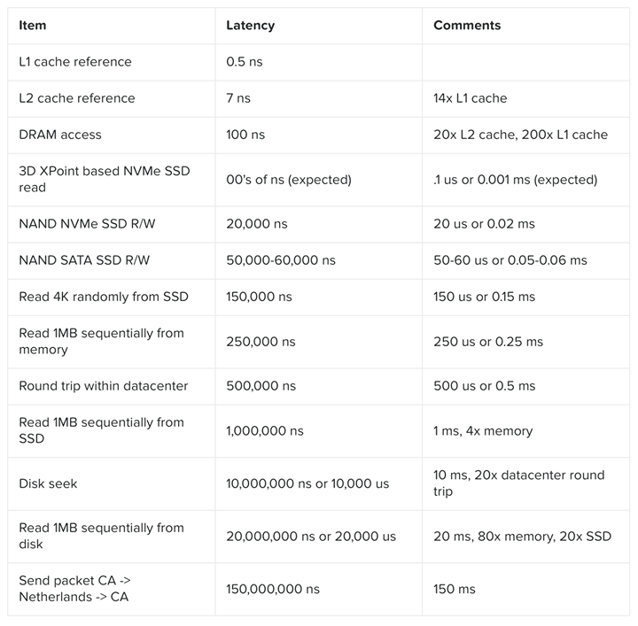
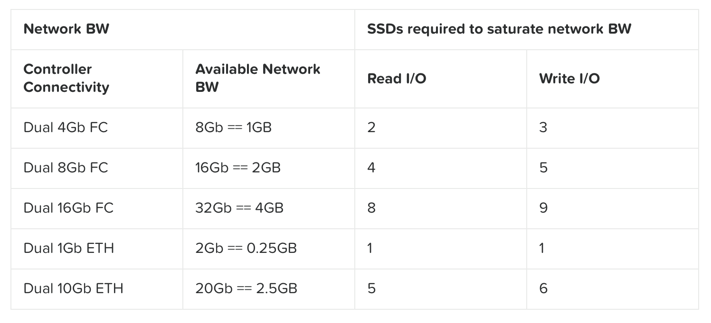

# Tầm quan trọng của độ trễ (latency)
---
## Đỗ trễ theo kiến trúc hệ thống



Bảng trên chỉ ra rằng:
- `CPU` có thể truy cập `caches` của nó với `độ trễ` trong khoảng `~0.5 – 7ns (L1 vs. L2)`.
- Với bộ nhớ chính (`memory`), những truy cập này có thể xảy ra tại `~100ns`, trong khi một tác vụ local 4K SSD read là `~150,000ns` hay `0.15 ms`.

Nếu chúng ta nghiên cứu một ổ SSD loại dành cho doanh nghiệp (trong trường hợp này là Intel S3700 - SPEC), thiết bị này có năng lực như sau:
- Năng lực I/O ngẫu nhiên:
 - Random 4K Reads: có thể đạt 75,000 IOPS
 - Random 4K Writes: có thể đạt 36,000 IOPS

Băng thông tuần tự:
- Đọc tuần tự: lên tới 500MB/s
- Ghi tuần tự: lên tới 460MB/s

Độ trễ:
- Đọc: 50 us
- Ghi: 65 us

## Khảo sát Băng thông
Đối với lưu trữ truyền thống, có các chuẩn truy xuất như sau:
- Fiber Channel (FC)
 - 4, 8, và 16-Gb

- Ethernet (bao gồm cả FcoE)
 - 1, 10Gb, (40-Gb Infiniband), etc.

VD:

Tính toán sau đây, chúng tôi sử dụng băng thông khả dụng từ Intel S3700 là 500MB/s Read và 460MB/s Write.

Tính toán được thực hiện như sau:
```
numSSD = ROUNDUP((numConnections * connBW (in GB/s))/ ssdBW (R or W))
```

> Ghi chú: Các con số được làm tròn do không thể có một mảnh SSD. Ở đây cũng không tính đến CPU cần thiết để xử lý tất cả các truy xuất I/O và giả thiết rằng CPU có đủ năng lực xử lý.



## Ảnh hưởng tới độ trễ của bộ nhớ trong

Độ trễ thông thường của bộ nhớ trong là `~100ns (không đồng nhất)`, chúng ta có thể thực hiện các tính toán sau:
```
Local memory read latency = 100ns + [OS / hypervisor overhead]

Network memory read latency = 100ns + NW RTT latency + [2 x OS / hypervisor overhead]
```

Nếu chúng ta giả định `network RTT` là `~0.5ms` (không đồng nhất tuỳ vào loại switch), tức là `~500,000ns` thì chúng ta có tính toán sau:

```
Network memory read latency = 100ns + 500,000ns + [2 x OS / hypervisor overhead]
```

Nếu chúng ta giả định về mặt lý thuyết một mạng rất nhanh với 10,000ns RTT:
```
Network memory read latency = 100ns + 10,000ns + [2 x OS / hypervisor overhead]
```
Điều này có nghĩa là thậm chí với một mạng nhanh về mặt lý thuyết, độ trễ khi truy xuất qua mạng chậm hơn 10,000% so với truy cập bộ nhớ không qua mạng. Với một mạng chậm thì nó có thể chậm hơn tới 500,000%.
Để giải quyết bài toán độ trễ này, các công nghệ caching ở máy chủ bắt đầu xuất hiện.
