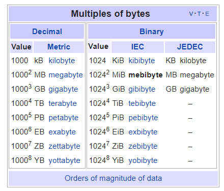

# FIO
---
## Thông số

### blocksize
Tùy chọn xác định kích thước khối của quá trình kiếm tra IO. Mặc định giá trình blocksize là `4k`.

Lưu ý:
- Cho hoạt động random, giá trị mặc định thường sử dụng là 4k
- Với hoạt động sequential, giá trị 1MB thương được sử dụng

```
--iodepth=1 (default)
```

### ioengine
Mặc đinh, FIO sử dụng `sync io`, có thể thay đổi giá trình này. 

Các giá trị thường sử dụng là `libaio` và `sync`

```
--iodepth=1 (default)
```

### iodepth
iodepth định nghĩa khối lượng IO trên 1 file suốt quá trình test. Nếu sử dụng `sync ioengine`, tăng iodepth sẽ không có tác dụng. 

Khi chỉnh ioengine sang `libaio`, OS vẫn sẽ hạn chế giá trị này. Vì vậy, khuyến cáo bắt đầu test từ giá trình 1, và tăng dần đến 16-32-64, nếu không thấy hiệu năng thay đổi, có thể bỏ qua cấu hình giá trị này (Mỗi server / OS có giá trị tối ưu khác nhau)

```
--iodepth=1 (default)
```

### direct
Cấu hình khai báo fio sử dụng direct IO hoặc buffered IO. Mặc đinh = 0, tức Fio sẽ sử dụng buffered IO cho quá trình test. Nếu set = 1, Fio sẽ sử dụng `O_DIRECT`. Sử dụng buffered IO cung cấp hiệu năng tốt hơn, đặc biệt với hoạt động `read`, hoặc nếu test với server có lượng RAM cao, sử dụng non-buffered IO sẽ tránh kết quả bị thổi phồng. Nếu test FIO trên SSD tới 600k IOPS, FIO có thể đã đọc dữ liệu từ RAM để có kết quả tốt hơn

```
--direct=0 (default)
```

### fsync
fsync khai báo FIO đẩy "dirty data" xuống disk. Mặc đinh giá trị = 0, nghĩa là ko sync. Nhiều app để linux chịu trách nhiệm đẩy dữ liệu dữ liệu từ memory xuống disk. Nếu app hoặc server thường đẩu dữ liệu tới disk (db or metadata) thì nên set giá trị này bằng 1. hoặc ngược lại, nếu app ko thường xuyên đẩy data bỏ qua giá trị này. Không được set fsync = 1 khi buffering write, nó sẽ ảnh hưởng trực tiếp đến hiệu năng Disk và đem lại giá trị xâu nhất (set fsync = 1 và chạy random write test). Kết quả thường thấp hơn khi set fsync = 1, nhưng tất cả hoạt động ghi sẽ thực hiện tới disk, disk sẽ bị stressed.

## Test Random Write và Random Read FIO
File test = 4gb, (8 job x 512MB trên mỗi thread = 8 process). 
- Nếu server có tổng ram = 8GB => nên test size = x2 ram để tránh việc buffering. 
- Nếu ram = 8gb, file size = 2gb, gấp đổi số job để có đánh giá sát nhất.
- Nếu không có nhiều không gian để test, chuyển "--direct=0" to "--direct=1", nó sẽ tránh caching hoạt động ghi. Nếu muốn tránh cache, test hiệu năng disk, set giá trị này bằng 1 hoặc set size gấp đôi số ram hiện có.
- Giá trị `--group_reporting` sẽ tổng hợp kết quả từng jobs, đơn giản cho việc đọc kết quả.

Các tham số cần lưu ý trong kết quả:
- Giá trị random read hoặc write sẽ quan trọng giá trị IOPS hơn là Bandwidth.
- `util=XX%`: Trong quá trình test, tham số thể hiện mức độ làm việc của của ổ
  - VD: util=89.71% tức thiết bị hoạt động mức 89% trong quá trình test (89% số IOPS), tức thiết bị có thể thực hiện 1 số hoạt động khác
  - Tuy nhiên nếu đẩy giá trị lên 100%, giá trị có được có thể không phải hiệu năng thực sự có thể đáp ứng của disk

## Phân tích thông số
```
read : io=10240MB, bw=63317KB/s, iops=15829, runt=165607msec
```
- Thể hiện file size = 10gb, bw = 63,3 MB/s, tổng iops = 15829
  

```
slat (usec): min=3, max=335, avg= 9.73, stdev= 5.76
```
- slat = Submission latency, độ trễ gửi. Thời gian cơ bản để gửi 1 IO. Giá trị này có thể là (nano, micro, milli sec)
- latency metric, thể hiện thời gian gửi IO tới Kernel xử lý.
- Giá trị này quan trọng khi cần tối ưu kernel.

```
clat (usec): min=1, max=18600, avg=51.29, stdev=16.79
```
- clat = Completion latency. 
- Thời gian chờ để hoàn thành, giá trị thể hiện khoảng thời gian giữa khoảng thời gian submit tới kernet tới khi hoạt động IO hoàn tất. 

```
lat (usec): min=44, max=18627, avg=61.33, stdev=17.91
```
- lat = Total latency. Biểu thụ thời gian khi FIO tạo 1 IO unit tớ thời gian hoàn thành hoạt động IO

```
clat percentiles (usec):
|  1.00th=[   42],  5.00th=[   45], 10.00th=[   45], 20.00th=[   46],
| 30.00th=[   47], 40.00th=[   47], 50.00th=[   49], 60.00th=[   51],
| 70.00th=[   53], 80.00th=[   56], 90.00th=[   60], 95.00th=[   67],
| 99.00th=[   78], 99.50th=[   81], 99.90th=[   94], 99.95th=[  101],
| 99.99th=[  112]
```
- Thể hiện đỗ trễ gửi IO trong từng thời điểm (1%, 10%, 99%) độ trễ tứng bằng usec = Microseconds
- So sánh giữa clat percentiles giữa SSD VS HDD
  ```
  SSD 
  clat percentiles (usec):
      |  1.00th=[   42],  5.00th=[   45], 10.00th=[   45], 20.00th=[   46],
      | 30.00th=[   47], 40.00th=[   47], 50.00th=[   49], 60.00th=[   51],
      | 70.00th=[   53], 80.00th=[   56], 90.00th=[   60], 95.00th=[   67],
      | 99.00th=[   78], 99.50th=[   81], 99.90th=[   94], 99.95th=[  101],
      | 99.99th=[  112]
  -----------------------------------------
  HDD
  clat percentiles (usec):
      |  1.00th=[ 3952],  5.00th=[ 5792], 10.00th=[ 7200], 20.00th=[ 8896],
      | 30.00th=[10304], 40.00th=[11456], 50.00th=[12608], 60.00th=[13760],
      | 70.00th=[15168], 80.00th=[16768], 90.00th=[18816], 95.00th=[20608],
      | 99.00th=[23424], 99.50th=[24192], 99.90th=[26752], 99.95th=[28032],
      | 99.99th=[30080]
    ```

```
bw (KB  /s): min=52536, max=75504, per=67.14%, avg=63316.81, stdev=4057.09
```
- Giá trị banwitdh khá dễ hiểu trừ `per=XX%`, nó thể hiện số lượng IO thực hiện trên mỗi tiễn trình. 

```
lat (usec) :   2= 0.01%,   4=0.01%,  10=0.01%,   20=0.01%, 50=51.41%
lat (usec) : 100=48.53%, 250=0.06%, 500=0.01%, 1000=0.01%
lat (msec) :   2= 0.01%,   4=0.01%,  10=0.01%,   20=0.01%
```
- Số liệu này thể hiện phân phối độ trễ thực hiện request. Tức theo số liệu:
  - `51,41%` request thực hiện dưới 50 usec (50 microsecon) 
  - `48.53%` thực hiện trong khoảng 100 usec, và từ đó đến hết
  - Lưu ý thời gian từ usec => msec (microsecon tới milisecon)

```
cpu          : usr=5.32%, sys=21.95%, ctx=2829095, majf=0, minf=21
```
- Số lương CPU sử dụng

```
IO depths    : 1=100.0%, 2=0.0%, 4=0.0%, 8=0.0%, 16=0.0%, 32=0.0%, &gt;=64=0.0%
```
- Fio sử dụng giá trị `iodepths` để kiểm soát số IO sẽ thực hiện tại bất kỳ thời điểm. Nó là giá trị cấu hình của app, và khác gới thông số IO queue của thiết bị. Trong trường hợp `IO depth` set = 1 => sử dụng 1 tiến trình tại mọi thời điểm. 

```     
submit    : 0=0.0%, 4=100.0%, 8=0.0%, 16=0.0%, 32=0.0%, 64=0.0%, &gt;=64=0.0%
complete  : 0=0.0%, 4=100.0%, 8=0.0%, 16=0.0%, 32=0.0%, 64=0.0%, &gt;=64=0.0%
```
- IO submit: Số lượng IO được gửi trong 1 single submit call. Giá trị `4=100%` tức ta gửi 1-4 IO trên mỗi lần. Ở đây vì `iodepth` = 1 nên toàn bị IO sẽ được summit = 1 thuộc khoảng từ 1-4.
- IO complete: giống IO submit nhưng là thời gian hoàn thành

```
issued    : total=r=2621440/w=0/d=0, short=r=0/w=0/d=0
issued    : total=r=0/w=524288/d=0, short=r=0/w=0/d=0
```
- Số lượng IO được thực hiện. Số liệu này sẽ trở nên phức tạp khi số lượng r và w = 50%

```
# Gộp cả write vả read
MIXED: io=12497MB, aggrb=42653KB/s, minb=277KB/s, maxb=41711KB/s, mint=300000msec, maxt=300012msec
----
# Chỉ write
WRITE: io=2048.0MB, aggrb=169425KB/s, minb=169425KB/s, maxb=169425KB/s, mint=12378msec, maxt=12378msec
----
# Không gộp
READ: bw=20.9MiB/s (21.9MB/s), 10.4MiB/s-10.8MiB/s (10.9MB/s-11.3MB/s), io=64.0MiB (67.1MB), run=2973-3069msec
WRITE: bw=1231KiB/s (1261kB/s), 616KiB/s-621KiB/s (630kB/s-636kB/s), io=64.0MiB (67.1MB), run=52747-53223msec
```
- Tổng thourghput và thời gian. 
- `io=` tổng số io đã thực hiện.
- `aggrb` tổng băng thông trên tất cả process với thiết bị.
- `minb/maxb` tổng băng thông tối thiểu và tối đa trên thiết bị. 
- `mint/maxt` hiện thị thời gian dài nhất và ngắn nhất của các test (thực hiện nhiều test cùng 1 lúc).

```
Disk stats (read/write):
*  vda: ios=62/444879, merge=28/119022, ticks=168/530425, in_queue=530499, util=89.71%
---
Disk stats (read/write):
  sda: ios=16398/16511, merge=30/162, ticks=6853/819634, in_queue=826487, util=100.00%
```
- `ios` số IO thực hiện bởi tất cả groups
- `merge`: Number of merges performed by the I/O scheduler.
- `ticks`: Number of ticks we kept the disk busy.
- `in_queue`: Tổng thời gian danh cho disk queue
- `util=XX%`: Trong quá trình test, tham số thể hiện mức độ làm việc của của ổ
  - VD: util=89.71% tức thiết bị hoạt động mức 89% trong quá trình test (89% số IOPS), tức thiết bị có thể thực hiện 1 số hoạt động khác
  - Tuy nhiên nếu đẩy giá trị lên 100%, giá trị có được có thể không phải hiệu năng thực sự có thể đáp ứng của disk

# Nguồn

https://tobert.github.io/post/2014-04-17-fio-output-explained.html

https://fio.readthedocs.io/en/latest/fio_doc.html#interpreting-the-output

https://wiki.mikejung.biz/Benchmarking

