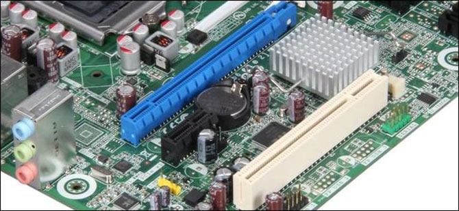
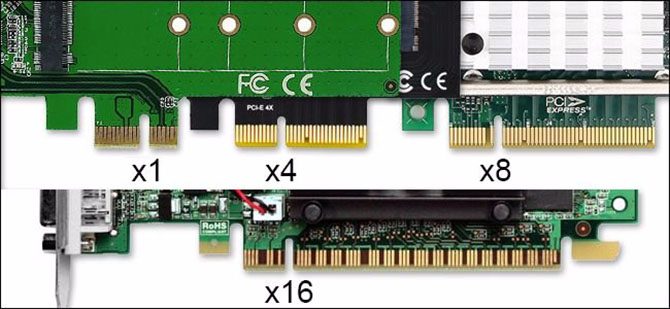

# PCI-E
---
PCI-E là bản nâng cấp cho chuẩn PCI (Peripheral Component Interconnect - cổng kết nối thiết bị ngoại vi), được giới thiệu vào năm 2000, với một ưu điểm cực lớn đó là sử dụng bus truy cập từ điểm đến điểm (point-to-point access bus) thay cho một bus nối tiếp (serial bus). Điều này có nghĩa là mỗi cổng PCI cùng với các thiết bị kết nối vào cổng đó có thể hoạt động với tốc độ tối đa mà không phải lo về vấn đề tắc nghẽn khi phải cùng lúc lưu thông qua một bus đơn.

Hãy tưởng tượng máy tính là một nhà hàng. Chuẩn PCI cũ giống như một quầy giao thức ăn, mọi người phải xếp vào một hàng dài ngay ngắn để đợi tới lượt. Tốc độ phục vụ tất nhiên cũng không được nhanh vì chỉ có một nhân viên đứng ở quầy này. Chuẩn PCI-E thì giống như một quầy bar, khách hàng tới ngồi tại các vị trí mình muốn, và trong quầy thì có vài ba anh bartender đẹp trai nhận order cùng một lúc! Quá dễ hiểu đúng không? Chuẩn PCI-E có nhiều làn dữ liệu được "khoán" lần lượt cho các thiết bị ngoại vi hay card mở rộng, máy tính có thể cùng lúc truy cập tất cả chúng nhanh - gọn - lẹ hơn rất nhiều.

Bây giờ, hãy tiếp tục tưởng tượng, thay vì mỗi khách được một bartender phục vụ, thì bây giờ có thêm vài anh nữa làm "chân dự bị" sẵn sàng "lao vào" khi cần thiết. Đó là ý tưởng về "đa làn".

## Đa làn trên PCI-E
PCI-E đã áp dụng ý tưởng "đa làn" ngay từ khi nó được thai nghén. Hiện tại thì các bo mạch chủ mới nhất đang sử dụng PCI-E v3, và v4 với tốc độ nhanh hơn nhiều đang ngày một phổ biến hơn, trong khi v5 được dự định ra mắt vào năm 2019. Tuy nhiên, dù đang sử dụng phiên bản nào thì chúng đều phải sử dụng cùng một loại kết nối vật lý, và kết nối vật lý lại được chia ra làm 4 kích cỡ chính: x1, x4, x8 và x16. x32 thực ra là có tồn tại nhưng khá hiếm, và thường không xuất hiện trên các phần cứng dành cho người dùng thông thường.

Các kích cỡ này tồn tại không phải để cho vui. Mỗi kích cỡ kết nối khác nhau cho phép một lượng chân kết nối dữ liệu đồng thời đến bo mạch chủ khác nhau: cổng càng lớn, lượng chân kết nối trên card và cổng càng nhiều. Các kết nối này được gọi ngắn gọn là "làn", trong đó mỗi làn PCI-E gồm 2 cặp tín hiệu, một cặp dùng để gởi và một cặp dùng để nhận dữ liệu. Mỗi phiên bản PCI-E có tốc độ khác nhau trên mỗi làn, nhưng nói chung thì cổng PCI-E và thiết bị kết nối vào cổng đó có càng nhiều làn thì tốc độ dữ liệu qua lại giữa thiết bị và hệ thống càng nhanh.

Trở lại với ví dụ quầy bar ở trên: nếu xem mỗi khách hàng đang ngồi đợi là một thiết bị PCI-E, thì làn x1 có thể xem là một bartender phục vụ một khách hàng. Tương tự, nếu khách hàng này ngồi tại ghế x4 thì người này sẽ được đến 4 chàng đẹp trai phục vụ, ghế x8 thì có 8 chàng, ghế x16 thì có 16 chàng!

## Thiết bị nào dùng cổng nào?

Giờ đến phần hấp dẫn.

Với phiên bản PCI-E v3, tần suất dữ liệu tối đa trên mỗi làn là 8 Gigatransfer, tương đương với khoảng 1 GB dữ liệu/giây/làn.

Vậy thì, nếu một thiết bị dùng cổng PCI-E x1 (ví dụ như một card âm thanh loại bình dân, card wifi...) thì nó có thể truyền dữ liệu đến hệ thống với tốc độ khoảng 1GBps. Một thiết bị khác sử dụng cổng kết nối vật lý lớn hơn như x4 hoặc x8 (ví dụ như card mở rộng USB 3.0 với nhiều hơn 2 cổng USB đang được sử dụng với tốc độ maximum) sẽ có thể truyền dữ liệu với tốc độ nhanh gấp 4 hoặc 8 lần. Cuối cùng, cổng x16 với tốc độ truyền tải trên lý thuyết vào khoảng 15GBps thì thường được sử dụng bởi các card màn hình của NVIDIA và AMD.

Đến thời điểm hiện tại, chưa có tài liệu cụ thể nào chỉ ra rằng loại card mở rộng nào sẽ sử dụng bao nhiêu làn dữ liệu. Tuy nhiên theo thông lệ chung thì card đồ hoạ sẽ sử dụng cổng x16 để có thể đảm bảo tính ổn định, còn card mạng tất nhiên không cần thiết phải dùng tới cổng x16 rồi, bởi cổng Ethernet hiện cũng chỉ hỗ trợ tốc độ tối ta 1 Gigabit/giây mà thôi. Một số lượng nhỏ các ổ cứng thể rắn (SSD) dùng cổng PCI-E x4, nhưng chuẩn M.2 có vẻ như đang dần chiếm ưu thế. Các loại card mạng cao cấp và các thiết bị dành cho giới chuyên nghiệp như adapter và controller RAID thì thường dùng cổng x4 và x8.

## Cần lưu ý rằng, kích thước cổng PCI-E và khái niệm "làn" đôi lúc không phải giống nhau

Một trong những vấn đề khiến người ta cảm thấy khó hiểu về PCI-E là: một cổng có thể có kích thước x16, nhưng lại chỉ có số làn dữ liệu tương đương x4. Bởi lẽ, trong khi PCI-E có thể cho phép một lượng vô hạn kết nối riêng lẻ, thì tốc độ truyền tải của làn lại bị giới hạn bởi chipset. Ví dụ, các bo mạch chủ bình dân có thể chỉ hỗ trợ 1 khe PCI-E x8, dù khe này về mặt vật lý có thể gắn vừa một card x16. Trong khi đó, một bo mạch dành cho game thủ có thể có tới 4 khe x16 với các làn x16 để hỗ trợ tối đa cho GPU.

Vấn đề xuất hiện ở đây là giả sử bo mạch có 2 khe PCI-E kích cỡ x16, nhưng một trong hai lại chỉ có các làn x4 thì nếu gắn nhầm card màn hình vào khe này sẽ gây hiện tượng nghẽn cổ chai, làm giảm hiệu suất của card màn hình đi 75%. May mắn là các nhà sản xuất thường chỉ rõ khe nào có làn tốc độ bao nhiêu ngay trên bo mạch chủ, hoặc trong hướng dẫn sử dụng.
