# INFRASTRUCTURE TOUR RED HAT ENTERPRISE LINUX
---
## 1. Các thách thức của doanh nghiệp
Thách thức của doanh nghiệp
-	Giảm giá thành;
-	Tăng lợi nhuận;

Tối ứu chi phí phải chi trả cho:
- Năng lượng tiêu thụ;
- Nơi đặt không gian sử dụng cho các máy chủ server, storage;
- Tài nguyên mạng;
- Chi phí quản lý, chi phí cho nhân lực;

Giải pháp cho những vấn đề trên là chuyển dịch, sử dụng các giải pháp Cloud (Private, Public, Hybird). Việc sử dụng các dịch vụ đám mây sẽ giảm giá thành, tận dụng tối đa chi phí, tăng chất lượng dịch vụ (QoS). Đồng nhất hóa các thành phần, vượt qua các trở ngại, rào cản công nghệ đang mắc phải, tối ưu chi phí duy trì, cải thiện trải nhiệm dịch vụ, bao gồm QoS và thỏa thuận cung cấp chất lượng dịch vụ (SLA: Service Level Agreement). Cho phép mở rông, hỗ trợ các giải pháp mới, cải thiện hệ thống hiệu quả hơn.

## 2. Các sản phẩm của Red Hat
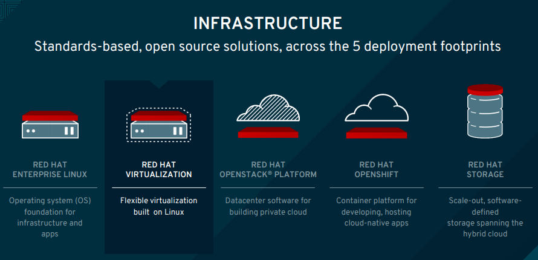

### Cockpit 
Là giao diện web thân thiện dành cho người quản trị hệ thống. Nó cho phép người quản trị giám sát tài nguyên hệ thống, điều chỉnh cấu hình 1 cách dễ dàng.

Cockpit đặc biệt vì:
- Xây dựng dựa trên các tính năng có sẵn của RHEL;
- Không yêu cầu cấu hình đặc biệt, sử dụng ngay khi cài đặt;
- Update dữ liệu về hệ thống trực tuyến, thời gian thực;
- Khi không sử dụng, Cockpit không chiếm tài nguyên RAM, CPU của hệ thống
- Cockpit không quản là tool configuration management nhưng nó có thể tương tác với các tool configuration management (Red hat Ansible)

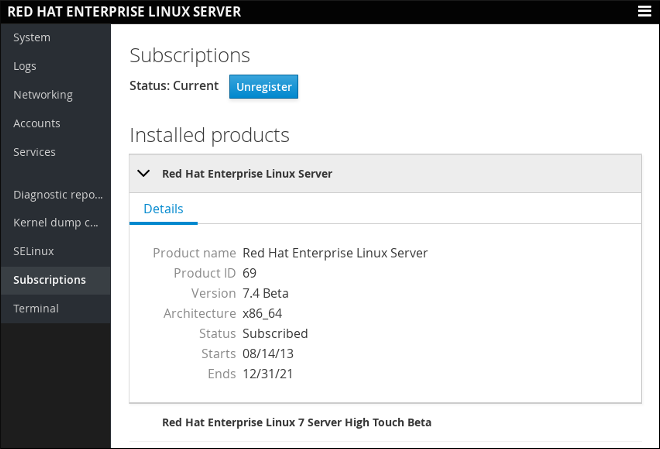

### Red Hat Satellite

Trong cloud hoặc cluster, Redhat Satellite là sản phẩm quản lý hệ thống dịch vụ của Redhat, cho phép người quản trị triển khai nhanh, quản lý các máy chủ Red Hat Enterprise (RHEL). Máy chủ vệ tinh (Satellite) đăng ký bằng Red Hat Subscription Management, qua đó sẽ ánh xạ tất cả các sản phẩm, phần mềm hiện có cũng như liệt kế các lỗ hổng tiềm tàng và cung cấp các giải pháp sửa lỗi, bản vá cấu hình, v.v. 

Đồng thời, Redhat Satellite cung cấp các trạng thái về các máy chủ nằm trong.

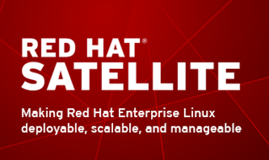

> Redhat không phải công ty về bảo mật, các giải pháp về bảo mật được áp dụng từ nhưng project mã nguồn mở do Redhat đóng góp.

### Red Hat Virtualization

Red Hat Virtualization (RHV) là sản phẩm ảo hóa x86 được cung cấp bởi RedHat, sản phẩm được phát triển dựa trên KVM. Red Hat Virtualization sử dụng giao thức SPICE và VDSM (Virtual Desktop Server Manager) với các máy chủ quản được quản lý tập trung bởi RHEL. 
Hệ thống cho phép thu thập thông tin người dùng từ dịch vụ Active Directory (FreeIPA Active Directory)

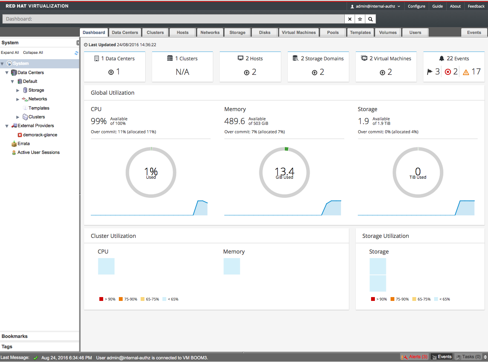

### Red Hat Insign

https://www.techrepublic.com/article/red-hat-insights-predictive-analytics-tool-gets-updates-for-managing-risks-containers-and-private/

Redhat chỉ cung cấp giải pháp cho hệ sinh thái redhat (RHEL). Các sản phẩm của RedHat bắt nguồn tự các project mã nguồn mở được cộng đồng đóng góp. 

## 3. Giải pháp lưu trữ Red Hat
Red hat cung cấp giải pháp đa dạng
- Physical: Ceph Storage, Gluster Storage – Giải quyết cho Redhat Enterprise linux
- Virtual: Gluster Storage – Giải quyết cho Enterprise linux, Redhat virtualization
- Private cloud: Ceph storage – tập trung cho nền tảng Openstack
- Container: Gluster storage – Openshift red hat
- Publich cloud: Gluster storage – Phiên bản Redhat enterprise, hỗ trợ Amazon, azure, google cloud

> Tại sao áp dụng Ceph cho Private cloud? – Bắt nguồn từ bản chất của Ceph, Ceph Object Storage. Khi tất cả giải pháp Ceph (RBD, RadosGW, CephFS) đều xây dựng dựa trên Object.

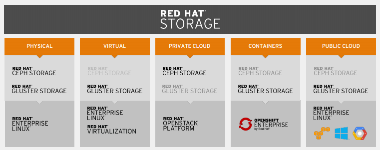

Giải pháp tổng hợp, Redhat cung cấp các giải pháp cung cố phiển bản Redhat Enterprise linux
-	Baremetal: Gluster storage – RHEL
-	VM – Gluser storage trên nền tảng ảo hóa RHEL
-	Container – Gluster storage (Openshift)
-	Public cloud: Gluser storage – tương thích amazon, azure, google cloud

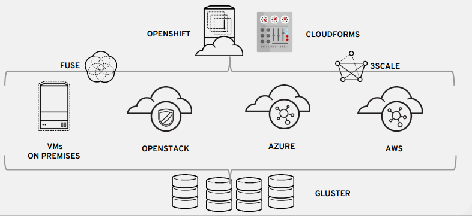

## 4. Kiến trúc Multicloud
### Multicloud bao gồm:
- Public cloud: Đám mây công cộng (là các dịch vụ trên nền tảng Cloud Computing để cho các cá nhân và tổ chức thuê, họ dùng chung tài nguyên).
- Private cloud: Đám mây riêng (dùng trong một doanh nghiệp và không chia sẻ với người dùng ngoài doanh nghiệp đó)
- Hybrid cloud:  Là mô hình kết hợp (lai) giữa các mô hình Public Cloud và Private Cloud 

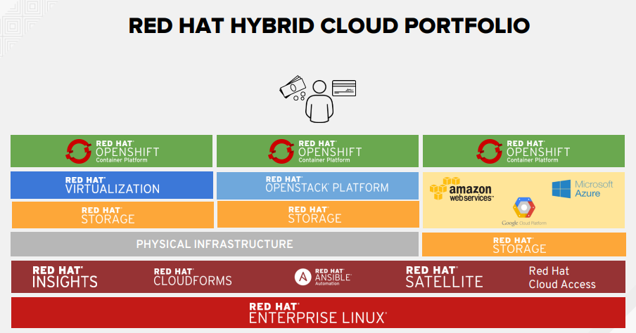

> Thực hiện hybrid cloud dựa trên RH OpenShift Container Platform. RH OpenShift Container Platform tương thích: VM, Openstack, Azure, AWS (Nền tảng Gluser)

## 5. Red Hat OpenStack
(..)

https://www.redhat.com/en/technologies/linux-platforms/openstack-platform

## 6. Container
### Tổng quan
Container là giải pháp để giải quyết vấn đề làm sao để chuyển giao phần mềm một cách đáng tin cậy (không phát sinh lỗi) giữa các môi trường máy tính khác nhau. Chẳng hạn như giữa máy tính của lập trình viên với máy của tester, giữa môi trường staging (hay còn được gọi là môi trường tiền thực tế) với môi trường thực tế hay thậm trí giữa máy chủ riêng đặt tại trung tâm dữ liệu với máy ảo trên cloud.

Container giải quyết vấn đề trên bằng cách tạo ra một môi trường bị cô lập (isolated) chứa mọi thứ mà phần mềm cần để có thể chạy được bao gồm mã nguồn, các thư viện runtime, các thư viện hệ thống, các công cụ hệ thống, … (gọi là sự phụ thuộc hoặc các phụ thuộc) mà không bị các yếu tố liên quan đến môi trường hệ thống làm ảnh hưởng tới cũng như không làm ảnh hưởng tới các phần còn lại của hệ thống.

### Đặc điểm kỹ thuật của container
Kiến trúc container bao gồm:
- Server (máy tính vật lý hoặc máy ảo)
- Host OS (hệ điều hành cài đặt trên server) 
- Các container.

Mỗi một ứng dụng (App A và App B) sẽ có những sự phụ thuộc riêng của nó bao gồm cả về phần mềm (các dịch vụ hay thư viện) lẫn cả về phần cứng (CPU, bộ nhớ, lưu trữ). Các ứng dụng này sẽ được Container Engine, một công cụ ảo hóa tinh gọn, được cài đặt trên host OS, nó sẽ cô lập sự phụ thuộc của các ứng dụng khác nhau bằng cách đóng gói chúng thành các container. 

Các tiến trình (process) trong một container bị cô lập với các tiến trình của các container khác trong cùng hệ thống tuy nhiên tất cả các container này đều chia sẻ kernel của host OS (dùng chung host OS).

Với mô hình, sự phụ thuộc của ứng dụng vào tầng OS cũng như cơ sở hạ tầng được loại bỏ giúp việc triển khai phương pháp “deploy anywhere” (triển khai ở bất kỳ nơi đâu) của container được hiệu quả hơn. Thêm vào đó, do chia sẻ host OS nên container có thể được tạo gần như một cách tức thì, giúp việc scale-up & scale-down theo nhu cầu được thực hiện một cách nhanh chóng.

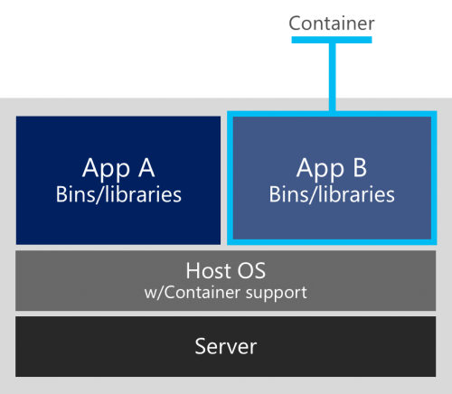

### Container vs VM (Virtual Machine)

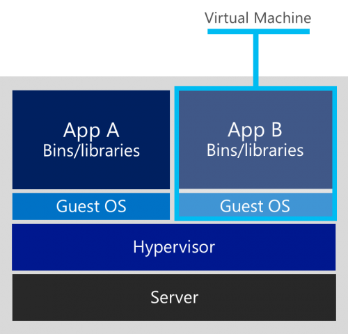

> Kiến trúc VM

Về kiến trúc:
- Với kiến trúc VM: Mỗi ứng dụng được ảo hóa bao gồm chính ứng dụng đấy và cũng chứa các phụ thuộc của nó giống như bên container. Tuy nhiên bên VM sẽ kèm theo thêm 1 guest OS. Điều này dẫn tới việc đóng gói ứng dụng được ảo hóa sẽ có dung lượng lên tới hàng GB.
- Với container: chia sẻ cùng host OS, các container sẽ có OS giống nhau thì với máy ảo, mỗi một VM có thể có OS khác so với các VM khác và thậm trí OS của các VM hoàn toàn có thể khác với host OS.

Về tính linh hoạt: 
- Với container, bảo trì buộc phải khởi động lại máy thì đồng nghĩa với việc hoạt động của các container có trong máy đó sẽ bị gián đoạn. 
- Với VM, hoàn toàn có thể di chuyển các VM có trong máy cần được bảo dưỡng sang tạm các máy tính khác. Điều này giúp ứng dụng có trong các VM hoạt động mà không bị gián đoạn.

Về tính an toàn: 
- Với container, do dùng chung OS nên nếu có lỗ hổng nào đấy ở kernel của host OS thì nó sẽ ảnh hưởng tới toàn bộ container có trong host OS đấy.
- Với VM, ứng dụng trong các VM chạy với các guest OS riêng biệt và giao tiếp với host OS thông qua hypervisor, về lý thuyết thì hypervisor vẫn có khả năng có những lỗ hổng để hacker khai thác nhưng vì nó không có nhiều chức năng như một kernel của OS. Vì vậy mức an toàn sẽ cao hơn
### Tại sao container
Với đặc tính nhanh gọn của mình, container rất phù hợp với xu hướng phát triển phần mềm hiện đại ngày nay khi mà yếu tố thời gian được đặt lên hàng đầu. Ngoài ra, container sử dụng công nghệ triển khai cũng như định dạng đóng gói thống nhất (unified), chỉ cần cài đặt Container Engine vào các máy cần tạo/dùng container và người dùng hoàn toàn yên tâm có thể sử dụng được các container được đóng gói một cách dễ dàng. Và còn một điểm cũng rất quan trọng để hút được sự quan tâm đó là container được sự hỗ trợ rất lớn từ cồng đồng công nghệ như Ubuntu, Redis, WordPress, …

## 7. Ansiable cho Redhat
Ansiable cho phép
-	Hỗ trợ triền khai ứng dụng nhanh
-	Hỗ trợ triển khai dạng container theo công nghệ Redhat

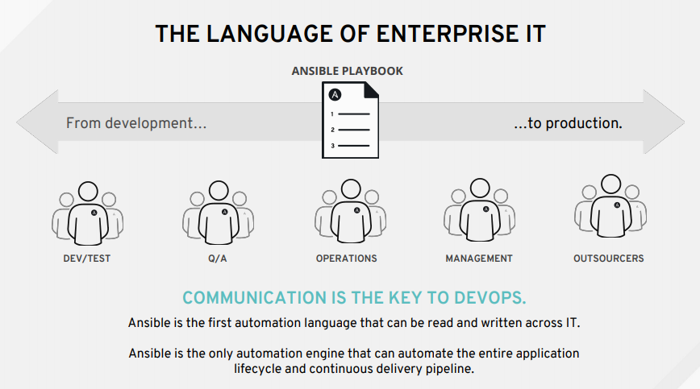

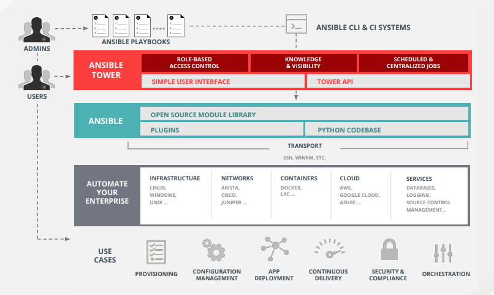

## Nguồn

https://www.redhat.com/en/topics/containers/whats-a-linux-container

https://www.redhat.com/en/topics/containers

https://access.redhat.com/documentation/en-us/red_hat_enterprise_linux/7/pdf/getting_started_with_cockpit/Red_Hat_Enterprise_Linux-7-Getting_Started_with_Cockpit-en-US.pdf

http://blog.lionpham.com/2016/09/02/docker-containers-azure-container-service-p1/

