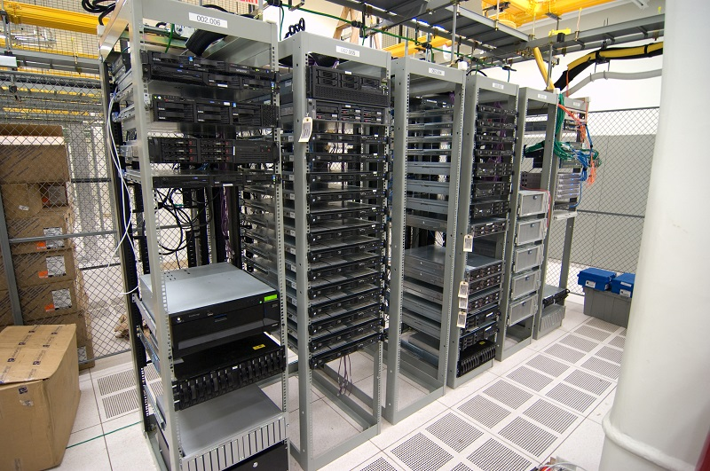

# ĐƠN VỊ U CỦA TỦ MẠNG RACK
---
U là đơn vị mà các nhà sản xuất quy ước dùng để đo chiều cao của thiết bị theo tiêu chuẩn EIA. Hệ thống lỗ trên các thanh treo trong tủ được chia làm các cụm, mỗi cụm bao gồm 3 lỗ vuông cạnh 0.5 inch (12.70 mm).

Mỗi hệ thống 3 lỗ vuông này được thiết kế song song tạo thành một phần không gian bên trong tủ với chiều cao 1U tương đương 1,75 inch (44,45 mm). Các thiết bị gắn trên tủ rack thường được thiết kế dựa trên số U này.

Ví dụ:
> máy chủ 2U, 4U, 6U, hay switch, router 1U, 2U,..

> 1U = 1,75 inch = 4,45 cm     (1 inch = 2,54cm)

Switch/hub/router/server 1U có nghĩa là chúng có chiều cao 1U. Nếu quan sát các thiết bị như switch, hub, router, server… dành cho doanh nghiệp (không phải loại dành cho gia đình, văn phòng nhỏ), bạn sẽ thấy chiều cao của chúng là bội số của U, chẳng hạn 1U, 2U, 4U, 5U…

Khoảng cách giữa các lỗ được đột trên mặt bích của tủ rack tiêu chuẩn 19 inch được  sắp xếp theo từng nhóm 3 lỗ. 3 lỗ đuợc xác định như một Đơn vị Rack (RU) hay còn được gọi là “U”. 1U = 1.75 inch (44.45mm) tính theo chiều dọc. Các nhà sản xuất thiết bị lắp trong tủ rack thường sản xuất các sản phẩm của họ dựa trên các đơn vị rack (RU). Bởi vì đơn vị này giúp xác định số lượng thiết bị được đặt trong tủ rack. Khoảng cách giữa các nhóm 3 lỗ đột trên mặt bích của tủ rack được xác định từ tâm lỗ này tới lỗ khác và sự thay đổi của khoảng cách này phụ thuộc vào tủ rack được đột lỗ vuông hay lỗ tròn. Tính thay đổi của khoảng cách giữa các lỗ với nhau chính là nguyên nhân của các vấn đề  phát sinh trong quá trình lắp ráp khi người thi công lắp đặt không chú ý vị trí các bộ phận lắp ráp của giá treo trượt đang được lắp. Một trong những vấn đề phổ biến nhất là móc trên giá treo trượt không phù hợp với các lỗ trên  tủ rack. Nguyên nhân gây ra vấn đề này là do các bộ phận lắp rắp của giá treo không vừa với mẫu lỗ trên tủ rack

## Tổng kết
> Đơn vị U có nghĩa là đơn vị đo chiều cao, 1 U = 4,45 cm. Tủ Rack càng lớn, U càng cao, càng có thể đặt được nhiều máy chủ.

# Nguồn
https://maychuvietnam.com.vn/don-vi-u-cua-tu-mang-rack-la-gi/
